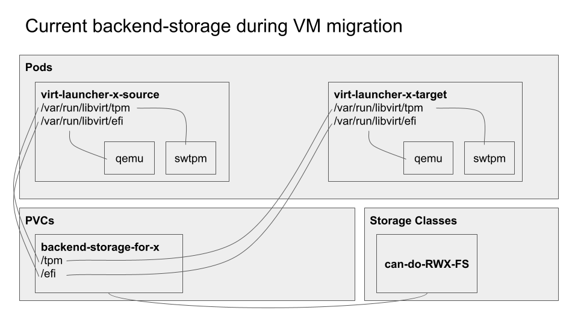
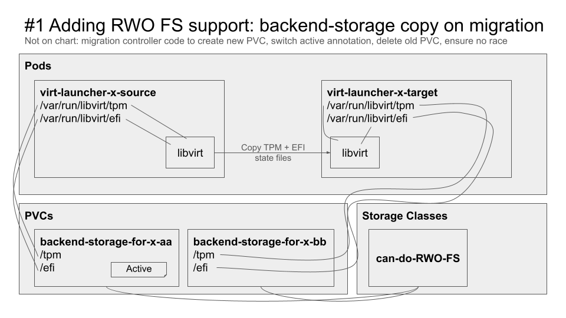
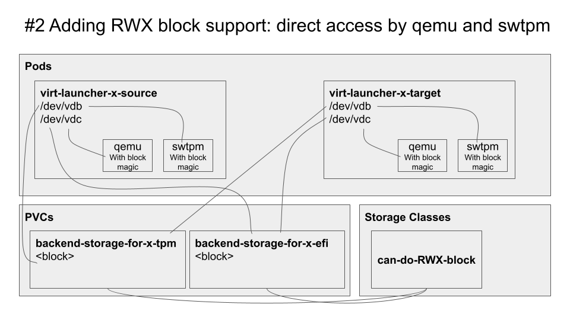

# Overview
This proposal is about supporting the migration of VMs that use persistent features, such as persistent vTPM, with any [storage class](https://kubernetes.io/docs/concepts/storage/storage-classes/).

To make this document as simple as possible, let's consider that storage in Kubernetes can either be filesystem (FS) or
block mode, and either ReadWriteOnce (RWO) or ReadWriteMany (RWX) access mode, with storage classes supporting any
number of combinations of both.

As of KubeVirt 1.3, Here is how each of the 4 combinations is supported by the backend-storage for persistent VM state:
- RWO FS: supported by backend-storage but makes VMs non-migratable. **This design proposal is about removing that limitation.**
- RWX FS: preferred combination, supported by backend-storage and compatible with VM migrations
- RWO block: not supported
- RWX block: not supported

This proposal is about switching to a different model which would instead create a new backend-storage PVC on migration, enabling RWO FS.  
It is important to note that RWO FS is supported by most, if not all, Kubernetes storage classes out there, as it is needed for basic pod functionalities.  
Implementing this proposal will therefore enable the of persistent features on any clusters, no matter which storage classes are present.

## Alternative approaches

### Direct block support in upstream projects

An alternative to this design would be for upstream components (libvirt - qemu - swtpm) to add block storage support for TPM/EFI.  
KubeVirt could then create one backend-storage PVC per feature (EFI/TPM) per VM and pass them directly to libvirt.  
That alternative approach would enable RWX block backend-storage (as opposed to RWO FS in this proposal).  

Pros:
- Less code to write and maintain in KubeVirt
- No need to duplicate backend-storage PVCs on migrations and delete the correct one after migration success/failure
- Libvirt gains a feature

Cons:
- Relies on upstream projects (libvirt/qemu/swtpm/...) adding and maintaining options to store config files into a block devices without filesystems
- Requires multiple PVCs per VM (one per persistence-enabled feature)
- We would have to either
  - Maintain 2 different backend-storage implementations (the existing RWX FS one and this RWX block one)
  - Deprecate RWX FS and require RWX block to enable backend-storage
- Many storage classes have a minimum PVC size, or a large alignment size. Both can lead to larger storage usage than requested. Having multiple PVCs multiplies that overhead.

We have opened RFEs against libvirt for [TPM](https://issues.redhat.com/browse/RHEL-54325) and [EFI](https://issues.redhat.com/browse/RHEL-54326), in case we decide to pursue to this approach in the future.

### Partitioned block support

[A pull request](https://github.com/kubevirt/kubevirt/pull/10346) (updated [here](https://github.com/kubevirt/kubevirt/pull/12337)) explored a not-safely-migratable implementation which partitions the block storage as ext3.  
Migratability actually appears functional but should be considered unsafe, since 2 pods (source and target virt-launchers) mount the same ext3 filesystem concurrently.  
Replacing ext3 with `gfs2` could be something to consider to solve this problem.

## Motivation/Goals
- Users want to be able to use any storage class for backend-storage
- Users want all VMs with persistent features to be potentially migratable

## Definition of Users
Any VM owner that wants to use persistent features, such as TPM and/or EFI

## User Stories
As a user, I want to be able to seamlessly enable persistent features while preserving the migratability of my VMs.

## Repos
kubevirt/kubevirt

# Design
- When creating a new VM with persistent features, we use either (first match wins):
  - The storage class specified in the KubeVirt Custom Resource
  - The storage class marked as the default for virtualization purposes unless it has a StorageProfile that shows only block is supported
  - The storage class marked as the default for the cluster
- All new persistent storage PVCs will be created with the name `persistent-state-for-<vm_name>-<random_string>` and the new annotation `persistent-state-for-<vm_name>=true`
- When starting an existing VM with persistent features, we will look for any PVC with the annotation, or any PVC with the legacy name, for backwards compatibility
- The volume mode will be Filesystem
- The access mode will be RWO, unless a StorageProfile exists for the Storage Class and shows only RWX is supported
  - Note: the CR field documentation will be adjusted to reflect that RWX is no longer needed
- When a migration is created:
  - We create a new empty PVC for the target, with the name `persistent-state-for-<vm_name>-<random_string>` and no annotation
  - In the migration object status, we store the names of both the source and target PVCs (see API section below)
  - If a migration succeeds, we set the annotation `persistent-state-for-<vm_name>=true` on the new (target) PVC and delete the old (source) PVC, using the source PVC name from the migration object
  - If a migration fails, we delete the target backend-storage PVC that was just created, using the target PVC name from the migration object
  - In the unlikely event that a VM shuts down during a migration, the migration will be considered failed and the target PVC will get discarded

## API
The only API that's introduced is a couple status fields in the VirtualMachineMigration object:
- `SourcePersistentStatePVCName`
- `TargetPersistentStatePVCName`

## Areas of concerns
For this to work reliably, we will need to pay close attention to these 2 details:

- Migration objects (VMIMs) should not survive VMI shutdown/reboots, since that could fool the controller into "continuing" a migration on a freshly (re)started VMI and mess with things like the backend-storage PVC(s)
- Migrations should not finish as long as the backend-storage PVC hasn't been fully taken care of. That part of the migration also needs to be reentrant to properly handle failure/crash cases

## Update/Rollback Compatibility
Since the name of the backend-storage PVC will change, we will keep fallback code to look for the legacy PVC.

## Functional Testing Approach
All existing backend-storage-related functional tests will still apply.  
More tests could be added to ensure all 4 combinations of FS/block RWX/RWO work for backend-storage, if we think it's worth the additional stress on the e2e test lanes. 

# Implementation Phases
See [implementation pull request](https://github.com/kubevirt/kubevirt/pull/12629)

# Diagrams
Below are (very) rough diagrams to illustrate this proposal:
## Current solution

## Proposed solution (this design proposal)

## Alternative solution: direct block support (see [above](#direct-block-support-in-upstream-projects))

