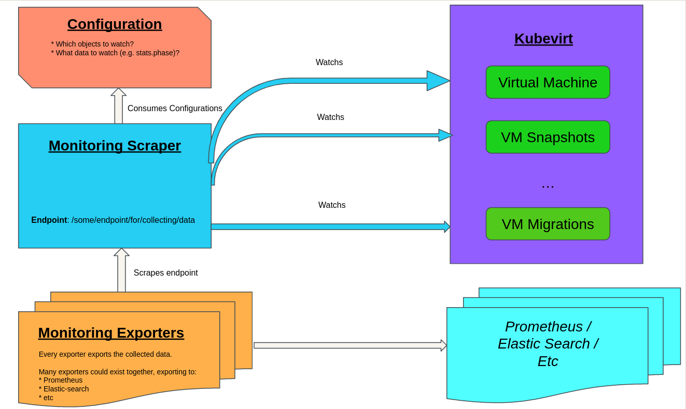

# Overview

Recently there is a lot of ongoing effort to establish a monitoring solution for the Kubevirt organization.
This effort is very important as a good monitoring solution & design directly impacts an operator's quality.
For example, operator framework define the [Operator Capability Levels](https://sdk.operatorframework.io/docs/overview/operator-capabilities/),
as a metric of an operator's maturity. Looking at the current state of Kubevirt, arguably we fill the requirements
of the first 3 levels, which are "Basic install", "Seamless Upgrades" and "Full Lifecycle" management. That said,
we probably have some more work to do in order to become level 4 and 5, which are "Deep insights" and "Auto Pilot".
These two levels are tightly related to our ability to perform monitoring. When we would fulfil level 4 with deep
insights, we would carve the way to being able to auto-config/heal/scale the cluster, therefore becoming an "auto-pilot"
operator.

**TLDR**: I suggest a monitoring approach in which the monitoring entities are **autonomous and external** in terms
of development (a dedicated repository) and deployment (a dedicated controller / operator).

**This design proposal aims to be a high-level design for a general path forward.** In other words, during this design
discussions, I prefer not to dwell on implementation details. Instead, I would like this PR to carve the way for an
agreed upon, very high-level, long-term design. This design will serve as a long-term vision and path forward for our monitoring
efforts. Follow-up design proposals should be created in order to deep-dive into the implementation of the components that
would be agreed upon in this PR.

## Motivation

### Development speed, and the ability to propose new ideas quickly

Monitoring structure aims to be similar across different repositories. Therefore,
there is a major overhead of aligning with different components. For example, let's say that we decide
that similar alerts need to pop up from all of our Kubevirt repos, let's say that it's a `component_X_is_unhealthy`.
In other words, we would have `component_virt_handler_is_unhealthy`, `component_virt_controller_is_unhealthy` etc for
kubevirt/kubevirt, and similar alert for kubevirt/CDI, kubevirt/HCO, etc. This not only causes a burden of implementing
these alerts separately in every repo, but also demands alignment between every different repo. Developers of every
repository can differ on their opinions, leading to a huge effort of aligning between them all. Eventually, this leads
to a situation in which it's very difficult to promote changes and new ideas that require a great amount of discussions
and alignment.

Once we have something like `kubevirt/monitoring` with a completely decoupled and autonomous from the operator, the
need for alignment would be reduced significantly. There will still be a need to agree upon which data the operator
exposes and how, but the monitoring logic itself will be decided in one single place.

### Decoupling monitoring code from operator code

Today, monitoring code resides within the operator's code. This approach has many disadvantages (in addition to the
alignment problem mentioned above).

To begin with, adding monitoring code to the heart of an operator's logic is unscalable from a maintainability perspective.
As times goes on, operators are expected to add more and more metrics and alerts. This can cause a situation in which
the portion of code that's dedicated to monitoring logic becomes too large and visible. As an example, in Kubevirt,
we report to Prometheus about VMs changing phases, starting / ending migrations, etc. That code is coupled to the heart
of our most sensitive logic, making our code less cohesive and more messy.

Moreover, this design significantly increases the development burden when adding / changing monitoring logic. Since the
monitoring code resides at the heart of a sensitive flow, code reviews will have to be strict. Often, people that are
expert on migration flows aren't familiar with monitoring areas and vice-versa. This often leads to a very large development
effort in order to merge new PRs.

### Enhanced security: monitor publicly available data only

Today we don't have a clear definition of which data is private and internal, and which data is public.

Let's take an example: the amount of times that virt-controller had reconciled a VM. Currently, this is a completely
internal data that isn't exposed. On the other hand, monitoring code can report it as metrics to Prometheus. So, is this
public or private data?

Every operator needs to decide which data is exposed and which data is kept private. If the data is exposed then it sould
be available for other automated tools and not be limited to monitoring logic exclusively.

### Becoming more modular and generic - resilient to future changes

Today we base our monitoring efforts exclusively on Prometheus, but what happens if another great tool emerges in the
future? Furthermore, what if we want to combine between different technologies, e.g. export some of our metrics to
Elastic search or any other tool?

We should get to a point in which we decouple scraping data and exporting it to external tools like Prometheus. If
that's the case, we can simply add another "exporter"/"plugin"/"adapter" that would export the same data into a different
target.

## Goals
- A generic and modular monitoring design. That is:
    - It would be easily configurable to support different repositories.
    - The collected data would be easily exported to different monitoring frameworks like Prometheus, Elastic Search, etc.
- An external controller/operator that is completely decoupled from Kubevirt in terms of:
    - Code: this monitoring solution needs to have its own repository outside kubevirt/kubevirt.
    - Data: the tool won't collect internal data, but rather only public data that is exposed publicly on the cluster

## Non Goals
As written above:

**This design proposal aims to be a high-level design for a general path forward.**

In other words, during this design
discussions, I prefer not to dwell on implementation details. Instead, I would like this PR to carve the way for an
agreed upon, very high-level, long-term design. This design will serve as a long-term vision and path forward for our monitoring
efforts. Follow-up design proposals should be created in order to deep-dive into the implementation of the components that
would be agreed upon in this PR.

## Definition of Users
Every operator in the Kubevirt organization, and possibly even other operators.

## User Stories
- As a monitoring developer, I don't want to deep dive into sensitive code of many operators and having to go through
a strict code review in order to add / change monitoring code.
- As an operator (e.g. Kubevirt) developer, I don't want to expose internal data to Prometheus, but rather either
expose data to everyone or keep it private.
- As an operator developer, I want the monitoring code to be decoupled from my operator's code.
- As a monitoring developer, I want to ensure that if a new monitoring tool emerges, I won't have to change my whole
design in order to support it.
- As a monitoring developer, I don't want to align between many different projects and try to convince them to work
by my conventions.

## Repos
All of Kubevirt repos that have monitoring code / that would like to get monitored

# Design
Here's a sketch of the design I have in mind:

Let me elaborate the different component:

## Configuration
The configuration is in charge of defining the following aspects:
* Which Kubernetes objects are being watched?
* What elements (e.g. `status.Phase`) are being watched?
* Which endpoints need to be scraped?
* etc

Generally speaking, operator already expose most of the data that needs to be monitored, especially through regular
Kubernetes structures such as a CR status. Instead of creating a Prometheus query, a configuration source can be used
to declaratively choose what needs to be tracked and how.

But, not all data can be exposed directly to etcd. It makes sense that some data is not suited to reside at etcd,
for examples values that are always changing, like a VM's RAM usage for example. In order to monitor these values,
the operator can choose to expose certain endpoints that would be periodically scraped. This is just an example,
we can think of more ways to expose more data, but the idea is to allow a declarative configuration file to
define everything we need to monitor.

Again - I don't want to get into the concrete implementation at the moment, but this configuration can be implemented
as a config-map, a new CR, or in any different way.

## Scraper

The scraper is the component which actually keeps track and monitors the data configured by the Configuration component
mentioned above. Basically, it will initialize the right informers to look at the defined objects, and will keep the
monitored data somewhere (in-memory? in some PVC? configurable?). Similarly, it will scrape the endpoints as
defined in the Configuration component.

## Exporter (a.k.a "adapter" / "plugin")

This component is responsible for taking the data collected by the scraper, and exporting it into some monitoring tool
like Prometheus. Obviously, we can then create more exporters to export the data into Elastic Search, SQL, files, or
every other customized target.

Exporters are expected to be very thin, and basically serve as an adapter between the raw data collected and another
tool that would consume it. Therefore, it should be relatively easy to add plugins for different usages.

## API Examples
(tangible API examples used for discussion)

## Scalability
In terms of scalability we have much to gain from this approach. Since the monitoring entities would reside in different
pods / deployments / etc, we could scale them separately of all the other components. In other words, we would gain
a separation of concerns, and the scaling decisions for our monitoring components can be decided unrelated to the operator's
components.

## Update/Rollback Compatibility
(does this impact update compatibility and how)

## Functional Testing Approach
(an overview on the approaches used to functional test this design)

# Implementation Phases
- Agree on a general design
- Discuss on the implementation of each component via follow-up design-proposals
