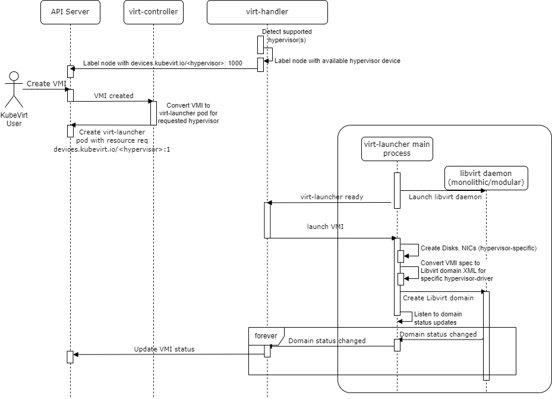

# Overview

This KubeVirt design proposal discusses how KubeVirt can be used to create `libvirt` virtual machines that are backed by diverse hypervisor drivers, such as QEMU/KVM, Xen, VirtualBox, etc. The aim of this proposal is to enumerate the design and implementation choices for enabling this multi-hypervisor support in KubeVirt. 

Although KubeVirt currently relies on libvirt to create and manage virtual machine instances (VMIs), it relies specifically on the QEMU/KVM virtualization stack (VMM and hypervisor) to host the VMI. This limits KubeVirt from being used in settings where a different VMM or hypervisor is used. 

In fact, libvirt itself is flexible enough to support a diverse set of VMMs and hypervisors. The libvirt API delegates its implementation to one or more internal drivers, dependending on the [connection URI](https://libvirt.org/uri.html) passed when initializing the library. The list of currently supported hypervisor drivers in Libvirt are:
- [LXC - Linux Containers](https://libvirt.org/drvlxc.html)
- [OpenVZ](https://libvirt.org/drvopenvz.html)
- [QEMU/KVM/HVF](https://libvirt.org/drvqemu.html)
- [VirtualBox](https://libvirt.org/drvvbox.html)
- [VMware ESX](https://libvirt.org/drvesx.html)
- [VMware Workstation/Player](https://libvirt.org/drvvmware.html)
- [Xen](https://libvirt.org/drvxen.html)
- [Microsoft Hyper-V](https://libvirt.org/drvhyperv.html)
- [Virtuozzo](https://libvirt.org/drvvirtuozzo.html)
- [Bhyve - The BSD Hypervisor](https://libvirt.org/drvbhyve.html)
- [Cloud Hypervisor](https://libvirt.org/drvch.html)

There are several parts in the KubeVirt source-code that hard-code the use of the QEMU/KVM hypervisor driver, which prevents the creation of VMIs using another hypervisor driver. Therefore, KubeVirt needs to be updated to introduce the choice of the backend libvirt hypervisor driver to use for creating a given VMI. This would expand the set of scenarios in which KubeVirt can be used.

## Goals

KubeVirt should be able to offer a choice to its users over which libvirt hypervisor-driver they want to use to create their VMI. The aim is to remove any hard-coded dependency of KubeVirt on qemu-kvm and have it interact solely with libvirt, while still being able to provide the same functionality for qemu-kvm based VMIs.

Additionally, this design proposal intends to provide developers of other hypervisors with a flexible way of onboarding their own hypervisor to KubeVirt.

## Non Goals

Support all libvirt hypervisor-drivers in KubeVirt. As the developers of hypervisor `H` make its libvirt hypervisor-driver stable, they would add functionality to KubeVirt so that it can leverage hypervisor `H` to create VMIs.

## Definition of Users

This proposal is aimed at serving users who intend to use KubeVirt on a cluster where at least one node has a virtualization stack different from the default QEMU-KVM stack.

## User Stories

- A user trying to use KubeVirt on a cluster of machines that have a hypervisor-VMM pair that is not necessarily QEMU/KVM.
- A regular user of libvirt with any of its supported hypervisor drivers who now wants to leverage the orchestration capability provided by KubeVirt. But the user does not want to abandon their hypervisor driver of choice.
- A regular user of a hypervisor-VMM-specific orchestration capability to expand their use to a cluster with a diverse set of hypervisor-VMM pairs.

## Repos

- KubeVirt
- Libvirt

# Design

## API Changes

Addition of a `vmi.hypervisor` field. Example of how a user could request a specific hypervisor as the underlying libvirt hypervisor-driver through the VMI spec:

```yaml
spec:
  hypervisor: cloud-hypervisor
```

- Introduction of a new field `hypervisor` in `VirtualMachineInstanceSpec`
- By default if no `hypervisor` is provided, it would default to `qemu-kvm`.
- The set of acceptable values for the `hypervisor` field would be the set of all hypervisor-drivers that libvirt supports.

### Supported feature check

Maintain a list of which VMI features are supported by different hypervisor-drivers. If the KubeVirt API user requests a feature for a VMI that is not supported by the requested hypervisor-driver, then the request for creation of VMI should be rejected.


## Generalization of KubeVirt components

### VMI spec to virt-launcher pod spec by Virt-Controller

Conversion of the VMI spec to `virt-launcher` pod spec needs to take into account the `vmi.hypervisor` field. The value of this field would affect the following:

- `virt-launcher` pod image should be specific to the `vmi.hypervisor`.

- Hypervisor resource needed by the `virt-launcher` pod. For instance, for a VMI with `hypervisor=qemu-kvm`, the corresponding virt-launcher pod requires the resource `devices.kubevirt.io/kvm: 1`.

- The resource requirement of the virt-launcher pod should be adjusted (w.r.t. to the resource spec of the VMI), to take into account the resources consumed by the requested VMM daemon running in the `virt-launcher` pod. Currently, the field `VirtqemudOverhead` holds the memory overhead of the `virtqemud` process.

### Virt-Handler

- Label each node based on which hypervisor devices (e.g., `/dev/kvm` or `/dev/mshv`) are available, e.g., `devices.kubevirt.io/kvm: 1000`.

### Virt-Launcher

- Launch the libvirt modular daemon (e.g., `virtqemud`, `virtxend`) if available for the `vmi.hypervisor` choice, otherwise launch the monolithic libvirtd daemon.

- Libvirt connection URI is hypervisor-driver specific.

- Creation of auxilliary resources for the libvirt domain, such as the cloud-init disk needs to be done in a hypervisor-specific way. For instance, the `cloud-hypervisor` VMM does not support ISOs - in which case cloud-init needs to be provided as a `raw` disk. 

- Conversion of VMI spec to libvirt domain XML needs to be hypervisor-driver specific. E.g., `cloud-hypervisor` does not support ISOs. Therefore, `cloud-init` needs to be provided as a `raw` disk.

### VMI flow

The flow of a VMI lifecycle would remain the same as before, with the addition of hypervisor-specific logic at virt-controller, virt-handler and virt-launcher.




## Hypervisor-agnostic Function Interface

To allow the easy incorporation of future hypervisors, the hypervisor-specific logic in KubeVirt's components (such as the ones enumerated above) need to be abstracted out in one or more interfaces. The developers working to enable a given hypervisor `H` in KubeVirt should implement the hypervisor-specific functionality for their `H`. 

### LibvirtWrapper interface

This interface encapsulates the logic for setting up and launching the hypervisor daemon (e.g., virtqemud or libvirtd)

```go
// This interface exposes functions used by virt-launcher to start and configure libvirt. The implementation varies for different hypervisors.
type LibvirtWrapper interface {
	// Setup libvirt for hosting the virtual machine. This function is called during the startup of the virt-launcher.
	SetupLibvirt(customLogFilters *string) (err error)
	// Return a list of potential prefixes of the specific hypervisor's process, e.g., qemu-system or cloud-hypervisor
	GetHypervisorCommandPrefix() []string
	// Start the libvirt daemon, either in modular mode or monolithic mode
	StartHypervisorDaemon(stopChan chan struct{})
	// Start the virtlogd daemon, which is used to capture logs from the hypervisor
	StartVirtlog(stopChan chan struct{}, domainName string)
	// Returns true if the libvirt process(es) should be run as root user
	root() bool
	// Return the URI to connect to libvirt and the user with which to connect to libvirt
	GetLibvirtUriAndUser() (string, string)
	// Return the directory where libvirt stores the PID files of the hypervisor processes
	GetPidDir() string
}
```

### Hypervisor interface

This interface provides static information for tuning the `virt-launcher` pod's specification, conversion of VMI to Libvirt domain XML and tuning resource-limits of `virt-launcher` pod's processes from `virt-handler`.

```go
// Hypervisor interface defines functions needed to tune the virt-launcher pod spec and the libvirt domain XML for a specific hypervisor
type Hypervisor interface {
	// The `ps` RSS for virt-launcher-monitor
	GetVirtLauncherMonitorOverhead() string
	// The `ps` RSS for the virt-launcher process
	GetVirtLauncherOverhead() string
	// The `ps` RSS for virtlogd
	GetVirtlogdOverhead() string
	// The `ps` RSS for hypervisor daemon, e.g., virtqemud or libvirtd
	GetHypervisorDaemonOverhead() string
	// The `ps` RSS for vmm, minus the RAM of its (stressed) guest, minus the virtual page table
	GetHypervisorOverhead() string
	// Return true if the hypervisor supports ISO files
	SupportsIso() bool
	// Return the K8s device name that should be exposed for the hypervisor,
	// e.g., devices.kubevirt.io/kvm for QEMU and devices.kubevirt.io/mshv for Cloud Hypervisor
	GetHypervisorDevice() string
	// Return true if the virt-launcher container should run privileged
	ShouldRunPrivileged() bool
	// Return a regex that matches the thread comm value for vCPUs
	GetVcpuRegex() *regexp.Regexp
	// Return the path to the libvirt connection socket file on the virt-launcher pod
	GetLibvirtSocketPath() string
	// Get the disk driver to be used for the hypervisor
	GetDiskDriver() string
	// Return true if the hypervisor requires boot order
	RequiresBootOrder() bool
	// Return true if the hypervisor supports memory ballooning
	SupportsMemoryBallooning() bool
}
```

## Functional Testing Approach

The very first hypervisor to be supported would be `qemu-kvm`. The preliminary testing goal would be to verify that all KubeVirt tests pass with `vmi.hypervisor=qemu-kvm`. Tests need to be updated to ensure that the created VMI uses the specified `vmi.hypervisor`.

As future hypervisors are integrated into KubeVirt, their developers would need to ensure that all KubeVirt tests pass while using their hypervisor-driver.

Developers of other hypervisors would have to ensure that their `libvirt` driver is stable before attempting to integrate it with Kubevirt. Once they are satisfied with their libvirt driver, they will implement the hypervisor-agnostic interface above and use it in the different KubeVirt components. 

## Backward Compatibility

### Legacy VM's lifecycle on upgraded KubeVirt

The proposed design would ensure that the Libvirt XML generated for a new VMI with `hypervisor=qemu-kvm` would be identical to the one generated by legacy KubeVirt (before the proposed change). Therefore, the lifecycle of a legacy VM will not be affected by the proposed change.

# Implementation Phases

- Extension of KubeVirt API to include `vmi.hypervisor` field.

- Creation of virt-launcher images for the supported libvirt hypervisor-drivers.
    - Test these images independently of being able to spin-up pods and launch libvirt domains, similar to what would be done in a typical KubeVirt VMI creation flow.

- Refactoring of virt-controller code to create virt-launcher pod with the correct hypervisor driver. Hypervisor-specific logic needs to be encapsulated into functions and added to the hypervisor-agnostic interface.

- Refactoring virt-handler code to remove hardcoded references to `qemu/kvm` and generalize the code to handle multiple hypervisor-drivers. Hypervisor-specific logic needs to be encapsulated into functions and added to the hypervisor-agnostic interface.

- Refactoring of virt-launcher code to make it hypervisor-agnostic. Hypervisor-specific logic needs to be encapsulated into functions and added to the hypervisor-agnostic interface.

# References

1. [Cloud Hypervisor integration - Google Groups](https://groups.google.com/g/kubevirt-dev/c/Pt9CDYJOR2A)
2. [[RFC] Cloud Hypervisor integration POC](https://github.com/kubevirt/kubevirt/pull/8056)
3. [design-proposals: Cloud Hypervisor integration](https://github.com/kubevirt/community/pull/184)