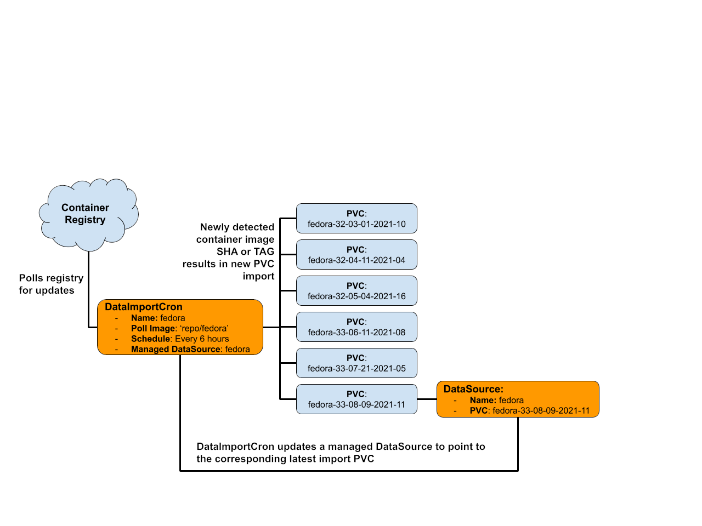
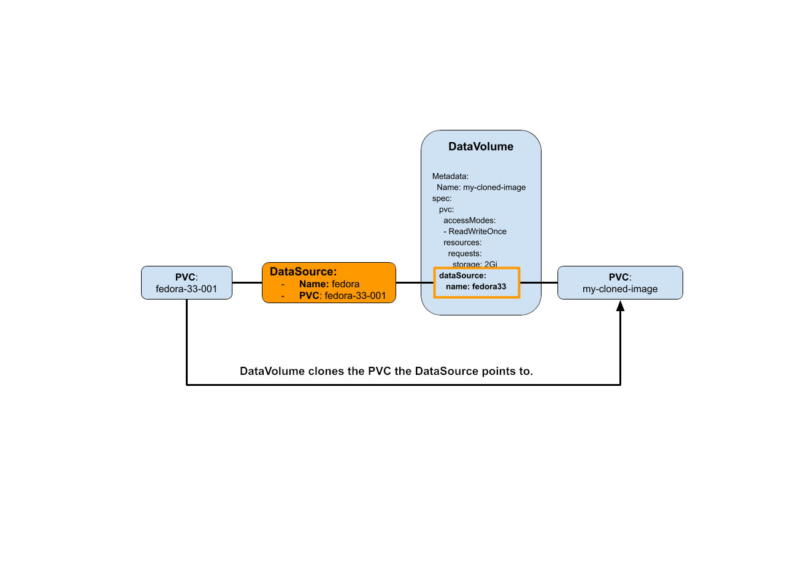
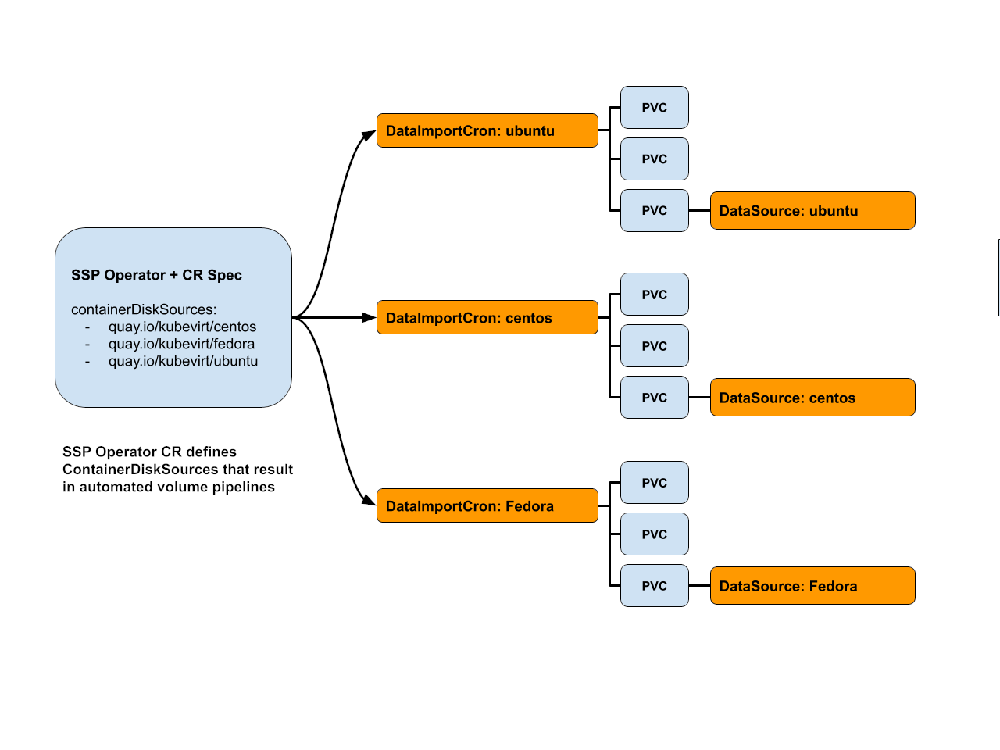

# Overview
This design provides an approach for automating golden disk image importing and keeping golden disk images up-to-date. The design also outlines how to integrate with this automation across the KubeVirt ecosystem including install (HCO+SSP), the OCP UI, and Helm/OCP VM templates.

## Motivation
Iaas platforms (like AWS and GCP) provide root disk images for commonly used operating systems as well as continually providing updated versions of those images. By making commonly used disk images both automatically available and automatically up-to-date, this lowers the friction involved with using their platform.

To close this usability gap between Iaas platforms and KubeVirt, the KubeVirt ecosystem should provide the tools necessary for supporting a similar pattern of disk image availability within the cluster.

## Terms

* Golden Disk Image: an immutable disk image stored in a PVC that can be cloned by a VM to be used as it's root OS image. Functionly, this concept is similar to an AWS AMI.
* Golden Disk Image Namespace: A namespace that specifically exists to host golden disk image PVCs. VMs can use CDI to cross namespace clone PVCs from this golden disk image namespace anywhere else in the cluster.

## Goals

* Pipeline capable of importing and keeping golden images up-to-date
* Zero operational downtime during disk updates
* No mutating existing PVCs during the import/update flow
* Compatible with DataVolumes
* Compatible with Templates (meaning helm and ocp templates)
* Transitions seamlessly with PVC Volume Populators in the future

## Non Goals

* Not a pipeline for updating disks attached to existing VMs

## User Stories

* As a vendor/distributor of OS images, I would like the most fresh version of my OS to reach the KubeVirt clusters that want it.
* As a user creating VMs, I want commonly used operating system disk images to automatically be made available to me without requiring uploading and managing my own os boot disk images.
* As a user creating VMs from a template, I want to be able to stamp out a new VM from a template which will always use the latest operating system version available.
* As a cluster admin managing VM images, I want the ability to automate sourcing in operating system disk image updates and make them available to users. This should come complete with monitoring and alerts to notify me if the automation fails.

## Repos

* **CDI**: Provides API (DataSource) to act as a mutable symbolic link to a PVC that can be referenced in a DataVolume. 
* **CDI**: Provides API (DataImportCron) to handle recurring polling/importing disk images as PVCs into a golden image namespace using the CDI import flows
* **SSP**: Manages setting up DataImportCrons objects with containerDisk image sources for commonly supported operating systems. Adds monitoring and alerting for pipeline failures.
* **Common Templates**: Transitions to use CDI’s DataSource as DataVolumeTemplate source which ensures templates always reference the most up-to-date operating system disk images.
* **HCO**: Pass in golden image container registries to ssp operator in order to setup automation import pipeline.
* **OCP UI**: Needs to ensure DataSource is linked properly to a PVC in order to determine whether the boot image for a common template is available. 


# Design



A **DataImportCron** object results in its corresponding controller polling for updates to a container image on a recurring interval. When updates to a container image are detected, the DataImportCron will automatically import the contents into a new PVC (using the standard CDI import flows) residing in a specific namespace with a unique name. The DataImportCron may need to implement a PVC garbage collection policy for removing outdated PVCs after an expiration period has been exceeded.

A **DataSource** object references an import/clone source for a PVC. Functionally, it is similar to the 'source' field of a DataVolume. The DataSource’s spec is mutable, which has the side effect of allowing the DataSource to act as a link that will redirect to whatever source the link currently points to. In the future, the DataSource will act as a PVC Populator as well as a DataVolume source.

**DataImportCron can manage a corresponding DataSource** to always point to the latest most up-to-date PVC that the cron has created. The DataImportCron should also be capable of adopting and taking ownership of an existing DataSource in order to statisfy the condition where an admin wishs to opt-in to using auto delivery/updates later on.


## CDI: DataVolume DataSource Source Field

The DataVolume object will add a new field capable of importing pvc content using a DataSource. 



## SSP: Setup DataImportCrons for common templates

Since the SSP operator manages installing common templates, this operator should also be responsible for setting up the DataImportCrons used to automatically source the disk images into the cluster that the common templates use.

The location the DataImportCrons pull from will be configurable on the SSP operators Custom Resource.



## Common templates: DataSources as DataVolume Source

The common templates shipped with SSP need to have their DataVolumeTemplate sections transition to using a DataSource rather than the inlined PVC source field. This allows the DataImportCron to seamlessly update the underlying PVC the corresponding DataSource points to, which then ensures that the common templates are always using the most up-to-date disk images.

## HCO: Integration with SSP Operator

During installation, the HCO bundle's CSV will pass into the HCO operator (as ENV VARs) locations where disk images are sourced from for the automated disk image delivery/update feature. The end user can opt-in to automatic delivery/updates of these image sources through a tuning on the HCO's CR. From there the HCO is responsible for configuring DataImportCrons on the SSP operator's CR.

This document doesn't include within it's scope how the HCO should expose this feature to the end user. The general expectation is that we will start with a simple tuning that enables toggling automated delivery/updates on and then consider advanced tunings in future releases. The exact structure of where this tuning belongs on the HCO API is left up to the HCO community.

## HCO Disconnected Environments

For the initial feature set, the HCO will not target enabling automated disk delivery/updates for disconnected environments.

Admins in disconnected environments have the option to create their own DataSourceCrons to automate importing disk images from a local container registery if they so choose. 

## OCP UI: Integration with DataSources

The UI currently detects if a template has a boot source by checking if the DataVolumeTemplate’s source PVC is present. The UI needs to now be capable of checking if a DataVolumeTemplate’s DataSource has the a ready condition equal to 'true'.

## Scalability

- DataImportCrons have the potential to exhaust storage resources. This can be mitigated through a garbage collection policy for out-of-date disk volumes. 
- A large amount of DataImportCrons triggering at the exact same interval could impact network resources during the import. This can be mitigated by introducing a jitter factor into the recurring poll interval.

## Update/Rollback Compatibility

### Transitioning the CommonTemplates to DataSources

SSP operator must make image pipelines an opt-in feature to ensure existing boot images are not overwritten.

To handle the default (non auto update/delivery) use case during update, the SSP operator will create corresponding DataSources for every DataSource referenced in the DataVolumeTemplate sections present in the deployed common templates. These default DataSources will point to a PVC name that matches the PVC name used before DataSources were introduced into the common templates.

Here's an example of how this works.

**Before Update:** If the common templates had a DataVolumeTemplate that looked like the following before DataSources were introduced.
```yaml
dataVolumeTemplates:
- apiVersion: cdi.kubevirt.io/v1beta1
  kind: DataVolume
  metadata:
    name: fedora
  spec:
    pvc:
      accessModes:
        - ReadWriteMany
      resources:
        requests:
          storage: 30Gi
    source:
      pvc:
        name: fedora
        namespace: golden-images
```


**After Update:** The common template would have a DataVolumeTemplate that looks like the following after the update
```yaml
dataVolumeTemplates:
- apiVersion: cdi.kubevirt.io/v1beta1
  kind: DataVolume
  metadata:
    name: fedora
  spec:
    pvc:
      accessModes:
        - ReadWriteMany
      resources:
        requests:
          storage: 30Gi
    sourceRef:
      kind: DataSource
      name: fedora
      namespace: golden-images

```

**After Update:** And the SSP Operator would create a DataSource that pointed to the old PVC location previously referenced before the update.
```yaml
apiVersion: cdi.kubevirt.io/v1beta1
kind: DataSource
metadata:
  name: fedora
spec:
  source:
    pvc:
      name: fedora
      namespace: golden-images
```

### Transitioning OCP UI to use DataSources

To maintain compatiblity, the UI must be capable of detecting boot sources for DataVolumeTemplates with both inlined sources and DataSources.

This means if a template references a PVC directly within the DataVolumeTemplates, then the UI should maintain the existing behavior of being able to display that the boot source is available if the PVC exists. In addition to this, if a template references a DataSource within the DataVolumeTemplates, the UI must be able to display the boot source is available if the DataSource exists and has the ready condition set to true.


### DataSource OwnerReference Behavior

When the SSP operator is involved, both the DataImportCron and SSP operator are owners of the same DataSources. This ensures that when the SSP operator creates a DataSource which is later adopted by a DataImportCron, that the DataSource won't get garbage collected until both the DataImportCron and SSP CR are deleted.

For this to work one simple rule must be followed, only the original creator of the DataSource should set the `controller: true` value on the owner reference. This means if the SSP operator creates a DataSource, it needs to set `controller: true` on the corresponding OwnerReference and that any DataImportCron adopting that DataSource should add its owner reference with `controller: false`. Likewise, if the DataImportCron creates a DataSource, then it should set `controller: true` on the owner reference and any other object claiming ownership needs to set `controller: false`

Here's an example of what the DataSource's ownerReference list might look like when the SSP operator creates the DataSource and the DataImportCron adopts the same DataSource.

```yaml
  ownerReferences:
   - apiVersion: ssp.kubevirt.io/v1beta1
     controller: true
     blockOwnerDeletion: false
     kind: SSP
     name: ssp-cr
     uid: e0c84798-986e-437e-835b-840da938e3f7
   - apiVersion: cdi.kubevirt.io/v1beta1
     controller: false
     blockOwnerDeletion: false
     kind: DataImportCron
     name: fedora
     uid: dc4caedd-bd0e-4af0-99ef-a146cfb19699
```

## Implementation Phases

**Phase1** - CDI APIs
* DataSource API/controller
* DataImportCron API/controller

**Phase2** - SSP + Common Templates
* Common Templates transition to DataSources for DataVolumeTemplate source
* SSP Operator creates DataImportCrons for automatic PVC import

**Phase3** - HCO and UI
* HCO Team integrates with SSP Operator’s API for setting volume import sources
* UI Team transitions to detecting boot source using a linked DataSource rather than looking directly for a PVC of a specific name.

# API Examples
## VM + DataVolumeTemplate + DataSource as source

```yaml
apiVersion: cdi.kubevirt.io/v1beta1
kind: DataVolume
metadata:
   name: my-fedora-vm-image
spec:
  pvc:
    accessModes:
    - ReadWriteOnce
    resources:
      requests:
        storage: 2Gi
  sourceRef:
    kind: DataSource
    name: fedora
    namespace: golden-images 
```

## DataImportCron Example

This example polls for image tags for the quay.io/kubevirt/fedora image and imports the latest image sorting tags based on semver. As new tags are introduced, the DataImportCron will import them as new PVCs and automatically manage updating the corresponding DataSource.

* **source** specifies where to poll from
* **managedDataSource** specifies the name of the corresponding DataSource this cron will manage. The controller should create this DataSource if it doesn't exist, and adopt ownership of the DataSource if it does already exist.
* **schedule** specifies in cron format when and how often to look for new imports 
* **garbageCollectOutdated** specifies whether old PVCs should be cleaned up after a new PVC is imported.

On the status we have information pertaining to when the last imports occurred as well as conditions to indicate if the most recent import is successful or not.

* **conditions** Indicate if the DataSource is up-to-date (UpToDate) and whether the cron is currently in the process of importing (Progressing)

```yaml
apiVersion: cdi.kubevirt.io/v1beta1
kind: DataImportCron
metadata:
  name: fedora-image-import-cron
  namespace: golden-images
spec:
  source:
    registry:
      url: docker://quay.io/kubevirt/fedora
  schedule: "0 */12 * * *"
  garbageCollectOutdated: true
  managedDataSource: fedora
status:
  lastImportedPVC: fedora-v33
  lastExecutionTimestamp: "01:01:01"
  lastImport: "01:01:01"
  conditions:
  - status: "False"
    message: "Unable to reach docker://quay.io/kubevirt/fedora"
    type: UpToDate
  - status: "False"
    message: "No import job in progress."
    type: Progressing
```

## DataSource Example

This example shows how a DataSource uses a ready condition to indicate that the corresponding pvc exists and is populated. 

The UI can use the ready condition to determine if a boot source exists for a DataSource or not. 

```yaml
apiVersion: cdi.kubevirt.io/v1beta1
kind: DataSource
metadata:
  name: fedora
spec:
  source:
    pvc:
      namespace: golden-images 
      name: fedora-32-001
status:
  conditions:
  - status: "True"
    type: Ready

```

## SSP Operator CR Example

This example shows how the SSP operator could expose opting into automatic image delivery and updates for images associated with their common templates. 

By default, the ssp operator would simply create dangling DataSources to match the PVC sources used in the DataVolumeTemplates in the common templates. Users would import their own disks which would automatically bind to the dangling DataSources and make them linked (reflected by ready condition set to true) to a PVC. This matches the behavior that exists today.

By specifying a DataImportCron on the SSP CR, one can opt-in to having DataSources automatically linked to imported PVCs and have that linkage update as new versions of the corresponding image are imported.

```yaml
apiVersion: ssp.kubevirt.io/v1beta1
kind: SSP
metadata:
  name: ssp-cr
spec: 
  DataImportCronTemplates:
  - metadata:
      name: fedora-image-cron
      namespace: golden-image-namespace
    spec:
      source:
        registry:
          url: docker://quay.io/kubevirt/fedora
      managedDataSource: fedora
  - metadata:
      name: centos8-image-cron
      namespace: golden-image-namespace
    spec:
      source:
        registry:
          url: docker://quay.io/kubevirt/centos8
      managedDataSource: centos8
```

