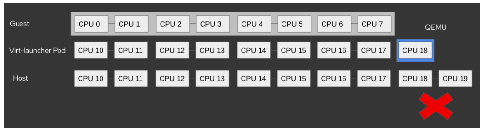

# Preface
High performance VMs, such as VMs using [DPDK](https://en.wikipedia.org/wiki/Data_Plane_Development_Kit) or [realtime](https://en.wikipedia.org/wiki/Real-time_computing) applications are sensitive to interference from neighboring workloads.
In order to avoid noisy CPU neighbors, such VMs need to use the [dedicatedCPUPlacement and IsolateEmulatorThread](https://kubevirt.io/user-guide/virtual_machines/dedicated_cpu_resources/#requesting-dedicated-cpu-for-qemu-emulator) features, along with other custom cluster configuration.
One of these cluster changes is to set the Kubelet’s CPUManager Policy to static - [full-pcpus-only](https://kubernetes.io/docs/tasks/administer-cluster/cpu-management-policies/). This forces kubelet to only accept Pods that will occupy full physical cores.

However, on nodes with [hyperthreading](https://en.wikipedia.org/wiki/Hyper-threading) (SMT) enabled, this causes an error, described on [BZ#2228103](https://bugzilla.redhat.com/show_bug.cgi?id=2228103).
This design proposal is meant to fix this issue.

Considering that hyperthreading (SMT) is enabled by default in many [Intel](https://www.intel.com/content/www/us/en/architecture-and-technology/hyper-threading/hyper-threading-technology.html) processors - it means that DPDK and Realtime users may be impacted.

## Motivation
Running High performance VMs with an even number of CPUs with the conditions below.

### The problem
In order to replicate this issue, the following conditions must be met:
* The node has hyperthreading (SMT) enabled.
* Kubelet’s CPUManager is set to static - full-pcpus-only.
* Kubevirt CR's defaultRuntimeClass is set to a high performance runtimeClass.
* VM is set with `dedicatedCPUPlacement` and `IsolateEmulatorThread` enabled.
* VM requests an even number of CPUs.

When enabling `IsolateEmulatorThread` on a VM with even CPU count, Kubevirt is requesting one extra CPU for the virt-launcher pod. This is an internal change that is not exposed to the user.
After the pod is scheduled, the now odd number of CPUs will collide with the CPU-Manager policy of using only full physical cores, and cause the kubelet to [reject](https://github.com/kubernetes/kubernetes/pull/101432) this pod.
For example, let’s consider this VM spec:
```
apiVersion: kubevirt.io/v1
kind: VirtualMachine
spec:
  running: true
  template:
    spec:
      domain:
        cpu:
          dedicatedCpuPlacement: true
          isolateEmulatorThread: true
          sockets: 1
          cores: 4
          threads: 2
```
kubelet will emit following event:
```
SMT Alignment Error: requested 9 cpus not multiple cpus per core = 2
```
The following picture helps show how this is a problem


## Goals
Fix [BZ#2228103](https://bugzilla.redhat.com/show_bug.cgi?id=2228103) on the Kubevirt scope.

## Non Goals
Set the virt-launcher Pod scheduling to match a node with SMT aligned to its request.

## Definition of Users
This bug addresses all KubeVirt users running VMs with isolateEmulatorThread and dedicatedCpuPlacement on nodes with hyperthreading enabled - specifically DPDK and Realtime users.

## User Stories
* As a cluster admin, I want to enable VMs with an even number of CPUs, `dedicatedCpuPlacement` and `isolatedEmulatorThread` enabled to run on my cluster by setting a cluster-wide knob on HCO.
* As a Kubevirt VM owner, I should be able to run VM with isolateEmulatorThread and dedicatedCpuPlacement enabled on a node with hyperthreading enabled, regardless of the amount of guest CPUs requested.

## Repos
- [kubevirt/kubevirt](https://github.com/kubevirt/kubevirt)
- [kubevirt/hyperconverged-cluster-operator](https://github.com/kubevirt/hyperconverged-cluster-operator)

# Bug fix design proposal
The bug fix proposal introduces an alpha annotation to the kubevirt CR: `alpha.kubevirt.io/EmulatorThreadCompleteToEvenParity`:
```
apiVersion: kubevirt.io/v1
kind: KubeVirt
metadata:
  annotations:
    alpha.kubevirt.io/EmulatorThreadCompleteToEvenParity:
spec:
  configuration:
    developerConfiguration:
      featureGates:
      - AlignCPUs
```
This annotation will be respected only when the `AlignCPUs` featureGate is enabled.

## Virt-API:

### VMI mutator webhook
When the following conditions are met:
1. The feature gate is enabled on the Kubevirt CR
2. Kubevirt CR has the annotation.
3. VMI is configured with `isolateEmulatorThread: true` and `dedicatedCpuPlacement: true`

then the VMI mutator webhook will copy the annotation from the kubevirt CR to the VMI annotations. This is done in order to pass the information between the virt-controller, virt-handler and virt-launcher, without changing the API between the virt-handler and the virt-launcher.

## Virt-controller:
When the following conditions are met:
1. VMI is configured with `isolateEmulatorThread: true` and `dedicatedCpuPlacement: true`
2. VMI has the annotation.

then virt-controller will set the virt-launcher pod with an even amount of CPUs, meaning:

| User requested CPUs               |Even (2,4,6,8,...)| odd (1,3,4,5,7,9,...) | Notes                                                                        |
|-----------------------------------|------------------|-----------------------|------------------------------------------------------------------------------|
| Extra emulatorThread CPUs for pod |        +2        | +1 (as usual)         | * In both scenarios the guest will get the same amount of vCPUs it requested |

## Virt-launcher:
When the following conditions are met:
1. VMI is configured with `isolateEmulatorThread: true` and `dedicatedCpuPlacement: true`
2. VMI has the annotation.

virt-launcher pod will then assign the emulator Threads (one or two, depending on the User requested CPUs as shown in the table above) to the domain's emulatorThreadPin.

## Virt-handler:
After virt-launcher set the emulatorThreadPin, the virt-handler will then set the emulator Threads from the emulatorThreadPin to the housekeeping cgroup.

Pros:
* Cleaner user experience for the VM owner. No prior knowledge of CPUs added behind the scene is needed.
* VM configuration is less complex.
* As this is an alpha annotation, it can be removed/ignored when and if solutions inside/outside Kubevirt such as CPU Manager handles the situation differently.

Cons:
* Setting an annotation in kubevirt CR is unconventional. 
* A cluster-wide configuration such as this may be CPU-wasteful for heterogeneous clusters, where node-level granularity is needed.

# Fix Alternatives
## Alternative #1 Adding `EmulatorThreadCompleteToEvenParity` annotation per VMI
Another way to do it is by adding the annotation on the VMI:
```
apiVersion: kubevirt.io/v1
kind: VirtualMachine
spec:
  running: true
  template:
    metadata:
      annotations:
        alpha.kubevirt.io/EmulatorThreadCompleteToEvenParity:
    spec:
      domain:
        cpu:
          dedicatedCpuPlacement: true
          isolateEmulatorThread: true
          sockets: 1
          cores: 4
          threads: 2
```
This is the same behavior as the selected proposal, without the automatic annotation that is done by the VMI mutator.
As opposed to the suggested solution where the cluster admin needs to add this annotation once on the kubevirt CR, it is possible to make this behavior VMI specific. This would make it possible for owners of VM with even-numbered CPU, to run them on non-homogeneous clusters without wasting one CPU per VM.
Usage of the annotation will be behind the feature-gate.

Pros:
* Matches the current crio convention of adding annotations in order to get high-performance pods, like `cpu-load-balancing.crio.io: disable`
* Reduces the “wasted” CPUs to minimum possible per scenario, i.e. only for VMs that specifically add this annotation, and only when they ask for even CPUs.

Cons:
* We’re adding yet another semi alpha knob to an already complicated set of knobs that each VM owner needs to be aware of.

## Alternative #2 Configure both pod and Guest
It is possible to use both the current Guest API and the old yet existing pod API, like so:
```
apiVersion: kubevirt.io/v1
kind: VirtualMachine
spec:
  running: true
  template:
    spec:
      domain:
        resources:
          requests:
            cpu: '10'
          limits:
            cpu: '10'
        cpu:
          cores: 4
          sockets: 1
          threads: 2
          dedicatedCpuPlacement: true
          isolateEmulatorThread: true
```
In order to do that the current validating webhooks regarding dedicatedCpuPlacement and IsolatedEmulatorThread will have to be loosened.

Pros:
* This option does not introduce any alpha knobs.

Cons:
* This option exposes the user to unnecessary implementation details and possible waste of physical CPUs. They have to do things manually, opening the door for misuse.
* Implementation difficulty: KubeVirt will need to adjust internal assumptions that are based on the fact that VMs {req, limits}.cpu = vCPUs. Specifically, how the housekeeping cgroup is being formed, but possibly other aspects.

## Scalability
The solution proposed is “wasting” one unused CPU for the purpose of maintaining SMT alignment.

## Update/Rollback Compatibility
Since the annotation is not an API change, it is backportable.
When a better solution is possible, Kubevirt can simply replace the annotation support with a better approach, thus not making the change relatively seamless for the client. 

## Functional Testing Approach
Will add unit tests to `renderresources_test.go` to check extra housekeeping logic, and in `templates.go` to check the virt-launcher pod spec output.

# Implementation Phases
## Phase 1: Align CPU to SMT requirements when feature gate is enabled and annotation is set on the VMI.
* Virt-config:
  * Add support for the new feature gate: `AlignCPUs`.
* Virt-API:
  * Add support for the new alpha annotation `alpha.kubevirt.io/EmulatorThreadCompleteToEvenParity:`.
  * in case annotation is set on kubevirt CR, the feature gate is enabled and the isolateEmulatorThread is enabled:
    * the VMI mutator webhook will copy the kubevirt CR annotation to the VMI annotations.
  * in case the VMI has the annotation and the feature gate is disabled:
    * the VMI creation will be blocked. 
* Virt-controller:
  * in case isolateEmulatorThread is enabled and the annotation is set on the VMI:
    * Add logic to Align the total number of CPUs to be even.
## Phase 2: Adjust housekeeping cgroup to use the extra CPU added by the alignment, if such a one is available.
* Virt-launcher:
  * in case isolateEmulatorThread is enabled and the annotation is set on the VMI
    * Fit two threads to the housekeeping cgroup (one or two, depending on the User requested CPUs as shown in the table above).
* Virt-handler:
  * Update code to allow accepting as housekeeping CPUSet of >1 CPUs.
## Phase 3: Add a knob on HCO CR to enable EmulatorThreadCompleteToEvenParity behavior on kubevirt.
* setting it to enabled will set the feature gate on kubevirt.
* Default value must stay disabled.
