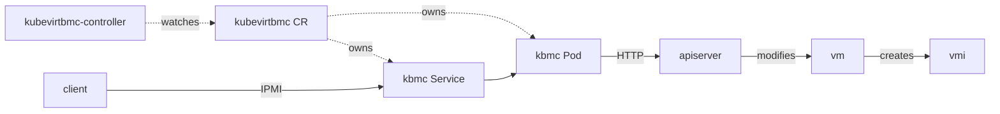

# Overview

This proposal introduces [KubeVirtBMC](https://github.com/starbops/kubebmc), a BMC emulator for Kubernetes that facilitates the deployment of software/applications/platforms such as OpenShift and OpenStack - whose installers typically require communication with bare-metal out-of-band management protocols like IPMI and Redfish - in KubeVirt VMs for development, testing, and debugging purposes, similar to the functionality provided by [VirtualBMC](https://opendev.org/openstack/virtualbmc) and [sushy-emulator](https://opendev.org/openstack/sushy-tools) but within a Kubernetes context.

## Motivation

Developers require the ability to deploy applications or systems in local virtual environments like bare-metal ones. Existing solutions involve libvirt domains or QEMU VMs with BMC emulators, which are not directly compatible with KubeVirt due to its internal use of [`virtqemud`](https://libvirt.org/manpages/virtqemud.html), necessitating a Kubernetes-native solution. This was initially raised in the GitHub issue: [Expose a virtual BMC service per virtual machine, for IPMI and/or Redfish actions · Issue #9108 · kubevirt/kubevirt](https://github.com/kubevirt/kubevirt/issues/9108).

## Goals

- Provide essential BMC functionalities such as (rebooting, changing boot devices, and mounting virtual media) via IPMI and Redfish protocols against VMs backed by KubeVirt
- Expose service endpoints for clients to access either in-cluster or externally
- Enable deployment tools, e.g. [Metal3](https://metal3.io/), [Tinkerbell](https://tinkerbell.org/), [Bifrost](https://opendev.org/openstack/bifrost/), etc., to install software on VMs without adapting to the virtual environment by modifying their source code

## Non Goals

- Providing BMC functionalities for bare-metal machines

## Definition of Users

- Users who want to do out-of-band management to the VMs within a KubeVirt environment directly using bare-metal-like methods, e.g., IPMI or Redfish
- Users who want to install software like OpenShift or OpenStack on VMs locally within a KubeVirt environment using existing deployment tools

## User Stories

- As a developer, I want to deploy a multi-node OpenShift cluster using its native installer in KubeVirt VMs.
- As a tester, I need to quickly spin up and destroy OpenStack clusters in a virtual environment for testing purposes.

## Repos

No existing repos under the KubeVirt organization will be impacted. KubeVirtBMC, proposed to be a new project under the KubeVirt organization, augments the KubeVirt ecosystem as an optional add-on providing an operator and the emulated BMC implementation.

# Design

KubeVirtBMC will act as a bridge between KubeVirt VMs and the BMC functionalities, using Kubernetes services to expose these capabilities. KubeVirtBMC consists of two components:

- **virt-bmc-controller**: A typical Kubernetes controller reconciles the VirtualMachineBMC, VirtualMachine, and Service objects
- **virt-bmc**: A BMC simulator for serving IPMI and Redfish endpoints and translating the incoming requests to native KubeVirt API calls

By manually creating the VirtualMachineBMC object, the `virt-bmc-controller` will watch and reconcile it to complete the BMC scaffold. This includes a BMC emulator Pod, i.e., `virt-bmc`, and its Service object working together to provide the BMC functionalities to various clients over the network. In addition, KubeVirtBMC could be configured to auto-create VirtualMachineBMC objects every time a new VirtualMachine is created.

Inside the BMC emulator, the IPMI/Redfish requests are translated to native KubeVirt API calls and sent to the API server. It's essentially a combination of IPMI/HTTP server and Kubernetes/KubeVirt client.

The following graph illustrates the entire KubeVirtBMC workflow:



## API Examples

The proposed VirtualMachineBMC CRD looks like the following:

```yaml
kind: VirtualMachineBMC
metadata:
  name: openshift-cluster-node-0
spec:
  # A Secret object reference for the IPMI/Redfish authentication.
  # It should contain a pair of username and password.
  authSecret:
    namespace: default
    name: bmc-cred
  # The VM this emulated BMC manages
  virtualMachine:
    namespace: default
    name: openshift-cluster-node-0
```

The condition of the created resources (Pod and Service) will be reflected under the `.status` section:

```yaml
status:
  serviceIP: 10.53.23.74
  conditions:
  - lastUpdateTime: "2024-03-01T08:48:23Z"
    status: "True"
    type: BMCEmulatorReady
  - lastUpdateTime: "2024-03-01T08:48:23Z"
    type: EndpointReady
    status: "True"
```

## Scalability

KubeVirtBMC is designed to scale within Kubernetes environments, and the number of emulated BMC Pods and Services should increase as the number of VM increases. Hence, the overhead each Pod introduced to the entire system should also be considered.

## Update/Rollback Compatibility

The proposed feature does not introduce any breaking changes to KubeVirt itself, so the functionality of versions before this feature should not be impacted upon update/rollback.

## Functional Testing Approach

Utilizes Kubernetes testing frameworks to validate functionality across different deployment scenarios.

Functional tests will simply:

- Create a VM
- Ensure the corresponding `kbmc` Pod and Serivce objects are created
- Create a testing Pod with any container image that includes the `ipmitool`/`curl` binaries
- Ensure the BMC emulator works as expected by sending IPMI/Redfish requests within the testing Pod to the BMC endpoint of the VM

# Implementation Phases

## Phase 1: Transfer the KubeBMC project to the KubeVirt organization

The [KubeBMC project](https://github.com/starbops/kubebmc) already has a basic set of IPMI functionalities implemented:

- Power on/off/reset
- Power status retrieval
- Boot device configuration (PXE or disk)

However, some chores need to be done before transferring. For example, the CRD name should be changed from KubeBMC to a more specific one like VirtualMachineBMC, and the API group of the VirtualMachineBMC CRD needs to be replaced with a suitable name conforming to KubeVirt's convention. Also, the code needs to be protected by robust unit tests and integration test plans.

## Phase 2: Align the implementation with the proposed design

The current CRD is slightly different from the one proposed above:

```yaml
kind: KubeBMC
metadata:
  name: openstack-ubuntu-compute
  namespace: kubebmc-system
spec:
  password: password
  username: admin
  vmName: compute
  vmNamespace: openstack-ubuntu
status:
  ready: true
  serviceIP: 10.53.1.159
```

Some work must be done to get align with the proposed design, including schema change and reconciling loop alteration.

## Phase 3: Support Redfish

KubeVirtBMC will support not only IPMI but also expose functionalities through the Redfish protocol. Additionally, it will enable virtual media operations for VMs, providing a new option for boot device selection.

## Phase 4: Support events

Adding support for the Redfish event subscription mechanism. VM-related events could be emitted to subscribed clients.
