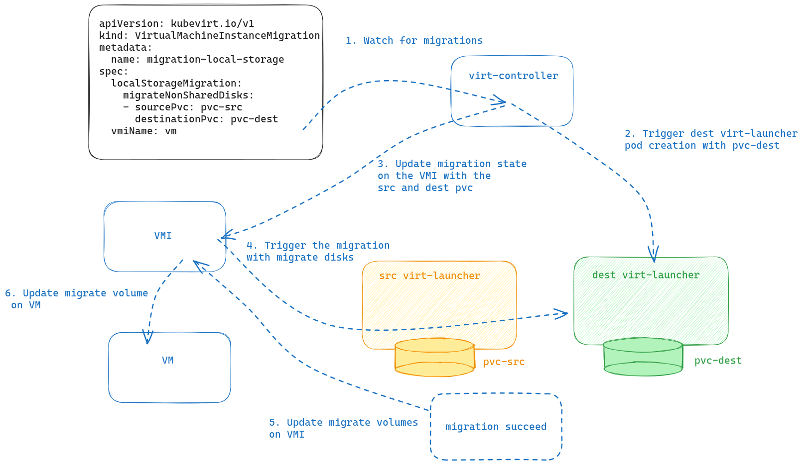

# Overview

This proposal enhances KubeVirt by adding the support for migrating VMs with
non-shared storage.

## Motivation

Shared storage is today a strong requirement for migrating Virtual Machines.
However, not all storage providers offer the ReadWriteMany access mode, therefore the VM cannot be transferred even if it only utilizes one local volume.


KubeVirt already partially supports migrate no-shared disks like container disks
using the libvirt feature for [migrating non-shared images](https://github.com/kubevirt/kubevirt/issues/6086). However, this doesn't apply to DataVolumes and PersistentVolumeClaims.

Furthermore, the ability to migrate local storage makes a number of additional interesting features available that are not specific to local storage. A copy of the storage is made as part of the storage migration.
Additional use-cases made possible by this mechanism include:
  1. Switch storage class. For example, if the user wants to
     change storage type, like in case the new storage provider provides
     additional functionalities.
  2. Move to a larger disk if the storage class doesn't support volume expansion
  3. Move from container disks to PVC (this can be considered as a slightly
     different flavor of the [Persistent containerDisk volumes](https://github.com/kubevirt/kubevirt/issues/6086))

## Goals

Design KubeVirt APIs and solution for introducing non-shared storage migration.

## Non Goals

The first version of this feature leaves out the container disks and
only concentrates on DataVolumes and PersistentVolumeClaims.

## Definition of Users

This features is addressed to all KubeVirt users that uses storage classes not
supporting RWX mode and that cannot migrate their VMs.

## User Stories

  1. Enable users to migrate VMs using PVCs/DVs with storage class supporting
     only RWO mode
  2. Enable users to change storage class for the storage providers
  3. Enable to switch from container disks to PVCs

## Repos

  - [kubevirt/kubevirt](https://github.com/kubevirt/kubevirt)

# Design

This proposal extend `type VirtualMachineInstanceMigrationSpec` by adding a new field that contains the information for migrating the non-shared storage:

```golang
type ReclaimPolicySourcePvc string

const (
        DeleteReclaimPolicySourcePvc ReclaimPolicySourcePvc = "Delete"
)

// MigrateNonSharedDisk represents the source PVC to be migrated to the
// destination PVC
type MigrateNonSharedDisk struct {
        SourcePvc      string `json:"sourcePvc,omitempty" valid:"required"`
        DestinationPvc string `json:"destinationPvc,omitempty" valid:"required"`
}

// LocalStorageMigration represents the local storage to be migrated
type LocalStorageMigration struct {
        MigrateNonSharedDisks  []MigrateNonSharedDisk `json:"migrateNonSharedDisks,omitempty"`
        ReclaimPolicySourcePvc ReclaimPolicySourcePvc `json:"reclaimPolicySourcePvc,omitempty"`
}

type VirtualMachineInstanceMigrationSpec struct {
        // The name of the VMI to perform the migration on. VMI must exist in the migration objects namespace
        VMIName               string                `json:"vmiName,omitempty" valid:"required"`
        LocalStorageMigration LocalStorageMigration `json:"localStorageMigration,omitempty"`
}

```

The `MigrateNonSharedDisks` is a list of disks that represent the source volume to be migrated to the destination volume.

The `ReclaimPolicySourcePvc` represents the policy that KubeVirt needs to apply to the source volume. Once the migration succeeds the source volume isn't used anymore and it can be treated in various ways. This is inspired by the [ReclaimPolicy](https://kubernetes.io/docs/concepts/storage/persistent-volumes/#reclaiming) of PersistentVolumes.

In the VMI status under the `MigrateState` we report the migrate volumes:
```golang
type VirtualMachineInstanceMigrationState struct {

        MigrationLocalDisks []MigrateNonSharedDisk `json:"migrationLocalDisks,omitempty"`
}
```

## Design details and motivation

One of the primary challanges with this design is that multiple PVCs with the same claim name are prohibited in a Kubernets cluster. KubeVirt implements the migration by creating 2 instances of *virt-launcher* pod that usually have the same volumes. One of the reasons we can't currently migrate non-shared storage is because the storage can't be accessed simultaneously by two pods on different nodes and we cannot create 2 PVCs with the same name.

This design proposal specifically uses two distinct PVCs to get around this limitation. The user must create the destination volumes, which will contain a conscious copy of the storage throughout the VM migration.

Concretely, this presumption for KubeVirt allows the migration of VMs with non-shared storage because it assumes that the source and target pods will have different PVCs.

This approach also generalizes the concepts of storage and migration. For instance, we may choose to alter the volume type while migrating. The user has made a declarative and explicit decision to use different names and storage in the migration job.

The VM and VMI specification will be updated by KubeVirt to reflect the new storage that the VM is using if the migration is successful.

DataVolumes are taken into account in the current proposal. DataVolumes are used to import the image during VM provisioning, but they may essentially be thought of as PVCs for the rest of the VM life cycle. According to this proposal, KubeVirt will replace the source DataVolumes with the destination PVC when a user wishes to migrate data to a PVC.


A schematic representation of the migration flow is shown below.



## API Examples

Example of Migration with VM with local storage and migration with non-shared storage.

Create a VM with local storage and the destination PVC:

```yaml
apiVersion: v1
kind: PersistentVolumeClaim
metadata:
  name: pvc-dest
spec:
  accessModes:
    - ReadWriteOnce
  volumeMode: Filesystem
  resources:
    requests:
      storage: 1Gi
---
apiVersion: kubevirt.io/v1
kind: VirtualMachine
metadata:
  annotations:
    kubevirt.io/libvirt-log-filters: "1:qemu.qemu_monitor 1:*"
  labels:
    kubevirt.io/vm: vm-alpine-datavolume
  name: vm-alpine-datavolume
spec:
  dataVolumeTemplates:
  - metadata:
      creationTimestamp: null
      name: alpine-dv
    spec:
      pvc:
        accessModes:
        - ReadWriteOnce
        resources:
          requests:
            storage: 1Gi
        storageClassName: local
      source:
        registry:
          url: docker://registry:5000/kubevirt/alpine-container-disk-demo:devel
  running: true
  template:
    metadata:
      labels:
        kubevirt.io/vm: vm-alpine-datavolume
    spec:
      domain:
        devices:
          disks:
          - disk:
              bus: virtio
            name: datavolumedisk1
          interfaces:
          - masquerade: {}
            name: default
        resources:
          requests:
            memory: 128Mi
      networks:
      - name: default
        pod: {}
      terminationGracePeriodSeconds: 0
      volumes:
      - dataVolume:
          name: alpine-dv
        name: datavolumedisk1

```

Trigger the migration with:
```yaml
apiVersion: kubevirt.io/v1
kind: VirtualMachineInstanceMigration
metadata:
  name: migration-local-storage
spec:
  localStorageMigration:
    migrateNonSharedDisks:
    - sourcePvc: alpine-dv
      destinationPvc: pvc-dest
  vmiName: vm-alpine-datavolume

```

Once the migration succeed:

Changes on the VMI:
```yaml

apiVersion: v1
items:
- apiVersion: kubevirt.io/v1
  kind: VirtualMachineInstance
[...]
    volumes:
    - name: datavolumedisk1
      persistentVolumeClaim:
        claimName: pvc-dest
 status:
    migrationState:
      completed: true
      endTimestamp: "2023-08-17T08:14:45Z"
 [...]
      migrationLocalDisks:
      - destinationPvc: pvc-dest
        sourcePvc: alpine-dv

```

On the VM:
```yaml
apiVersion: kubevirt.io/v1
kind: VirtualMachine
[...]
      volumes:
      - name: datavolumedisk1
        persistentVolumeClaim:
          claimName: pvc-dest

```


## Scalability

This proposal shouldn't have any impact on scalability.

## Update/Rollback Compatibility

Old KubeVirt versions won't be able to use this feature and the new added fields
in the API shouldn't interfere with previous versions.

## Functional Testing Approach

Extensively add functional tests for migrating VMs with non-shared storage:
  - Migrating a VM using the same kind of source and destination PVCs
  - Migrating a VM using a larger destination PVC then the source
  - Migrating a VM using a different storage classes (NOTE: migrating from a
    filesystem to a block PVC need still to be investigated. This could be
    considered as a further enhancement of the proposal)
  - Migrating a VM using a DataVolume as source disk to a PersistentVolumeClaim
    as destination disk

# Implementation Phases

Initially, we could focus to migrating the VM to DVs/PVCs on the same storage
class and same geometry. If this works well, then tackle the more complex usage
