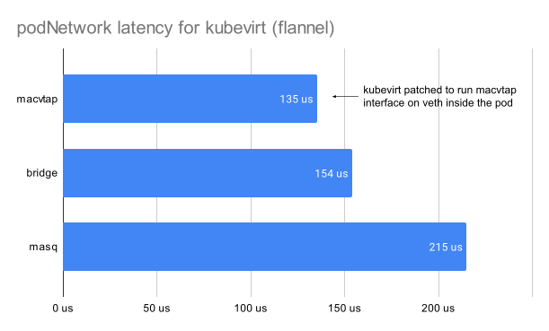
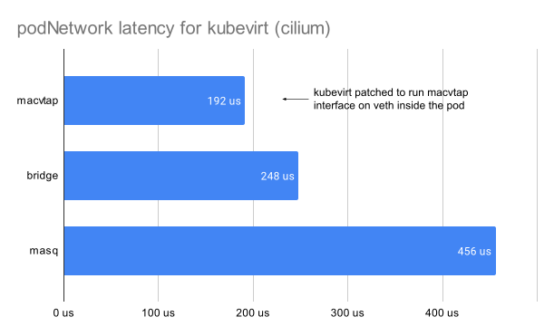
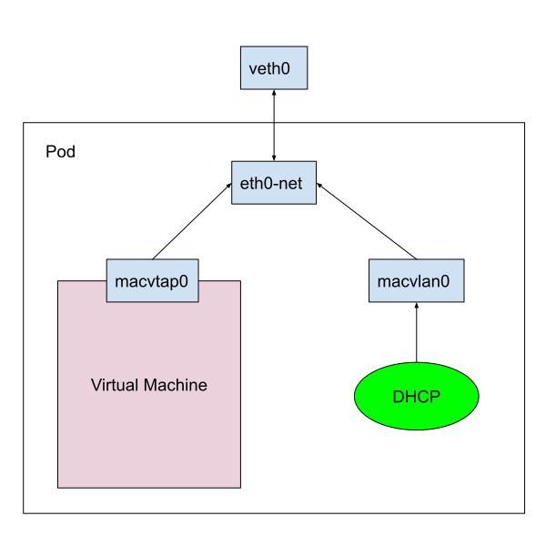

# Macvtap mode for pod networking

Author: Andrei Kvapil \<kvapss@gmail.com\>

## Overview
This feature adds macvtap networking mode for binding the pod network to VM.  
This method does not require any bridges, as a result it has less latency for communication between VM and other pods.

## Motivation

From my point of view the current networking model is messy.
Due to the complexity, the Kubevirt networking is significantly inferior to traditional virtualization solutions.
Trying to reuse CNI specification in KubeVirt leaded us to the situation where we have so many options and no one is working perfectly:

**Masquerade mode** allows to bind VM into a pod networking namespace, but it is not as performant as bridge and macvtap:


```
{CNI magic}  [veth]<--->[veth]   {Masquerade}   [bridge]<--->[tap]<--->[eth0]
^-------host--------^ ^---------------------pod--------------------^ ^--vm--^
```

**Bridge mode** generates a chain of three interfaces inside every pod. In case CNI uses another upper bridge, then the packet should go through at least 5! different interfaces before it reach VM:

```
{CNI magic}  [veth]<--->[veth]<--->[bridge]<--->[tap]<--->[eth0]
^-------host--------^ ^---------------pod-------------^ ^--vm--^
```

This is affecting networking latency and stability, which can be especially noticeable on highly loaded hosts

**Macvtap mode**

There is **macvtap-cni** project, which allows you to bind physical device directly to the VM:

```
{Ethernet}---[eth0]
           ^
           |
           '------->[macvtap]<--->[eth0]
         ^--host--^ ^---pod---^ ^--vm--^
```


However it does not work with pod networking, which is always based on advanced logic and veth interfaces.
But **having a pod network is still mandatory for the many environments where VM is communicating with pods and Kubernetes services.**

This change allows to bind the macvtap interface directly to veth, so the VM will get performance of native pod networking:

```
{CNI magic}  [veth]<--->[veth]
                     ^
                     |
                     '-->[macvtap]<---->[eth0]
^---------host--------^ ^----pod---^  ^--vm--^
```

As shown by benchmarks, it gets almost the same throughput as native veth interface:




## Goals
Provide a more efficient method to bind pod networking.

## Non Goals
Same as bridge the macvtap mode for pod networking does not support live-migration, unless the [`NetworkAwareLiveMigration`](https://github.com/kubevirt/community/pull/182) feature be merged.

## Definition of Users
Users who are looking for less latency mode to bind pod networking.

## User Stories
* As a user / admin, I want to bind a VM directly to a pod network without having overhead on additional network interfaces and masquerade.

## Repos
- [KubeVirt](https://github.com/kubevirt/kubevirt)

# Design
KubeVirt already has macvtap binding mode, but it is working only with [macvtap-cni](https://github.com/kubevirt/macvtap-cni).  
This change is going to extend its logic to make it working with pod network and other CNIs as well.

If `macvtap` mode requested, then the folowing check is invoked:

- If the pod interface is **macvtap**, usually provided by macvtap-cni, then attach VM directly to it. This is left for compatibility with macvtap-cni.

- If the pod interface is **veth** or any other type, then create a macvtap interface and bind to it.  
  Due to the inability to use a downward veth interface for communicating with VM, you also have to prepare macvlan just to bind DHCP server to it.

  The final scheme:  
  

Also this change extends existing macvtap driver to write cached information about the interface and prepare DHCP config.

**How is the macvtap device created?**

The new flag is added to the **tap-device-maker** binary. If it is called with `--parent-name` specified, then macvtap device will be created instead of tap.  
But unlike tap, before running VM with macvtap interface, you need need to:

- Set device rule for the cgroup running this pod:

  *more details here: https://www.kernel.org/doc/Documentation/cgroup-v1/devices.txt*

- Create character device in pod mount namespace:
  ```
  cat /sys/class/net/tap0/macvtap/tap5/dev
  238:1
  mknod /dev/tap5 c 238 1
  ```

## API Examples
Thanks to macvtap-cni we already have everything needed and we don't need to modify the API.  
From the user perspective we just allow to using macvtap mode to bind pod networking, example:

```yaml
apiVersion: kubevirt.io/v1
kind: VirtualMachine
metadata:
  name: vm2
spec:
  running: true
  template:
    spec:
      domain:
        devices:
          disks:
          - disk:
              bus: virtio
            name: containerdisk
          - disk:
              bus: virtio
            name: cloudinitdisk
          interfaces:
          - macvtap: {}
            name: default
        machine:
          type: q35
        resources:
          requests:
            memory: 1024M
      networks:
      - name: default
        pod: {}
      terminationGracePeriodSeconds: 30
      volumes:
      - containerDisk:
          image: kubevirt/fedora-cloud-container-disk-demo:latest
        name: containerdisk
      - cloudInitNoCloud:
          userData: |-
            #cloud-config
            password: fedora
            chpasswd: { expire: False }
        name: cloudinitdisk
```


## Scalability
I don't see any scalability issues.

## Update/Rollback Compatibility
While using the same API this change does not break compatibility with macvtap-cni.
Instead it extends it to support other CNIs as well.

## Functional Testing Approach
- Create VM with pod network binded with macvtap.
- Check the connectivity to VM

# Implementation Phases
Implementation is already prepared as single pull request:
https://github.com/kubevirt/kubevirt/pull/7648
