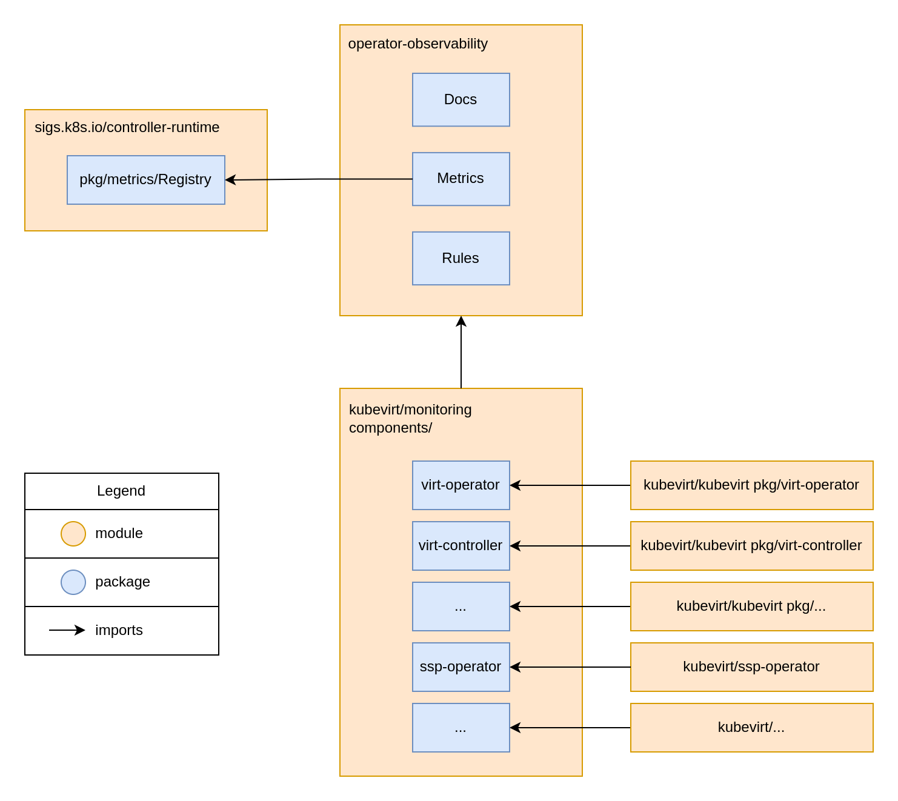
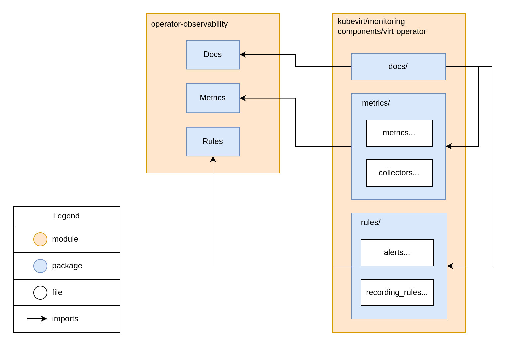

# Move existing monitoring code to kubevirt/monitoring

**Authors:** João Vilaça <jvilaca@redhat.com>

## What

This design document is proposing a code refactor for the monitoring logic in
all KubeVirt components. The goal is to move all monitoring code to a single
repository, `kubevirt/monitoring`. It should be a centralized place for the
configuration of monitoring resources and a have declarative way to define
metrics, recording rules, and alerts.

## Why

It’s important to centralize the monitoring code in a single repository to
reduce complexity, reduce the risk of introducing errors, and allow us to test
each component independently. Each component should be able to define its
metrics, recording rules, and alerts in a declarative way in dedicated packages
in the `kubevirt/monitoring` repository. The repository should then be vendored
as a dependency for all KubeVirt components, so they can import the monitoring
packages and use the metrics, recording rules, and alerts defined in them.

### Pitfalls of the current solution

- Observability contributions are demanding, very time-consuming, require going
  through multiple duplicated code reviews, uses many CI resources, which makes
  it mentally harder to decide to change anything

- Reduced observability code quality and consistency across components, since
  each component has its own code review process and its own maintainers,
  instead of a dedicated observability team

- Reduced productivity and increased the risk of introducing errors

### Goals

- Have a centralized place for the configuration of monitoring resources
- Have a declarative way to define metrics and alerts

### Non-Goals

- Update any metrics or alerts
- Apply these ideas to events in this phase
- Create a new component to run in the cluster alongside other components to
  collect metrics and create alerts

## How

### General relationship diagram:



With this refactor, we intend to move out monitoring logic from all the KubeVirt
components' business logic code. As we see in the above diagram, each KubeVirt
component will now import a package in the `kubevirt/monitoring` repository.
Each package will contain, for the corresponding component, the declaration and
registration of metrics, the generation of the `PrometheusRule` resource with
the alerts and recording rules, and the automatically generated documentation
information.

### Relationship diagram for each component monitoring code:



Each component package in `kubevirt/monitoring`, will have a `metrics/` package
with the metrics declarations, the methods to update/consult the metrics values
and the collectors logic. The `rules/` package will also have the declarative
configuration of the resources, in this case, alerts and recording rules.

### Declarative configuration

The declarative configuration will be done using YAML files. The YAML files will
be parsed and used to create the metrics, alerts, and recording rules.
Components should be able to define their resources in one or more YAML files.

As a general rule, the files will be structured in the following way:

```yaml
observability:
  common_labels:
    - name: controller
      value: example-operator

  groups:
    - name: operator_resources
      common_labels:
        - name: grouped
          value: this_is_grouped
      metrics:
        - name: example_operator_reconcile_count
          help: Number of times the operator has executed the reconcile loop
          type: counter
          stability: stable
          labels:
            - name: another_label
              value: only_for_this_metric

      recording_rules:
        - name: example_operator_number_of_pods
          help: Number of example operator pods in the cluster
          type: gauge
          expr: sum(up{namespace='$NAMESPACE', pod=~'example-operator-.*'}) or vector(0)
      
      alerts:
        - name: OperatorDown
          expr: example_operator_number_of_pods == 0
          for: 5m
          annotations:
            summary: Example operator is down
            description: Example operator is down for more than 5 minutes.
            runbook_url: $RUNBOOK_BASE_URL/OperatorDown
          labels:
            severity: critical
```

But components can have a single file only for metrics or for a specific group
of metrics, for example:

```yaml
observability:
   groups:
      - name: operator_resources
        common_labels:
           - name: grouped
             value: this_is_grouped
        metrics:
           - name: example_operator_reconcile_count
             help: Number of times the operator has executed the reconcile loop
             type: counter
             stability: stable
             labels:
                - name: another_label
                  value: only_for_this_metric

      - name: other_group
        metrics:
          ...
```

In the end, all the declarative configuration will be parsed and joined into a
single `Observability` struct, which will be used to create the metrics, alerts,
and recording rules. The same idea will be applied to other resources.

It should be possible to:

- create a single file with all groups of metrics, alerts, and recording rules

- create multiple files, each with a specific set of groups. With each group
  containing its metrics, alerts, and recording rules

- create multiple files, each with multiple groups with only one type of
  resource (metrics, alerts, or recording rules). For example, one file with all
  metrics, another with all alerts, and another with all recording rules.

## Action Plan

### Have a declarative way to define metrics and alerts

1) Update the operator-observability package to have a declarative way to
   define metrics and alerts

2) Update the monitoring code in each component to use the declarative way to
   define metrics and alerts

### Move existing monitoring code to kubevirt/monitoring

1) Create the component packages in `kubevirt/monitoring` with the metrics,
   declarations, collectors, and the documentation generation for core KubeVirt
   components

2) Migrate the existing monitoring code to the new packages
