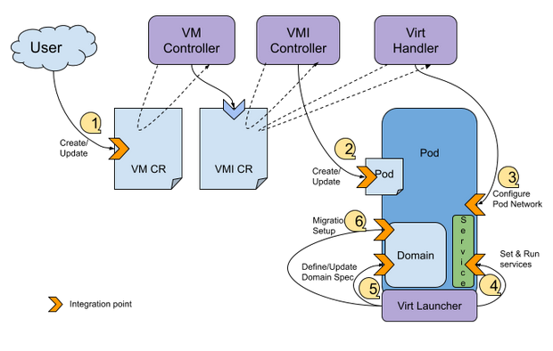

# KubeVirt Network Binding Plugin

## Summary

Define a plugin API with all needed integration points to support
KubeVirt network bindings as plugins external to KubeVirt. Enabling
contributors to modify and extend the network integration options
available.

## Overview

### Motivation

The KubeVirt project has seen increasing interest and adoption in the
last years, with substantial increase in features and feature-requests.
While some features have been added to KubeVirt, many have been put on
hold or rejected due to the heavy maintenance cost.

While the project enters a period where stability and maintenance are
prioritized, there is a need to re-examine current implementations,
restructuring, cleaning up, and retire some less-used features.

The KubeVirt SIG-network maintainers & contributors are looking to
answer both needs: to extend the network functionality and to better
maintain the current and future codebase.

### Goals

- Allow contributors to supply their custom network bindings without a
  need to maintain them under kubevirt/kubevirt.
- Extract existing network bindings out of the core kubevirt/kubevirt
  codebase.
- Reduce the number of built-in bindings to (ideally) a single one in
  order to have an out-of-the-box solution

### Non-Goals

- N/A

### Current State Overview

In KubeVirt, a network binding specifies how a VM vNIC is wired to
access a node network.

The current list of supported bindings are:

- Bridge
- Masquerade
- SR-IOV
- macvtap
- Passt
- SLIRP

The bridge, masquerade and SR-IOV bindings are the most commonly used
bindings. The others are receiving less attention from both users and
contributors/maintainers.

Each network binding has its own benefits and drawbacks, some being
agnostic to the CNI used and others dependent on a specific CNI. Some
support IPAM and others do not.
Some working smoothly with VM migration and some considered unsupported
on migration.
There are network bindings that are supported only on the primary (pod)
network while others have no limitation.

Support for Hot{Un}Plug is also available for some network bindings (as
of this writing, only bridge binding is supported).

The following table summarizes some of the described features supported
by the known bindings.

> **Note**:
> - CNI Specific: Dependency on a specific CNI.
> - Sup. Live Migration:
    >

- For the primary network, support means the migration is
  > possible (otherwise blocked).

> - For secondary networks, support means the connectivity is
    > expected to be preserved.
> - Pod/Multus: Pod refers to the primary network while Multus
    > to the secondary ones.
    > Pod networks require IPAM while for secondary networks,
    > IPAM is optional.

|                    | CNI Specific | Sup. Live Migration | Pod/Multus | HotPlug | Comment                      |
|--------------------|--------------|---------------------|------------|---------|------------------------------|
| Bridge (primary)   | no           | no                  | pod        | no      |                              |
| Bridge (secondary) | no           | Yes (without IPAM)  | multus     | yes     |                              |
| Masquerade         | no           | yes                 | pod        | no      |                              |
| SR-IOV             | yes          | yes                 | multus     | WIP     |                              |
| macvtap            | yes          | yes                 | multus     | no      |                              |
| passt              | no           | no                  | pod        | no      | Has potential to support LM. |
| SLIRP              | no           | no                  | pod        | no      | Planned for deprecation.     |

### User Story

- As a KubeVirt Contributor I want to develop a specific CNI plugin on
  my schedule for my specific use-case, without requiring to merge the
  code into kubevirt, in order to provide benefits to my users.
- As an Admin, I want my VM to be connect-able to pods and multus
  networks out of the box, without the need to supply and pre-provision
  specific CNIs.

## Proposal

KubeVirt shall provide an API with integration points (e.g. hooks) to
allow some of the existing supported network bindings and future custom
ones, to be integrated into KubeVirt as plugins.

To reduce the scope and complexity of the work, the intention is to
focus only on Multus based network attachments.

### Integration Points

This section focuses on identifying the various stages & layers a
network binding may need to act at. It is not required for a network
binding to visit them all.



- VM/VMI CR (API).
- Admission control (webhooks).
    - Some configuration rules are being validated on creation/update.
        - Example: Masquerade binding is only supported for the primary
          network.
- Pod definition & creation [virt-controller].
    - Examples: Annotate CNI, env variables, resources, read multus
      info.
- Configure network elements in the pod network
  namespace [virt-handler].
    - Based on VM/VMI Spec
    - Requires privileged access.
- Run services in the pod/container namespaces [virt-launcher].
    - Based on the VM/VMI Spec
    - May require data from before the pod netns has been touched.
    - Runs in the `virt-launcher` with no privileged access.
- Domain definition and creation [virt-launcher].
    - Build the domain configuration (XML) based on the VM/VMI spec.
    - May require data from before the pod netns has been touched.
    - Runs in the `virt-launcher` with no privileged access.
    - May require data passed in the pod/container by other sources,
      like:
        - Device Plugin (as env variables): For special devices.
        - Pod through DownWard API.
        - Pod through Env Variables.
        - Pod through a mount point: For regular files/folders.
- Domain migration execution [virt-launcher].
    - Perform operations on the domain.
      E.g. unplug devices at the source.

### Supported network binding integration points

|             | AC webhook | Pod Def | Pod net conf | Pod Service | Domain Def | DomainMigration |
|-------------|------------|---------|--------------|-------------|------------|-----------------|
| Bridge      | ✔          | ✔       | ✔            | ✔           | ✔          | \-              |
| Masquerade  | ✔          | ✔       | ✔            | ✔           | ✔          | \-              |
| SR-IOV/VDPA | ✔          | ✔       | \-           | \-          | ✔          | ✔               |
| macvtap     | ✔          | ✔       | ✔            | \-          | ✔          | \-              |
| passt       | ✔          | ✔       | ✔            | \-          | ✔          | \-              |
| SLIRP       | ✔          | ✔       | \-           | \-          | ✔          | \-              |

## Design Details

### Implementation options (per integration point)

The [Integration Points](#integration-points) section described the
areas where a network binding may be required to act.
In this section we will explore each point implementation.

#### API

Network bindings are registered on the cluster by specifying on the
Kubevirt CR their name and configuration. On the VM/VMI specification,
the binding is referenced by name with optional additional arguments.

- Kubevirt CR:
    - Define a new binding subtree under spec-configuration-network.
      Each binding name appears as a key-value, where the key is the
      binding name and the value contains multiple key-value pairs,
      representing parameters and their values.
      Some parameters are considered as “standard” and are understood by
      kubevirt-core, while others are only treated by the individual
      binding (passes to the CNI plugin or sidecar as is).
    - Standard fields:
        - networkAttachmentDefinition
        - sidecarImage
        - domainAttachment (a standard domain definition that exists in
          the core . E.g `tap`, `sriov`).
        - downwardAPI (E.g `device-info`)
- VMI Specification CR:
    - Define a new binding subtree under spec-domain-devices-interfaces.
      Each interface has a binding subtree that contains a required name
      field whose value references the binding name on the Kubevirt CR.
- Extended binding specific fields are allowed on both the Kubevirt CR
  and on the VMI specification.
- Example: See concrete
  example [here](#appendix-b-concrete-example-for-bridge-binding).

#### Admission Control

Preserve generic rules under KubeVirt webhooks. Specific binding rules
can be introduced with dedicated webhooks (on the VM & VMI object)
provided by the network binding vendor.

#### Pod definition & creation

Preserved the logic in the `virt-controller`, but generalized it to fit
any binding.
Anything that affects pod changes should be a known possibility set in a
specific field of the binding configuration.

E.g. if a meta CNI is expected to be added to the CNI plugins chain, it
should be specified in the configuration. If a mounting point should be
defined, it should be described in a well known manner in the binding
configuration so the `virt-controller` can configure it correctly on the
pod.

- Possible network binding fields which the controller can use to define
  the pod:
    - Meta CNI plugins, to be chained to the main CNI plugin.
    - Env variables
    - Mount points
    - Downward API

##### Sidecar Resource Requirements / Limits
When registering a network binding plugin in the KubeVirt CR, it is possible to specify an optional sidecar container image. 
Currently, this sidecar container's CPU/Memory requests and/or limits are set in any of the following scenarios:
1. The VMI was configured to have dedicated CPUs (by setting `Spec.Domain.CPU.DedicatedCPUPlacement`).
2. The VMI was configured to have a virt-launcher pod with [Guaranteed QOS class](https://kubernetes.io/docs/concepts/workloads/pods/pod-qos/#guaranteed) (by setting `Spec.Domain.Resources`).
3. The cluster-admin had configured sidecar pods requests and/or limits on the [KubeVirt CR](https://kubevirt.io/api-reference/main/definitions.html#_v1_supportcontainerresources).

> **Note**
>
> Setting CPU/memory requests and/or limits for sidecar pods on the KubeVirt CR will apply uniformly on all [hook sidecar containers](https://kubevirt.io/user-guide/user_workloads/hook-sidecar/) and network binding plugin sidecar containers.

In the common scenario of a regular VM and no spacial configuration on the KubeVirt CR, 
the network binding plugin sidecar containers do not have CPU/Memory requests and limits.
The sidecar container can have a memory leak and may cause node's destabilization.

Suggested solution:

An additional API for network binding plugin sidecar resource specification will be added:

The network binding plugin API in the KubeVirt CR shall receive an additional input field to specify the sidecar resource requirements:

```yaml
apiVersion: kubevirt.io/v1
kind: KubeVirt
metadata:
  name: kubevirt
  namespace: kubevirt
spec:
  configuration:
    network:
      binding:
        mynetbindingplugin:
          sidecarImage: quay.io/kubevirt/mynetbindingplugin
          sidecarResources:
            requests:
              cpu: 200m
              memory: 20Mi
```

In case a sidecar image was specified for the plugin in the KubeVirt CR, the VMI controller (part of virt-controller) will create a sidecar container spec with the resource specification provided in `sidecarResources`.
Since the VMI controller creates a single sidecar container per unique plugin defined on the VMI spec, the plugin sidecar's resources will only be added once.

Pros:
- Cluster-wide definition of network binding plugin sidecar resources per plugin.
- Finer grained control over resources allocated to network binding plugin sidecars.
- Decoupling from existing hook sidecars.
- Additional resources could be requested other than CPU and memory.
- The additional resource specification is visible to cluster admins.

Cons:
- Requires an API change.
- When upgrading KubeVirt / network binding plugin versions, the sidecar container's resource specification might require adjustments.

This solution was selected since it provides the cluster admin more control in regard to resource allocation.

For the alternative solutions please see [Appendix G](#appendix-g-alternatives-to-plugin-sidecar-container-resource-specification)

#### Configure Pod netns

The CNI plugin has privileged access to the pod network namespace and
can configure it to fit the needs of a specific network binding.

- It requires network bindings to provide a dedicated CNI plugin.
- The CNI plugin needs access to the VM/VMI spec in order to generate
  the right configuration in the pod netns.
  To access the spec details, one of the following approaches can be
  used:
    - Access the api-server to read the VM/VMI spec.
    - Pass the relevant information through generic arguments (cni-args)
      in the pod annotation.
- The CNI plugin needs to be chained as a meta plugin after the main one
  on the pod annotation.
    - Each binding needs to provide a NAD which the cluster admin needs
      to
      place in the relevant namespace.
    - It is recommended for the cluster admin to place the binding NAD
      in
      the same namespace as the VM/s operate, controlling which bindings
      are supported per namespace.
      Cluster admins may place NADs in a default namespace, allowing any
      namespace to use it.

#### Reacting to CNI results (Multus networks/status annotation)

Once Multus finishes a specific CNI execution, it reports back to the
pod annotation the results. This data is currently used to update the
VMI status and in one case to pass the data (processed) to the
`virt-launcher`.

- DownwardAPI

##### Device Info

In some cases the multus status annotation
contains [device-info](https://github.com/k8snetworkplumbingwg/device-info-spec/blob/main/SPEC.md).
This info may be valuable for the binding plugin sidecar. For example
`SRIOV` and `VDPA` plugins need this info.

As the multus status annotation is not there yet on `virt-launcher` pod
creation, the suggested solution is to use downwardAPI volume and mount
it to the sidecar.
The downwardAPI volume will track a new `virt-launcher` pod
annotation `kubevirt.io/network-info` that will contain the `network-info`
of the networks that have `downwardAPI`.
Very similar to the
existing [SRIOV downwardAPI](https://github.com/kubevirt/kubevirt/pull/8226)
solution which is mapping the networkName to the `pci-address` of the
device and mounting the downwardAPI volume to the `virt-launcher` pod.

**Note**: Multus provides device-info information since version v3.7.
If an older version is used, the downward API is not supported,
the annotation will have empty values.

Alternatives:

- Instead of configuring in the kubevirt CR whether deviceInfo should be
  mounted to the sidecar or not, we can pass via the downward API the device
  info of all the interfaces that have it.
  The downside in this approach is that a DownwardAPI volume will be added to
  the pod even when it is not actually needed.
- Passing `PCIDEVICE_<RESOURCE_NAME>_NET_INFO` env var from the
  `virt-launcher` to the sidecar by adding it as an annotation to the
  vmi object passed to the onDefineDomain method. The problem with this
  approach is that it will reintroduce the
  same [bug](https://github.com/kubevirt/kubevirt/issues/7444)
  that the SRIOV downward API solved.
- Sharing
[CNIDeviceInfo](https://github.com/k8snetworkplumbingwg/device-info-spec/blob/main/SPEC.md#5-new-cni-plugin-arguments)
file with the sidecar. It is a very similar approach to the
downwardAPI option, the disadvantage here is that the user would have
to specify the file path in the `NetworkAttachmentDefinition`.
- Instead of using an annotation and DownwardAPI, extend the VMI interface status
API to contain the interface device info.

  Pros:
  - DownwardAPI volume is not required, the VMI is already passed to the virt-launcher
  compute and sidecar containers.

  Cons:
  - The VMI CRD should be changed.
    The device infromation is exposed to users as a contract,
    while the pod annotation with the DownwardAPI is an implementation detail with no such contract.
  - It should be easy to move from the pod annotation to VMI Status in the future,
  but we cannot go the opposite way.
  - Keeping pod specific information in the VMI status may be raceful over migration.
  - Users that have read permissions on the VMI will be able to see the device info.
- Using DownwardAPI to pass the whole multus status annotation.

   Pros:
   - Additional annotation is not required.

   Cons:
   - The multus status annotation contains networking information about all the pod interfaces.
  It may be unsecure to pass this info to the sidecar.
   - Extending the network info to contain information from other sources besides the multus status
  annotation will be impossible.

- Additional alternatives to a similar issue are listed in the SRIOV
mapping
design [doc](https://github.com/kubevirt/community/blob/main/design-proposals/sriov-interfaces-mapping.md).

#### Run services in the virt-launcher pod

- Use the existing sidecar hook which KubeVirt currently supports.
    - Current hook focuses on the domain configuration.
- Create a new sidecar with an enhanced API and hook points.
- Use an existing domain attachment.

#### Domain definition & creation

- Use the existing sidecar hook which KubeVirt currently supports.
- Create a new sidecar with an enhanced API and hook points.
- Use an existing domain attachment.

> **Note**: When there is a need to pass into the pod a special device
> from the node, device-plugins are a good fit.
> KubeVirt networking is already using them for SR-IOV and macvtap.

##### Existing domain attachment

Kubevirt will provide several common generic l implementation methods to
attach interfaces to the domain.

The initial domain attachments suggested are `tap` and `SR-IOV`.

Plugins can use domain attachments instead of implementing a sidecar to
configure the domain.

The domain attachment used by the plugin will be configured in the
kubevirt CR and propagated to the `virt-launcher` via the `SyncVM`.

Alternatives passing the domain attachment to sync VMI:

1. Vmi.interface API - include the domain attachment in the VMI
   interface API
   - Pros:
     - `virt-handler` -> `virt-launcher` API shouldn’t be changed,
       the VMI interfaces are already passed to `virt-handler`.

   - Cons:
     - Virt-controller has to copy the domain attachment from the
       kubevirt CR to the vmi-interface.
     - User facing API (vmi.interfaces) has to be extended.
     - The is no use case the user would like to override the domain
       attachment via the vmi.interface.domainAttachment (if another
       domain-attachment/sidecar is needed, another plugin can be added
       to the kubevirt CR).

2. `virt-handler.SyncVMI`:
   - Pros:
     - It is an internal API (not user facing).

   - Cons:
     - Requires `virt-handler` -> `virt-launcher` API changed.
     - Requires `virt-handler` to be familiar with the kubevirt CR
       binding structure.

Both of the options are not perfect, but the `virt-handler.SyncVMI`
has fewer cons. Therefore, it was chosen.

### Planning

- Collect scenarios from the community contributors & users.
- Map the various stages and layers where the network bindings take
  action. \[Done]
- PoC/s, confirming architecture and design assumptions:
    - PoC using CNI plugin to configure pod network. \[Done]
    - PoC using sidecar to mutate the domain configuration. \[Done]
    - PoC using sidecar to run a DHCP server. \[TODO]
- Release the first network binding plugin: **SLIRP**. \[Done]
- Release the existing less-common supported bindings as plugins:
    - Macvtap (includes usage of core **domain-attachment**) \[Done]
    - Passt (includes a **CNI plugin**) \[Done]
- Release the rest of the supported bindings as plugins.
    - Should we deprecate the embedded binding eventually?
        - We will keep the common bindings: Bridge, Masquerade and
          SR-IOV.
        - All other bindings will get deprecated in favor of the plugin
          alternative.

### Feature Gate

The network binding plugin API and integration points should be
initially protected by a FG.
Feature lifecycle is expected to pass alpha, beta and eventually to GA.

## Appendix A: Concrete example for bridge-binding

Present a concrete example of the actions needed at each integration
point, considering the option suggested in the
[design section](#design-details).

### Kubevirt CR Specification

The bridge-binding is registered to the Kubevirt CR, including the
reference to the network-attachment-definition and the sidecar image.
The plugin is then referenced by name from the VM Specification.

```yaml
apiVersion: kubevirt.io/v1
kind: KubeVirt
metadata:
  name: kubevirt
  namespace: kubevirt
spec:
  configuration:
    network:
      bindings:
        bridge:
          networkAttachmentDefinition: default/kubevirt-network-bridge-binding
          sidecarImage: quay.io/kubevirt/network-bridge-binding
          domainAttachment:
            name: tap
```

### VM Specification

```yaml
apiVersion: kubevirt.io/v1
kind: VirtualMachine
metadata:
  name: vmi-1-bridge
spec:
  template:
    spec:
      domain:
        devices:
          interfaces:
            - name: blue
              mac: 12:34:56:78:9a:bc
              binding:
                name: bridge
      networks:
        - name: blue
          pod: { }
```

### NetworkAttachmentDefinition Specification

```yaml
apiVersion: "k8s.cni.cncf.io/v1"
kind: NetworkAttachmentDefinition
metadata:
  name: kubevirt-bridge-binding
spec:
  config: '{
            "cniVersion": "0.3.1",
            "name": "kubevirt-bridge",
            "type": "kubevirt-bridge-binding",
            "uid": 107,
            "gid": 107,
  }'
```

### Webhook Admitter

- The core KubeVirt admitter assures that only one method of binding
  definition is possible: Either the old style method or the new one.
- No addmiter is provided as part of the bridge binding.

### Pod Definition

The VMI controller updates the pod manifest per the VMI specification.

- From the VMI spec, the following snippet is detected:

```yaml
name: blue
mac: 12:34:56:78:9a:bc
binding:
  name: bridge
```

- As a result, the pod is updated with the following annotations & spec:

```yaml
apiVersion: v1
kind: Pod
metadata:
  name: virt-launcher-123
  annotations:
    k8s.v1.cni.cncf.io/networks: '[
           { 
             "name" : "kubevirt-network-bridge-binding",
             "namespace": "default",
             "interface": "12345678",
             "mac": "12:34:56:78:9a:bc",
             "cni-args":
               "queues": 0,
           }
   ]'
spec:
  containers:
    - name: hook-sidecar-1
      image: quay.io/kubevirt/network-bridge-binding
```

### Configure Pod network namespace

This step is performed by the CNI plugin referenced in
the `kubevirt-bridge-binding` network attachment definition. It
needs to be placed and called *after* the connectivity CNI plugin.

The CNI plugin appears as a binary in the node, built from a dedicated
project that implements all the needed logic to define the network
configuration in the pod (sometimes also referred to as phase1 setup).

The following configuration is described in a nmstate specification
format:

> **Note**: For simplicity, the example does not include IPAM. The only
> implication for having IP involved, is an addition of parameters.
> The example also does not include the pod default network.

```json
{
  "interfaces": [
    {
      "name": "k6t-12345678",
      "type": "linux-bridge",
      "state": "up",
      "ethtool": {
        "txchecksum": "false"
      }
    },
    {
      "name": "12345678-nic",
      "index": "1",
      "copy-mac-from": "k6t-12345678",
      "controller": "k6t-12345678",
      "ipv4": {
        "enabled": "false"
      },
      "ipv6": {
        "enabled": "false"
      },
      "linux-stack": {
        "port-learning": "false"
      }
    },
    {
      "name": "tap12345678",
      "type": "tap",
      "state": "up",
      "mtu": 1500,
      "controller": "k6t-12345678",
      "tap": {
        "queues": 0,
        "uid": 107,
        "gid": 107
      }
    },
    {
      "name": "pod12345678",
      "type": "dummy",
      "state": "up",
      "mtu": 1500,
      "mac-address": "12:34:56:78:9a:bc",
      "ipv4": {
        "enabled": "false"
      },
      "ipv6": {
        "enabled": "false"
      }
    }
  ],
  "linux-stack": {
    "ipv4": {
      "forwarding": "false"
    },
    "ipv6": {
      "forwarding": "false"
    }
  }
}
```

### Reacting to CNI results (Multus status annotation)

Once the bridge binding CNI plugin finishes the configuration in the pod
network namespace, it reports (through multus) results.
It provides means to identify when the operation finished and to share
information from the configuration.

For the bridge binding, this information is not required [non final].

### Run services in the virt-launcher pod

Bridge binding requires a DHCP server in case IPAM is in use.
Although the example has not covered IP settings so far, this is a good
opportunity to present what this integration point is all about and
describe here what is expected from the bridge binding service and how
it is implemented.

When IPAM is in used for the network interface, the bridge binding
sidecar will act as follows:

- Start the DHCP server when an IP is detected on the dummy
  interface (`pod12345678`).
- The DHCP server should advertise/suggest the IP from the dummy
  interface, an optional default gateway route in case it appears to use
  the dummy interface and information from resolv.conf.

### Domain definition & creation

The domain network configuration is composed at this step.
A built-in (implemented in `virt-launcher`) tap domain attachment will
be
used.

Libvirt configuration snippet:

```xml

<interface type='ethernet'>
    <alias name='ua-blue'/>
    <target dev='tap12345678' managed='no'/>
    <model type='virtio-non-transitional'/>
    <mac address='12:34:56:78:9a:bc'/>
    <mtu size='1500'/>
    <rom enabled='no'/>
</interface>
```

## Appendix B: Concrete example for slirp-binding

Present a concrete example of the actions needed at each integration
point, considering the option suggested in the
[design section](#design-details).

### Kubevirt CR Specification

The slirp-binding is registered to the Kubevirt CR, including the
reference to the sidecar image.
The plugin is then referenced by name from the VM Specification.

> **Note**: The SLIRP binding does not need to perform changes in the
> pod network, therefore, there is no need for a
> network-attachment-definition.

```yaml
apiVersion: kubevirt.io/v1
kind: KubeVirt
metadata:
  name: kubevirt
  namespace: kubevirt
spec:
  configuration:
    network:
      binding:
        slirp:
          sidecarImage: quay.io/kubevirt/network-slirp-binding
```

### VM Specification

```yaml
apiVersion: kubevirt.io/v1
kind: VirtualMachine
metadata:
  name: vmi-1-bridge
spec:
  template:
    spec:
      domain:
        devices:
          interfaces:
            - name: blue
              mac: 12:34:56:78:9a:bc
              binding:
                name: slirp
      networks:
        - name: blue
          pod: { }
```

### NetworkAttachmentDefinition Specification

Not required for SLIRP binding

### Webhook Admitter

- The core KubeVirt admitter assures that only one method of binding
  definition is possible: Either the old style method or the new one.
- No addmiter is provided as part of the slirp binding.

### Pod Definition

The VMI controller updates the pod manifest per the VMI specification.

- From the VMI spec, the following snippet is detected:

```yaml
name: blue
mac: 12:34:56:78:9a:bc
binding:
  name: slirp
```

- As a result, the pod is updated with the following annotations & spec:

```yaml
apiVersion: v1
kind: Pod
metadata:
  name: virt-launcher-123
spec:
  containers:
    - name: hook-sidecar-1
      image: quay.io/kubevirt/network-slirp-binding
```

### Configure Pod network namespace

Not required for SLIRP binding

### Reacting to CNI results (Multus status annotation)

Not required for SLIRP binding

### Run services in the virt-launcher pod

Not required for SLIRP binding

### Domain definition & creation

The domain network configuration is composed at this step.
The original sidecar goal was to allow the domain configuration to be
controlled through this hook point, therefore it fits well with building
the whole network configuration of the domain.
The API between the sidecar and `virt-launcher` is using gRPC with a
well-defined interface.

The following steps are expected:

- When the domain configuration is created, it passes the VMI
  specification and the domain specification from the `virt-launcher` to
  the sidecar.
- The sidecar computes the required domain configuration, specifically
  for the bridge binding, to work and returns the mutated spec to the
  `virt-launcher`.

  Libvirt configuration snippet:

```xml

<qemu:commandline>
    <qemu:arg value='-netdev'/>
    <qemu:arg
            value='user,id=default,net=10.0.2.0/24,dnssearch=kubevirt-test-default1.svc.cluster.local,dnssearch=svc.cluster.local,dnssearch=cluster.local,hostfwd=tcp::80-:80'/>
    <qemu:arg value='-device'/>
    <qemu:arg
            value='{&quot;driver&quot;:&quot;e1000&quot;,&quot;netdev&quot;:&quot;default&quot;,&quot;id&quot;:&quot;default&quot;,&quot;mac&quot;:&quot;de:ad:00:00:be:af&quot;}'/>
</qemu:commandline>
```

- The domain itself is created by the `virt-launcher`.

## Appendix C: Concrete example for SR-IOV binding

Present a concrete example of the actions needed at each integration
point, considering the option suggested in the
[design section](#design-details).

### Kubevirt CR Specification

The sriov-binding is registered to the Kubevirt CR.
The plugin is then referenced by name from the VM Specification.

> **Note**: The SR-IOV binding does not need to perform changes in the
> pod network, therefore, there is no need for a
> network-attachment-definition.
> Also, the built-in **sriov** domain attachment is used to generate the
> domxml, so there is no need for a sidecar as well.

```yaml
apiVersion: kubevirt.io/v1
kind: KubeVirt
metadata:
  name: kubevirt
  namespace: kubevirt
spec:
  configuration:
    network:
      binding:
        sriov:
          domainAttachment: sriov
```

### VM Specification

```yaml
apiVersion: kubevirt.io/v1
kind: VirtualMachine
metadata:
  name: vmi-1-bridge
spec:
  template:
    spec:
      domain:
        devices:
          interfaces:
            - name: blue
              mac: 12:34:56:78:9a:bc
              binding:
                name: sriov
      networks:
        - name: blue
          pod: { }
```

### NetworkAttachmentDefinition Specification

Not required for SR-IOV binding

### Webhook Admitter

- The core KubeVirt admitter assures that only one method of binding
  definition is possible: Either the old style method or the new one.
- No addmiter is provided as part of the SR-IOV binding.

### Pod Definition

The VMI controller updates the pod manifest per the VMI specification.

- From the VMI spec, the following snippet is detected:

```yaml
name: blue
mac: 12:34:56:78:9a:bc
binding:
  name: sriov
```

- As a result, the pod is updated with the following annotations & spec:

```yaml
apiVersion: v1
kind: Pod
metadata:
  name: virt-launcher-123
  annotations:
    kubevirt.io/network-pci-map: '{"nic-east":"0000:19:04.0"}'
```

### Configure Pod network namespace

Not required for SR-IOV binding

### Reacting to CNI results (Multus status annotation)

Not required for SR-IOV binding

### Run services in the virt-launcher pod

Not required for SR-IOV binding

### Domain definition & creation

The domain network configuration is composed by `virt-launcher` using
the built-in SRIOV domain attachment implementation.

Libvirt configuration snippet:

```xml

<hostdev mode='subsystem' type='pci' managed='no'>
    <driver name='vfio'/>
    <source>
        <address domain='0x0000' bus='0x19' slot='0x04' function='0x0'/>
    </source>
    <alias name='ua-sriov-nic-east'/>
    <address type='pci' domain='0x0000' bus='0x06' slot='0x00'
             function='0x0'/>
</hostdev>
```

- The domain itself is created by the `virt-launcher`.

## Appendix D: Concrete example for macvtap-binding

Present a concrete example of the actions needed at each integration
point, considering the option suggested in the
[design section](#design-details).

### Kubevirt CR Specification

The macvtap-binding is registered to the Kubevirt CR.
The plugin is then referenced by name from the VM Specification.

> **Note**: The macvtap binding does not need to perform changes in the
> pod network, therefore, there is no need for a
> network-attachment-definition.

```yaml
apiVersion: kubevirt.io/v1
kind: KubeVirt
metadata:
  name: kubevirt
  namespace: kubevirt
spec:
  configuration:
    network:
      Binding:
        Macvtap:
          domainAttachment: tap
```

### VM Specification

```yaml
apiVersion: kubevirt.io/v1
kind: VirtualMachine
metadata:
  name: vmi-1-bridge
spec:
  template:
    spec:
      domain:
        devices:
          interfaces:
            - name: blue
              mac: 12:34:56:78:9a:bc
              binding:
                name: macvtap
      networks:
        - name: blue
          pod: { }
```

### NetworkAttachmentDefinition Specification

Not required for Macvtap binding

### Webhook Admitter

- The core KubeVirt admitter assures that only one method of binding
  definition is possible: Either the old style method or the new one.
- No addmiter is provided as part of the Macvtap binding.

### Pod Definition

The VMI controller updates the pod manifest per the VMI specification.

- From the VMI spec, the following snippet is detected:

```yaml
name: blue
mac: 12:34:56:78:9a:bc
binding:
  name: macvtap
  domainAttachment: tap
```

### Configure Pod network namespace

Not required for Macvtap binding

### Reacting to CNI results (Multus status annotation)

Not required for Macvtap binding

### Run services in the virt-launcher pod

Not required for Macvtap binding

### Domain definition & creation

The domain network configuration is composed at this step.
`virt-launcher` will read from the spec that the required domain
attachment is tap and define the domain accordingly.

Libvirt configuration snippet:

```xml

<interface type='ethernet'>
    <alias name='ua-blue'/>
    <target dev='pod12345678' managed='no'/>
    <model type='virtio-non-transitional'/>
    <mac address='12:34:56:78:9a:bc'/>
    <mtu size='1500'/>
    <rom enabled='no'/>
</interface>
```

## Appendix F: Concrete example for vDPA binding

Present a concrete example of the actions needed at each integration
point, considering the option suggested in the
[design section](#design-details).

### Kubevirt CR Specification

The vDPA binding is registered to the Kubevirt CR.
The plugin is then referenced by name from the VM Specification.

> **Note**: The vDPA binding does not need to perform changes in the
> pod network, therefore, there is no need for a
> network-attachment-definition.
```yaml
apiVersion: kubevirt.io/v1
kind: KubeVirt
metadata:
  name: kubevirt
  namespace: kubevirt
spec:
  configuration:
    network:
      binding:
        vdpa:
          sidecarImage: quay.io/kubevirt/network-vdpa-binding
          downwardAPI: device-info
```

### VM Specification

```yaml
apiVersion: kubevirt.io/v1
kind: VirtualMachine
metadata:
  name: vmi-1-bridge
spec:
  template:
    spec:
      domain:
        devices:
          interfaces:
            - name: blue
              mac: 12:34:56:78:9a:bc
              binding:
                name: vdpa
      networks:
        - name: blue
          multus:
            networkName: vdpa-network
```

### NetworkAttachmentDefinition Specification

Not required for vDPA binding

> **Note**: Defining a NetworkAttachmentDefinition to connect the pod to the node vDPA interface is required,
> this NetworkAttachmentDefinition is specified in the VM spec.
> No additional NetworkAttachmentDefinition is required, because there is no need to configure the pod network
> stack for vDPA.

### Webhook Admitter

- The core KubeVirt admitter assures that only one method of binding
  definition is possible: Either through the Interface API or Network Binding Plugin API.
- No addmiter is provided as part of the vDPA binding.

### Pod Definition

The VMI controller updates the pod manifest per the VMI specification.

- From the VMI spec, the following snippet is detected:

```yaml
name: blue
binding:
  name: vdpa
```

- As a result, the pod is updated with the following annotations & spec:

```yaml
apiVersion: v1
kind: Pod
metadata:
  name: virt-launcher-123
  annotations:
    kubevirt.io/network-info: '{
      "interfaces": [{
        "network": "blue"
        "device-info": {
          "type": "vdpa",
          "version": "1.1.0",
          "vdpa": {
            "parent-device": "vdpa:0000:65:00.3",
            "driver": "vhost",
            "path": "/dev/vhost-vdpa-1",
            "pci-address": "0000:65:00.3"
          }
        }
      }]
    }'
  spec:
    containers:
      - name: compute

      - name: hook-sidecar-1
        volumeMounts:
          - name: network-info
            mountPath: /etc/pod-info
    volumes:
      - name: network-info-annotation
        downwardAPI:
          items:
            - path: network-info
              fieldRef:
                fieldPath: metadata.annotations[kubevirt.io/network-info]
```

### Configure Pod network namespace

Not required for vDPA binding

### Reacting to CNI results (Multus status annotation)

Device info from the multus status annotation will be propagated to the
sidecar using downwardAPI. The data will be used to compose the libvirt
domain xml interface.

### Run services in the virt-launcher pod

Not required for vDPA binding

### Domain definition & creation

A sidecar will be introduced to add the vDPA interfaces to the libvirt
domain.

Libvirt configuration snippet:

```xml
<interface type='vdpa'>
    <driver name='vfio'/>
    <source dev='/dev/vhost-vdpa-1 network=default'/>
      <alias name='ua-blue'/>
      <address type='pci' domain='0x0000' bus='0x65' slot='0x00' function='0x3'/>
</interface>
```

- The domain itself is created by the `virt-launcher`.

# Appendix G: Alternatives to plugin sidecar container resource specification

1. The cluster admin could configure worst case CPU/Memory requests and/or limits on the KubeVirt CR:

Pros:
- Already implemented.

Cons:
- Applies uniformly on all hook sidecars and network binding plugins
    - Worst case CPU/Memory requests/limits should be defined on the KubeVirt CR which maybe wasteful for a combination of hook sidecars and network binding plugins.
    - Coarse level of control.
    - Only supports CPU and memory requests and limits.

2. Mutating Webhook

For each unique network binding plugin used, the VMI controller will add a label on the virt-launcher pod with the following format:

`kubevirt.io/network-binding-plugin:<plugin-name>`

The binding plugin authors will provide a [mutating webhook](https://kubernetes.io/docs/reference/access-authn-authz/admission-controllers/#mutatingadmissionwebhook) that will intercept
virt-launcher pod creation that have the above label, and add the appropriate resources requests/limits
for every relevant sidecar container.

The mutating webhook will be able to identify the plugin's sidecar container by its image URL.

Pros:
- Plugin authors have full control over the sidecar's resources
- Additional API is not added to KubeVirt.
- Opens the door for additional changes to the virt-launcher pod without changes to KubeVirt.
- Code changes in KubeVirt are very small.

Cons:
- Plugin authors should provide another component and integrate it.
- Additional point of failure.
- Requires maintaining certificates for the webhook.
- Additional latency when creating VMs with network binding plugins.
- The additional resource specification is less visible to cluster admins.
- Resource specification could collide with the support container resources specified on the KubeVirt CR or other webhooks.

This solution provides flexibility for plugin authors while keeping the network binding plugin API in KubeVirt small.
The requirement to maintain certificates for the webhook could be mitigated using tools such as [cert-manager](https://cert-manager.io/).
