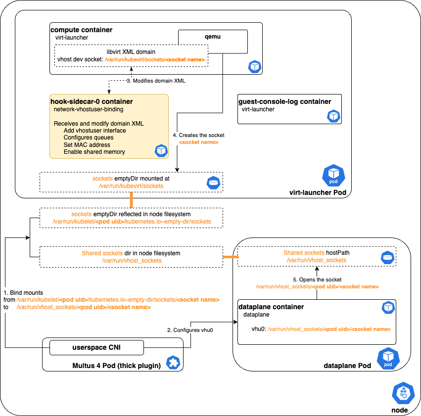
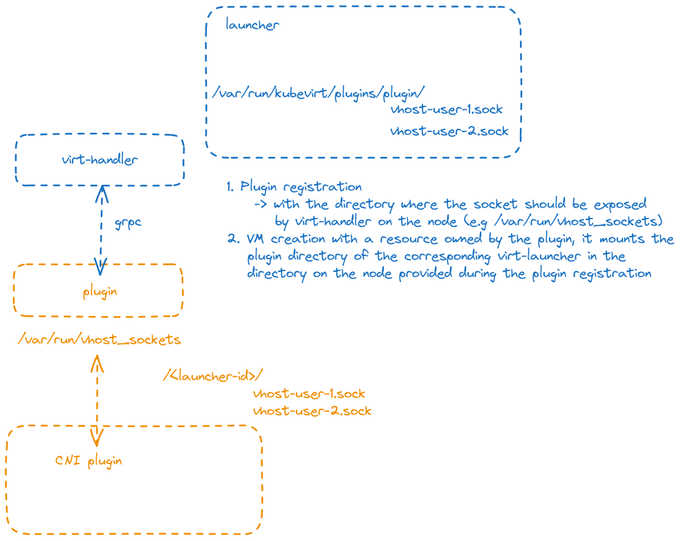

# Overview
`vhostuser` interfaces are supported by qemu but not implemented in Kubevirt. Network Binding Plugin is a good framework to add support for `vhostuser` interfaces to Kubervirt. 

## Motivation
`vhostuser` interfaces are required to attach VMs to a userspace dataplane such as OVS-DPDK or VPP and achieve a fast datapath from the VM to the physical NIC.
This is a mandatory feature for networking VMs such as vRouter, IPSEC gateways, firewall or SD-WAN VNFs, that usually bind the network interfaces using DPDK. Expected performance with DPDK can only be met if the whole datapath is userspace and not go through kernel interfaces like with usual bridge interfaces.

## Goals
Be able to add `vhostuser` secondary interfaces to the VM definition in Kubevirt.

## Non Goals
The `vhostuser` secondary interfaces configuration in the dataplane is under the responsibility of Multus and the CNI such as `userspace CNI`.

## Definition of Users
Users of the feature are everyone that deploys a VM.

## User Stories
- As a user, I want to create a VM with one or serveral `vhostuser` interfaces attached to a userspace dataplane.
- As a user, I want the `vhostuser` interface to be configured with a specific MAC address.
- As a user, I want to enable multi-queue on the `vhostuser` interface
- As a Network Binding Plugin developper, I want the shared socket path to be accessible to virt-launcher pod 
- As a CNI developper, I want to access the shared vhostuser sockets from Multus pod

## Repos
Kubevirt repo, and most specificaly cmd/sidecars.

## Design
This proposal leverages the Kubevirt Network Binding Plugin sidecar framework to implement a new `network-vhostuser-binding`.

`network-vhostuser-binding` role is to implement the modification to the domain XML according to the VMI definition passed through its gRPC service by the `virt-launcher` pod.

`vhostuser` interfaces are defined in the VMI under `spec/domain/devices/interfaces` using the binding name `vhostuser`:

```yaml
    spec:
      domain:
        devices:
          networkInterfaceMultiqueue: true
          interfaces:
          - name: default
            masquerade: {}
          - name: net1
            binding:
              name: vhostuser
            macAddress: ca:fe:ca:fe:42:42
```

`network-vhostuser-binding` translates the VMI definition into libvirt domain XML modifications:
1. Creates a new interface with `type='vhostuser'`
2. Set the MAC address if specified in the VMI spec
3. If `networkInterfaceMultiqueue` is set to `true`, add the number of queues calculated after the number of cores of the VMI
4. Add `memAccess='shared'` to all NUMA cells elements
5. Define the device name according to Kubevirt naming schema
6. Define the `vhostuser` socket path

Below is an example of modified domain XML:

```xml
<cpu mode="host-model">
        <topology sockets="2" cores="8" threads="1"></topology>
        <numa>
            <cell id="0" cpus="0-7" memory="2097152" unit="KiB" memAccess="shared"/>
            <cell id="1" cpus="8-15" memory="2097152" unit="KiB" memAccess="shared"/>
        </numa>
</cpu>
<interface type='vhostuser'>
    <source type='unix' path='/var/run/kubevirt/sockets/poda08a0fcbdea' mode='server'/>
    <target dev='poda08a0fcbdea'/>
    <model type='virtio-non-transitional'/>
    <mac address='ca:fe:ca:fe:42:42'/>
    <driver name='vhost' queues='8' rx_queue_size='1024' tx_queue_size='1024'/>
    <alias name='ua-net1'/>
</interface>
```

This design leverages the existing `sockets` emptyDir mounted in `/var/run/kubevirt/sockets`. This allows the CNI to bind mount the socket emptyDir (`/var/lib/kubelet/<pod uid>/volumes/kubernetes.io~empty-dir/sockets`) to a host directory available to the dataplane pod through a hostPath mount.

However this assumes:
- the `sockets` emptyDir can be used for such a purpose
- the CNI has access to the `sockets` emptyDir of the `virt-launcher` pod and that it can bind mount it to a path available to the dataplane. This can be tricky especially with Multus 4 in thick plugin mode, where the CNI is executed by the mutlus pod. Usually the multus thick plugin daemonset defines a `/hostroot` hostPath volume mount with `mountPropagation: HostToContainer` option. A `mountPropagation: Bidirectional` option is needed for the bind mount to be propagated back to the host and to the dataplane pod.
- the dataplane pod has the privilege to mount a hostPath

Here is a diagram showing sockets sharing mecanisms between `virt-launcher` pod, `userspace CNI` and the `dataplane` pod.



Sharing the `vhostuser` sockets between `virt-launcher` pods and the dataplane pod is something to be enhanced in order to limit usage of hostPath volumes and bind mounts.

## Alternative designs

Some alternative designs were discussed in .

### Expose a virt-launcher pod directory to binding plugin

This requires to implement a new network binding plugin mechanism we could expose the content of a `virt-launcher` directory to an external plugin.
The plugin registration in Kubervirt resource would define the target directory on the node where the directory should be exposed.

This diagram explains this mechanism.



The advantages of such an approach are:
- is generic and could also be potentially reused by other device types
- hides the KubeVirt implementation details. Currently, you need to know where the KubeVirt sockets are located in the virt-launcher filesystem. Potentially, if we change the directory path for the sockets, this would break the CNI plugin
- can isolate the resources dedicated to that particular plugin

The drawback side is that `virt-launcher` pod would need to be run with `privileged: true` in order to do the bind mount.

### Device plugin for `vhostuser sockets` resource

Device plugins have the ability to add hostPath mounts to the pods when they request for managed resources.
We could implement a vhostuser device plugin that would manage two kinds of resources:
- dataplane: 1
  This only resource is resquested by the userspace dataplane, and add a `/var/run/vhost_sockets` mount to the dataplane pod.
- vhostuser sockets: n
  This as many resources as we want to handle, is requested by the `virt-launcher` pod using vhostuser plugin. This makes the device plugin create a per pod directory like `/var/run/vhost_sockets/<launcher-id>`, and mount it into the `virt-launcher` pod.

This solution allows both dataplane and vm pods to share the vhostuser sockets without requiring to be privileged, and without the need for the CNI to do some bind mounts and avoid the constraints on Multus mountPropagation option.

We still have to care about directory and sockets permission (and SELinux categories?). 

## API Examples
(tangible API examples used for discussion)

## Scalability
(overview of how the design scales)

## Update/Rollback Compatibility
Kubevirt Network Binding plugin relies on `hooks/v1alpha3` API for a clean termination of the `network-vhostuser-binding` container in the virt-launcher pod.

## Functional Testing Approach
Create a VM with several `vhostuser` interfaces then:
- check the generated domain XML contains all interfaces with appropriate configuration
- check the vhostuser sockets are created in the expected directory of virt-launcher pod
- check the vhostuser sockets are available to the dataplane pod
- check the VM is running

# Implementation Phases
1. First implementation done
2. Iterate on design issues regarding socket sharing
3. Upstream `network-vhostuser-binding`