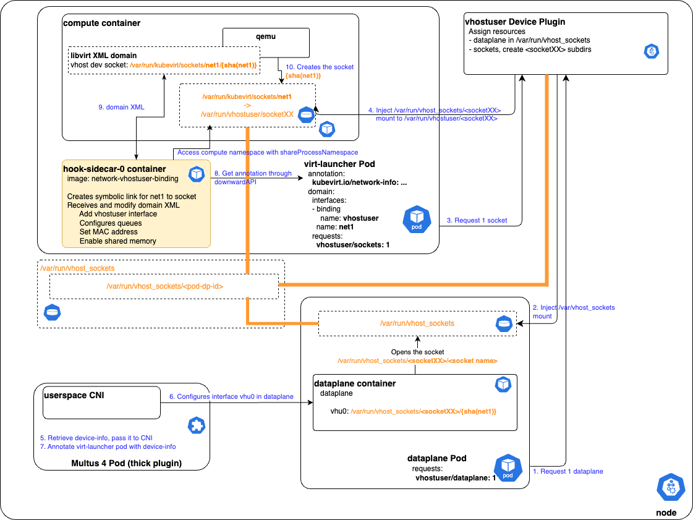

# Overview
`vhostuser` interfaces are supported by qemu but not implemented in Kubevirt. Network Binding Plugin is a good framework to add support for `vhostuser` interfaces to Kubervirt. 

## Motivation
`vhostuser` interfaces are required to attach VMs to a userspace dataplane such as OVS-DPDK or VPP and achieve a fast datapath from the VM to the physical NIC.
This is a mandatory feature for networking VMs such as vRouter, IPSEC gateways, firewall or SD-WAN VNFs, that usually bind the network interfaces using DPDK. Expected performance with DPDK can only be met if the whole datapath is userspace and not go through kernel interfaces like with usual bridge interfaces.

## Goals
Be able to add `vhostuser` secondary interfaces to the VM definition in Kubevirt.

## Non Goals
The `vhostuser` secondary interfaces configuration in the dataplane is under the responsibility of Multus and the CNI such as `userspace CNI`.

## Definition of Users
- **VM User** is the persona that configures `VirtualMachine` or `VirtualMachineInstance`
- **Cluster Admin** is the persona that configures `KuberVirt` resources
- **Network Binding Plugin Developer** is the persona that implements the `network-vhostuser-binding` plugin
- **CNI Developer** is the persona that implements the CNI that configures the dataplane with vhostuser sockets
- **Dataplane Developer** is the persona that implements the userspace dataplane

## User Stories
- As a VM User, I want to create a VM with one or serveral `vhostuser` interfaces attached to a userspace dataplane.
- As a VM User, I want the `vhostuser` interface to be configured with a specific MAC address.
- As a VM User, I want to enable multi-queue on the `vhostuser` interface
- As a VM User, I want to be able to configure the `vhostuser` interface as transitional
- As a Cluster Admin, I want to be able to enable `network-vhostuser-binding`
- As a Network Binding Plugin Developer, I want the shared socket path to be accessible to `virt-launcher` pod 
- As a Dataplane Developer, I want to access all `vhostuser` sockets of VM pods
- As a CNI Developer, I want to know whet vhostuser sockets are located
 
## Repos
Kubevirt repo, and most specificaly [cmd/sidecars](https://github.com/kubevirt/kubevirt/tree/main/cmd/sidecars).

## Design
This proposal leverages the KubeVirt Network Binding Plugin sidecar framework to implement a new `network-vhostuser-binding`.

`network-vhostuser-binding` role is to implement the modification to the domain XML according to the VMI definition passed through its gRPC service by the `virt-launcher` pod on `OnDefineDomain` event from `virt-handler`.

`vhostuser` interfaces are defined in the VMI under `spec/domain/devices/interfaces` using the binding name `vhostuser`:

```yaml
spec:
  domain:
    devices:
      networkInterfaceMultiqueue: true
      interfaces:
      - name: default
        masquerade: {}
      - name: net1
        binding:
          name: vhostuser
        macAddress: ca:fe:ca:fe:42:42
```

`network-vhostuser-binding` translates the VMI definition into libvirt domain XML modifications on `OnDefineDomain`:
1. Creates a new interface with `type='vhostuser'`
2. Set the MAC address if specified in the VMI spec
3. Define model type according to `useVirtioTransitional` VMI spec
4. If `networkInterfaceMultiqueue` is set to `true`, add the number of queues calculated after the number of cores of the VMI
5. Add `memAccess='shared'` to all NUMA cells elements
6. Define the device name according to Kubevirt naming schema
7. Define the `vhostuser` socket path

As `OnDefineDomain` hook can be called multiple times by KubeVirt, `network-vhostuser-binding` modification must be idempotent.

Below is an example of modified domain XML:

```xml
<cpu mode="host-model">
        <topology sockets="2" cores="8" threads="1"></topology>
        <numa>
            <cell id="0" cpus="0-7" memory="2097152" unit="KiB" memAccess="shared"/>
            <cell id="1" cpus="8-15" memory="2097152" unit="KiB" memAccess="shared"/>
        </numa>
</cpu>
<interface type='vhostuser'>
    <source type='unix' path='/var/run/vhostuser/poda08a0fcbdea' mode='server'/>
    <target dev='poda08a0fcbdea'/>
    <model type='virtio-non-transitional'/>
    <mac address='ca:fe:ca:fe:42:42'/>
    <driver name='vhost' queues='8' rx_queue_size='1024' tx_queue_size='1024'/>
    <alias name='ua-net1'/>
</interface>
```

### Implementation details

The socket path have to be available to both `virt-launcher` pod (and `compute` container) and dataplane pod.  
In order to not use hostPath volumes that requires pod to be privileged, we propose to implement a **vhostuser Device Plugin** that will be able to inject mounts to the sockets directory into unprivileged pods, and annotations.

### Device Plugin for **vhostuser sockets** resource

Device plugins have the ability to add mounts into the pods when they request for managed resources.

This design proposal relies on a device plugin that would manage two kinds of resources, representing a host directory where sockets will rely (for example `/var/run/vhost_sockets`):
- **dataplane**: `1`  
  This only resource is requested by the userspace dataplane, and add a `/var/run/vhost_sockets` mount to the dataplane pod.
- **vhostuser sockets**: `n`  
  This as many resources as we want to handle and may represent the number of port of the dataplane vSwitch.  
  It is requested through VM or VMI definition in resources request spec. In turn the `virt-launcher` pod will request the same resources.  
  This makes the device plugin create a per pod directory like `/var/run/vhost_sockets/<pod-dp-id>`, and mount it into the `virt-launcher` pod as to well known location `/var/run/vhostuser`.  
  The device plugin has to generate a `pod-dp-id` and push it as an annotation in `virt-launcher` pod. This will be used later by the CNI or any component that configures the vhostuser socket in the dataplane with right path.

We still have to care about directory and sockets permission and SELinux. 

### Implementation diagram



## API Examples
No modification needed to KubeVirt API.

Example of a `VirtualMachine` definition using `network-vhostuser-binding` plugin and device plugin resources requests:

```yaml
apiVersion: kubevirt.io/v1
kind: VirtualMachine
metadata:
  name: vhostuser-vm
  namespace: tests
spec:
  running: true
  template:
    metadata:
      labels:
        kubevirt.io/domain: vhostuser-vm
    spec:
      architecture: amd64
      domain:
        cpu:
          cores: 4
        devices:
          disks:
          - disk:
              bus: virtio
            name: containerdisk
          interfaces:
          - masquerade: {}
            name: default
          - binding:
              name: vhostuser
            macAddress: ca:fe:ca:fe:42:42
            name: net1
          networkInterfaceMultiqueue: true
        machine:
          type: q35
        memory:
          hugepages:
            pageSize: 1Gi
        resources:
          limits:
            vhostuser/sockets: 1
          requests:
            memory: 2Gi
            vhostuser/sockets: 1
      networks:
      - name: default
        pod: {}
      - multus:
          networkName: vhostuser-network
        name: net1
      nodeSelector:
        node-class: dpdk
      volumes:
      - containerDisk:
          image: os-container-disk-40g
        name: containerdisk
```

## Scalability
(overview of how the design scales)

## Update/Rollback Compatibility
Kubevirt Network Binding plugin relies on `hooks/v1alpha3` API for a clean termination of the `network-vhostuser-binding` container in the virt-launcher pod.

## Functional Testing Approach
Create a VM with several `vhostuser` interfaces then:
- check the generated domain XML contains all interfaces with appropriate configuration
- check the vhostuser sockets are created in the expected directory of virt-launcher pod
- check the vhostuser sockets are available to the dataplane pod
- check the VM is running

# Implementation Phases
1. First implementation of the `network-vhostuser-binding` done
2. Implement vhostuser device plugin
3. Upstream `network-vhostuser-binding`
