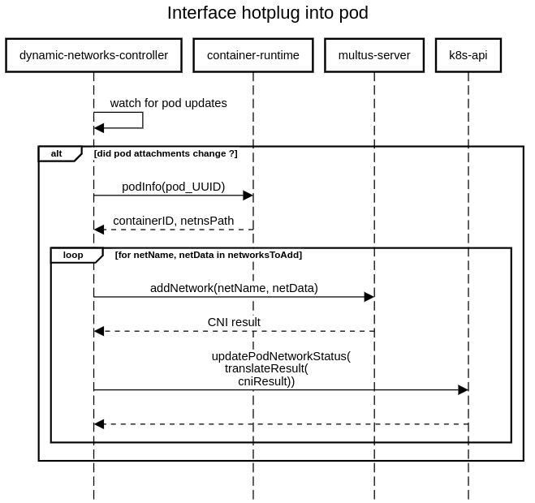
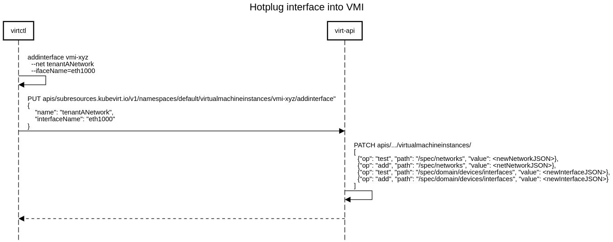

# Overview
This KubeVirt design proposal discusses possible implementations for adding -
and removing - network interfaces from running Virtual Machines, without
requiring a restart.

## Motivation
Hot-plug / hot-unplug (add / remove) NICs to running VMs is an industry
standard available in multiple platforms, allowing the dynamic attachment of L2
networks. This is useful when the workload (VM) cannot tolerate a restart when
attaching / removing networks, of for scenarios where, for instance, the
workload is created prior to the network.

This would help bridge the gap between KubeVirt's feature set and what the user
base expects from it.

## Goals
Adding network interfaces to running VMs.
Removing networking interfaces from running VMs.
A VM can have multiple interfaces connected to the same (secondary) network(s).

**Note:** the above are goals for the KubeVirt project, whose scope are VMs.
Achieving the same goals for pods (on the multus project) is a **requirement**
for KubeVirt.

## Non Goals
- Providing multiple connections to the primary cluster network (managed by
Kubernetes).
- Dynamic attachment / removal of SR-IOV (or macvtap) networks; since these rely
on a device plugin - and thus require the update of the pod's resources - i.e.
request the VF resource - something which, is not possible on a running pod.
This particular goal requires more study, and should be discussed in a separate
design document.
- Propagating networking changes / reconfiguration of existing interfaces;
the API is a bit misleading, since a user might want to think that updating an
existing interface is possible (since these are actually `NetworkSelectionElement`s
from the [multus api](https://github.com/k8snetworkplumbingwg/multus-cni/blob/dc9315f12549d70a9fa40a95a11bd8ea88b95577/pkg/types/types.go#L118)).

## Definition of Users
This feature is intended for cluster users who want to connect their existing
Virtual Machines to additional existing networks.
These users may - or may not - have permissions to create the aforementioned
additional networks; if so, they would need to rely on the cluster
administrator to provision it for them.

## User Stories
* as a user, I want to add a new network interface to a running VM.
* as a user, I want to remove an existing network interface from a running VM.

## Repos
- [CNAO](https://github.com/kubevirt/cluster-network-addons-operator)
- [KubeVirt](https://github.com/kubevirt/kubevirt)
- [Multus](https://github.com/k8snetworkplumbingwg/multus-cni)

# Design

## Multus
Multus - a CNI plugin - only handles the ADD / REMOVE verb, and is triggered
by kubelet only when the pod's sandbox is created - or removed. Given its
simplicity, it assumes no networks exist whenever it is executed, and proceeds
to call the ADD / DEL for **all** networks listed in its
`k8s.v1.cni.cncf.io/networks` annotation.

As such, the first part of the design implementation must focus on multus; it
must be refactored to enable it to be triggered not only when the pod's sandbox
is created, but also on-demand - i.e. whenever the pod's
`k8s.v1.cni.cncf.io/networks` are updated.

To do that, a controller residing on a long-lived process must be introduced.
An important detail to take into account is this controller will end up being a
CNI client; as a result, it needs to instruct CNI with parameters such as
container id, and container netns path (which are CNI inputs). For this, this
controller needs to query container runtime directly (use CRI API).

The solution finally accepted by the multus maintainers was:
1. re-architect multus-cni as a thick-plugin. It shares the host-PID namespace.
   Multus-cni also has an endpoint to add a particular (singular) attachment to
   a running pod.
2. a separate controller reconciles the pod's desired state (network selection
   elements, i.e. the `k8s.v1.cni.cncf.io/networks` annotation) against the
   pod's current state (i.e. the `k8s.v1.cni.cncf.io/network-status` annotation).
   Once this pod identifies a network must be added (present in the desired
   state, but missing in the current state), it will invoke multus via a
   dedicated endpoint. Once it gets the multus CNI result, it will translate it
   to network-status, and update the pod's annotations.

### Controller
The solution relies on an external control loop - which is implemented in
[this repo](https://github.com/k8snetworkplumbingwg/multus-dynamic-networks-controller) -
to listen to pod updates, and react when the `k8s.v1.cni.cncf.io/networks`
have changed. It will then query the container runtime (containerd / CRI-O) for
runtime info (container ID and net namespace path), and finally use the multus
`/delegate` endpoint to issue ADD operations for each new network, and DELETE
operations for networks that were removed.

Refer to the sequence diagram below for more information:



### Multus-cni re-architected as a thick plugin
A "thin CNI plugin" runs as a one-shot process, typically as a binary on disk
executed on a Kubernetes host machine.

A "thick CNI Plugin", on the other hand, is a CNI component composed of two (or
more) parts, usually composed of "shim", and a long-lived process (daemon)
resident in memory. The "shim" is a lightweight "thin CNI plugin" component that
simply passes CNI parameters (such as JSON configuration, and environment
variables) to the daemon component, which then processes the CNI request.

To transform multus into a thick plugin, it is needed to instantiate a long-lived 
process - which will be the multus pod entrypoint - listening to a unix
domain socket - this socket must be available both in the multus pod and the
hosts's mount namespaces; as such, a bind mount to host this socket must be
provided for the multus pod.

The CNI shim will then be invoked by kubelet, and send the CNI ADD/DELETE
commands to the server side of multus via the unix domain socket previously
mentioned. The multus daemon would also contact the shim whenever a new network
is to be added - or removed.

Refer to the sequence diagram below for more information:


The functionality described above is exposed via the `/cni` [endpoint](https://github.com/k8snetworkplumbingwg/multus-cni/blob/a9ace511d8f5337406a01e8febbdf9f415b37441/pkg/server/api/api.go#L29).

Multus-cni additionally provides the following endpoints:
- `/delegate`: endpoint used when a 3rd party wants to add/remove an interface
  to a running pod
- `/healthz`: endpoint used for a 3rd party to know if the multus server is
  currently alive

## KubeVirt
In order to mimic the disk hotplug feature, the proposed API also follows the
notion of a sub-resource, which will be used to trigger changes in the VM, the
VMI, or both - by sending an HTTP PUT to the correct URL endpoint.
This also enables a simple - and coherent - integration with `virtctl`, which
would help preserve the user's expectations of how the system works.

Furthermore, by design, KubeVirt only allows the update of the VMI spec by the
Kubevirt service accounts, thus via the VMI subresource path.

The proposed API changes for VM objects can be seen in
[the VM API examples section](#vms), while the proposed API changes for the VMI
object can be seen in [the VMI API examples section](#vmis).

### Pod interface naming
The VMs’ pod interfaces names are ordinal based (`net1`, `net2`, …, `netX`),
derived from their order in the VMI spec.
They are requested from Multus by specifying then in virt-launcher pod 
`k8s.v1.cni.cncf.io/networks` annotation (which is created by virt-controller).

Given a VM with three secondary interfaces:
```yaml
spec:
  networks:
  - name: blue-network
    multus: ...
  - name: red-network
    multus: ...
  - name: green-network
    multus: ...
```

The pod's Multus networks annotation will look like so:
```json
"k8s.v1.cni.cncf.io/networks": [
  {"interface": "net1", ...},
  {"interface": "net2",  ...},  
  {"interface": "net3",  ...}
]
```

In the scenario where "red-network" interface is unplugged, the annotation will change  as follows:
```json
"k8s.v1.cni.cncf.io/networks": [
  {"interface": "net1", ...},
  {"interface": "net3",  ...}
]
```
Now it's impossible to associate between all VMI spec and pod interfaces.

Thus, the name of the `virt-launcher` pod network interfaces must be generated 
without relying on the interface order in the spec, allowing the unplug feature.

The pod interface name will be derived from the `kubevirt-spec-iface-name`; 
we'll simply compute a Hash of the interface name
(which is guaranteed to be unique within each VMI), and ensure all generated
names for the pod's networking infrastructure are accepted by the kernel.
Refer to the following list for examples of names on pod networking infra:
- VM interface name: `iface1`
- pod interface name: `pod7e0055a6880`
- in-pod bridge name: `k6t-7e0055a6880`
- dummy pod nic name: `7e0055a6880-nic`

>**Note:**  The kernel limitation for max interface name length is 15 characters.

>**Note:**
> Since the bridge and dummy interfaces used internally they can be changed in the future to have 3 chacter digits and align with the new formatting:
> - in-pod bridge name: `bri7e0055a6880`
> - dummy pod nic name: `dum7e0055a6880`


The proposed algorithm is SHA256; here's a minimal implementation:
```golang
func PodInterfaceName(vmiSpecInterfaceName string) string {
    // allows the dummy pod suffix (`-nic`) to fit the kernel limitation of 15 chars.
    const MaxIfaceNameLen = 11
    hash := sha256.New()
    _, _ = io.WriteString(hash, vmiSpecInterfaceName)
    return fmt.Sprintf("%x", hash.Sum(nil))[:MaxIfaceNameLen]
}
```

## VMI flows

### virtctl
Two new commands will be introduced to the `virtctl` root command:
`addinterface`, and `removeinterface`, which result in an HTTP PUT being sent
to the corresponding VM/VMI subresource, on `virt-api`.

Refer to the image below for more information.



**NOTE:** this step is common for both VM / VMI objects. When used for a VM,
the user should provide the `--persist` flag.

### virt-api
The `virt-api` subresource handlers will then proceed to patch the VMI spec
`spec.domain.devices.interfaces`, and `spec.networks`.

### virt-controller
A VMI update will be triggered in virt-controller, during which we must patch
the `k8s.v1.cni.cncf.io/networks` annotation on the pod holding the VM, which
in turn causes multus to hotplug an interface into the pod.

The request to plug/unplug will then be forwarded to the correct `virt-handler`.

### virt-handler
Finally, `KubeVirt`s agent in the node will create - and configure - any
required networking infrastructure, and finally tap into the correct
`virt-launcher`s namespaces to execute the commands required to hot plug / hot
unplug the network interfaces.

**NOTE:**  The feature is protected by the `HotplugNICs` feature gate.

## VM flows
The flows to patch up the VMI object are a subset of the steps required to
hot-plug an interface into a VM. This means that some extra initial steps are
required to update the corresponding VMI networks and interfaces specs, but
afterwards, the flows are common.

As with VMIs, it starts with issuing a `virtctl` command.

### virtctl
To hot-plug a new NIC into a running VMI, the user would execute the following
command:
```bash
$ virtctl addinterface <vmi-name> \
    --network-name <nad-name> \
    --iface-name <kubevirt-spec-iface-name> \
    --persist
```

For hot-unplugging, use the `removeinterface` command instead.

### virt-api
The `virt-api` subresource handlers will then proceed to patch the VM status
with a `VirtualMachineInterfaceRequest`.

### virt-controller
The `virt-controller` will then see this status update and will proceed to
update the VM template with the added / removed interfaces, and all call the
VMI `AddInterface` endpoint described in the [VMI flows section](#vmi-flows).

## API Examples

### VMs
```golang
// VirtualMachineStatus represents the status returned by the
// controller to describe how the VirtualMachine is doing
type VirtualMachineStatus struct {
...
    InterfaceRequests []VirtualMachineInterfaceRequest `json:"interfaceRequests,omitempty" optional:"true"`
}

type VirtualMachineInterfaceRequest struct {
    // AddInterfaceOptions when set indicates a network interface should be added.
    // The details within this field specify how to add the interface
    AddInterfaceOptions *AddInterfaceOptions `json:"addInterfaceOptions,omitempty" optional:"true"`
    // RemoveInterfaceOptions when set indicates a network interface should be removed.
    // The details within this field specify how to remove the interface
    RemoveInterfaceOptions *RemoveInterfaceOptions `json:"removeInterfaceOptions,omitempty" optional:"true"`
}


// AddInterfaceOptions is provided when dynamically hot plugging a network interface
type AddInterfaceOptions struct {
    // NetworkAttachmentDefinitionName references a NetworkAttachmentDefinition CRD object. Format:
    // <networkAttachmentDefinitionName>, <namespace>/<networkAttachmentDefinitionName>. If namespace is not
    // specified, VMI namespace is assumed.
    NetworkAttachmentDefinitionName string `json:"networkAttachmentDefinitionName"`
    // Name indicates the logical name of the interface.
    Name string `json:"name"`
}

// RemoveInterfaceOptions is provided when dynamically hot unplugging a network interface
type RemoveInterfaceOptions struct {
    // Name indicates the logical name of the interface.
    Name string `json:"name"`
}
```

**Note:** KubeVirt will **always** explicitly define the pod interface name for
multus-cni. It will be computed from the VMI spec interface name, to allow
multiple connections to the same multus provided network.

### VMIS
The following snippets elaborate the VMI status API changes:
```golang
type VirtualMachineInstanceNetworkInterface struct {
...
    // Ready reflects the readiness of the pod interface
    Ready bool `json:"ready,omitempty"`
}

```

The proposed `VirtualMachineInstanceNetworkInterface` status change is required
to block the `virt-handler` component until it realizes the multus dynamic
networks controller has already finished configuring the pod interface
accordingly - there would otherwise be a race between the CNI plugin and
`virt-handler` (virt-handler could see the pod interface created but **missing**
the IP addresses - or some other configuration) if its reconcile cycle kicked
in while CNI IPAM was still configuring the link.

`Virt-controller` will set an interface's status as `Ready` once it sees the
corresponding entry on the pod's network-status (which indicates CNI has
finished configuring the pod interface).

### Hotplug for pods
Assuming the following two `network-attachment-definition`s:
```yaml
---
apiVersion: "k8s.cni.cncf.io/v1"
kind: NetworkAttachmentDefinition
metadata:
  name: macvlan-conf-1
spec:
  config: '{
            "cniVersion": "0.3.0",
            "type": "macvlan",
            "master": "eth1",
            "mode": "bridge",
            "ipam": {
                "type": "host-local",
                "ranges": [
                    [ {
                         "subnet": "10.10.0.0/16",
                         "rangeStart": "10.10.1.20",
                         "rangeEnd": "10.10.3.50",
                         "gateway": "10.10.0.254"
                    } ]
                ]
            }
        }'
---
apiVersion: "k8s.cni.cncf.io/v1"
kind: NetworkAttachmentDefinition
metadata:
  name: macvlan-conf-2
spec:
  config: '{
            "cniVersion": "0.3.0",
            "type": "macvlan",
            "master": "eth1",
            "mode": "bridge",
            "ipam": {
                "type": "host-local",
                "ranges": [
                    [ {
                         "subnet": "12.10.0.0/16",
                         "rangeStart": "12.10.1.20",
                         "rangeEnd": "12.10.3.50"
                    } ]
                ]
            }
        }'
```

And a pod with the following spec:
```yaml
apiVersion: v1
kind: Pod
metadata:
  name: pod-case-03
  annotations:
    k8s.v1.cni.cncf.io/networks: macvlan-conf-1
spec:
  containers:
  - name: pod-case-03
    image: docker.io/centos/tools:latest
    command:
    - /sbin/init
```
Update the pod to:
```yaml
apiVersion: v1
kind: Pod
metadata:
  name: pod-case-03
  annotations:
    k8s.v1.cni.cncf.io/networks: macvlan-conf-1,macvlan-conf-2
spec:
  containers:
  - name: pod-case-03
    image: docker.io/centos/tools:latest
    command:
    - /sbin/init
```

The aforementioned update will trigger multus to start the CNI ADD flow for the
network named `macvlan-conf-2`.

### Unplug for pods
Following [hotplug for pods example](#hotplug-for-pods), to unplug an interface, update the pod to:
```yaml
apiVersion: v1
kind: Pod
metadata:
  name: pod-case-03
  annotations:
    k8s.v1.cni.cncf.io/networks: macvlan-conf-2
spec:
  containers:
  - name: pod-case-03
    image: docker.io/centos/tools:latest
    command:
    - /sbin/init
```

The aforementioned update will trigger multus to start the CNI DEL flow for the
network named `macvlan-conf-1`.

## Backward Compatibility
### Legacy VM's virt-launcher pods interface naming
*Legacy VM - running VMs prior to KubeVirt version that introduce
the pod interface naming change.
These VMs run in an old virt-launcher pod*

Changing the virt-launcher pod interface name scheme breaks backward compatibility 
in a way that legacy VMs won't be able to migrate, See the diagram below:


1. The VM originally runs on top of virt-launcher pod from version v0.59.0
2. Kubevirt upgrades to v0.60.0.
3. The VM is migrated.
4. The migration target pod is created from the new image (v0.60.0) with interface names in form of the new name-scheme - `7e0055a6880`.
But the interface name in the migration domain XML is in form of the old name scheme - `tap1`.

The proposed solution is having virt-controller to create the migration target pod with  
`k8s.v1.cni.cncf.io/networks` annotation with same pod interface names as the migration 
source pod annotation.

The migration target pod interfaces names will then match the names in the 
incoming migration domain XML and the migration process will start.

In case the user migrates the VM again, same as before, the migration target 
`pods k8s.v1.cni.cncf.io/networks` annotation value will have the same interface 
names as in the migration source annotation.

### Unplug interface of a legacy VM
#### Story 1
Running legacy VM with secondary networks, with the following networks in the spec:
```yaml
spec:
networks:
- name: blue-network
  multus:
    networkName: blue-net-br
- name: red-network
  multus:
    networkName: red-net-br
```
>**Note**: `blue-net-br` and `red-net-br` are the `NetworkAttachmentDefinition` name.

The VM pod network-status annotation will look as follows:
```json
"k8s.v1.cni.cncf.io/networks-status": [
  { "interface": "net1", "name": "blue-net-br", ...},
  { "interface": "net2", "name": "red-net-br",  ...},
]
```

Unplugging `net1` and `net2` should be blocked because it makes mapping between 
the VMI networks names and the pod interfaces names impossible.

#### Story 2
Running legacy VM that was migrated following Kubevirt upgrade, and has new interfaces that were hot-plugged into it.
The VM pod will have interfaces with names in the form of the old name scheme, and some in the form of the new name scheme.

The VMI networks spec will be like so:
```yaml
spec:
networks:
- name: blue-network
  multus:
    networkName: blue-net-br
- name: red-network
  multus:
    networkName: red-net-br
- name: green-network
  multus:
    networkName: green-net-br
- name: yellow-network
  multus:
    networkName: yellow-net-br
```
The VM pod network-status annotation will look as follows:
```json
"k8s.v1.cni.cncf.io/networks-status": [
  { "interface": "net1", "name": "blue-net-br", ...},
  { "interface": "net2", "name": "red-net-br", ...},
  { "interface": "netXYZ123", "name": "green-net-br", ...},
  { "interface": "netABC456", "name": "yellow-net-br", ...},
]
```
Similar to the [story 1](#story-1), unplugging `net1` or `net2` will make it impossible to map 
between the VMI networks and the pod interfaces names.

The proposed solution is to block unplug for VMs' interfaces whose pod network 
interface name is in form of the ordinal naming scheme (i.e `net1`, `net2`, ...).

1. virt-controller shall check VM's pod `k8s.v1.cni.cncf.io/network-status` 
annotation, for interfaces named using the ordinal naming scheme.
2. if any are found, reject the request and raise warning an event.

## Functional Testing Approach
Functional testing will use the network sig KubeVirt lanes -
`k8s-<x.y>-sig-network`. These lanes must be used since this feature is network
related, and, they have multus CNI installed in the cluster via CNAO.
In KubeVirt, a new test suite will be added, where the following tests will be
performed:

* plug a new NIC into a running VM
* unplug a NIC from a running VM (can be performed in the previous test
  teardown)
* migrate a VM having a hot-plugged interface

All these tests have as pre-requirements that the `HotplugNICs` feature
gate is enabled, **and** a secondary network provisioned.

The pod network interfaces naming tests shall cover:
* Running VMs prior to Kubevirt version that introduce the naming change, 
can be migrated following KubeVirt upgrade (when workload-strategy is set to Migrate), and after 
Kubevirt upgrade following user request.

It should cover changes around virt-launcher pod interface name change and in general cover 
backward compatibility for changes related to the networking code.

### Multus functional tests
In multus, new functional tests must be added that cover the following
scenarios:
* plug a new network interface into a running pod
* plug multiple network interfaces - using the same attachment - into a running
  pod
* unplug a network interface from a running pod

# Implementation Phases
1. **M** Refactor multus as a thick cni plugin.
2. **M** Expose an extra endpoint in multus to allow adding / removing specific
   attachments
3. Add a controller monitoring pod attachment updates
4. **C** Consume this dynamic networks functionality via CNAO
5. **K** Add the hot-plug functionality to KubeVirt for L2 and L3 networks
     (with IPAM enabled on the pod interface)`
6. **K** Change virt-launcher pod network interfaces name scheme
7. **K** Add a remove-interface command at `virtctl` and correspond endpoints at `virt-api`, **support VMI objects only**
8. **K** Detach the requested interface from the guest through Libvirt API, **support VMI objects only**.
9. **K** Extend the `InterfaceRequests` API to support remove-interface requests.
10. **K** Extend the remove-interface `virtctl`'s command and `virt-api`'s endpoints to support `VirtualMachine`.
11. **K** Implement `virt-controller` pod annotation patching for unplug requests.
12. **K** Cleanup the unplugged interface's bridge and tap-device from virt-launcher pods.
13. **K** Shut down the unplugged interface IPAM DHCP server instance.

**Notes:**
* the action items listed above have either `M`, `K`, or `C` to
indicate in which project should it be implemented.
* the MVP version would be composed of steps 1 through 4, inclusive.
* the MVP for unplug functionality would be composed of steps 6 through 8, inclusive.
* Until step 12 and 13 are implemented, the unplugged interface's bridge, tap device 
and DHCP server will remain in the launcher pod, until the VM is migrated.
