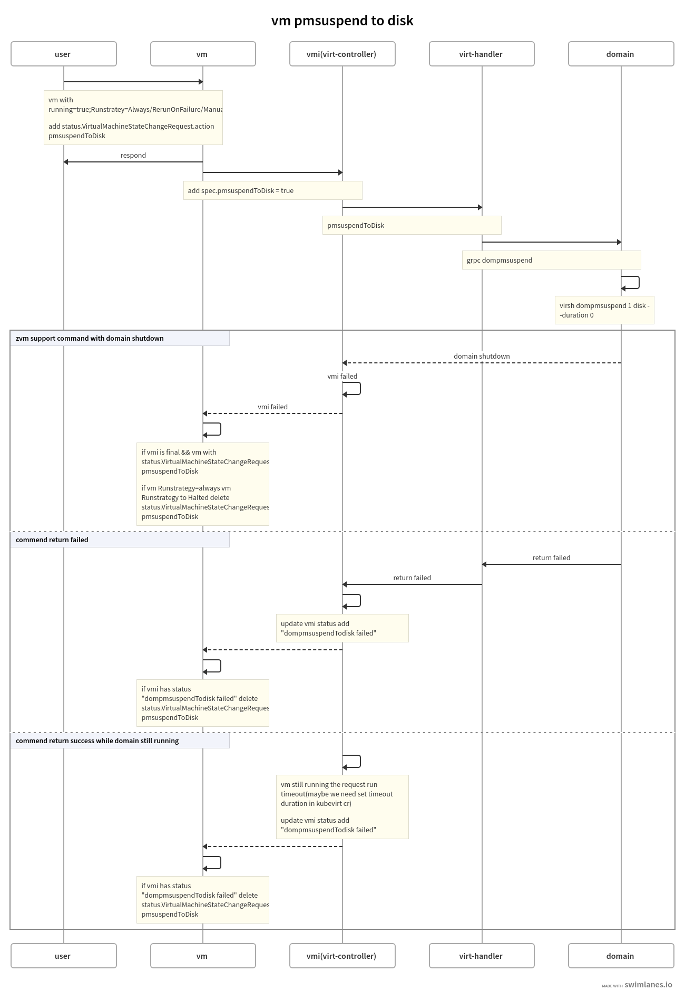

# Overview
libvirt have a pmsuspend interface [https://libvirt.org/html/libvirt-libvirt-domain.html#virDomainPMSuspendForDuration], at least for QEMU with flag `target disk` and `duration 0` we can shutdown a domain with  memory to disk. This can release resources. This proposal try to stop vm with `pmsuspend --target disk duration 0`,which can meet specific needs.

## Motivation
Some users wish to shut down running machines to free up resources, but the virtual machine state remains the same when turned on as when turned off.

## Goals
Add a new way to stop vm in kubevirt. which can make virtual machine state remains the same when turned on as when turned off.

## Non Goals
Add pmsuspend to memery to kubevirt（In my opinion, it can implement like pause）

## User Stories

A user exec `virtctl pmsuspendToDisk vm.name` commend, the vm stopped with memory state saved, exec `virtctl start vm.name` to start the stopped vm.

# Design


## Update/Rollback Compatibility
(does this impact update compatibility and how)

## Functional Testing Approach
(an overview on the approaches used to functional test this design)

# Implementation Phases

### phase1(send request)

1. pmsuspendToDisk is trigger by add status.VirtualMachineStateChangeRequest.PmsuspendToDisk to vm.

```
StopRequest  StateChangeRequestAction = "PmsuspendToDisk"
```

2. vm-controller find this status and add `pmsuspendToDisk = true` for vmi.

3. virt-handler send grpc request to virt-launcher and call libvirt interface.

### phase2(return)

According to my experimental results, there are three possible results.1)vm support command with domain shutdown; 2)command return failed; 3) command return successed while domain still running.

1) command successed domain shutdown

   when domain shutdown, vmi failed, vm Runstrategy update to halted.

2) command return failed
   
   If command failed. virt-handler get err grpc respond and add `domainpmsuspendTodisk` status for vmi. vm cancel request(delete status.VirtualMachineStateChangeRequest.PmsuspendToDisk in vm)
   
3) command return successed while domain still running
   
   We need set a timeout duration (maybe in kubevirt cr), If timeout while domain still running. we also add `domainpmsuspendTodisk` status for vmi and cancel request(delete status.VirtualMachineStateChangeRequest.PmsuspendToDisk in vm) in vm. (If domain shutdown after we cancel vm. We do nothing, just let the previous control logic execution, restart if Runstrategy=always)



