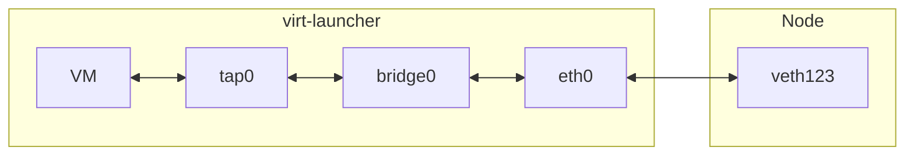
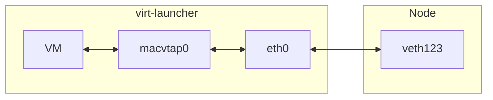

# Primary Pod Network Binding for Seamless Migration

## Summary

Choose the most appropriate Kubevirt network binding for the primary pod
network, considering basic functionality support, including seamless
migration.

## Overview

### Motivation

Kubevirt has been using the primary pod network with two main bindings:
masquerade and bridge. In order to support migration,
masquerade binding is required as it is the only binding that ensures
the guest IP remains the same while the Pod IP changes.
The primary pod network binding requirements allow migration, but it
does not promise any seamless traffic continuity on the primary pod
network (i.e. existing connectivity passing through the primary pod
network is expected to interrupt or break).

Seamless traffic continuity is assured only for secondary networks with
bridge bindings (or any alternative L2 connectivity). Usually the
secondary networks come without IPAM support, i.e. Kubevirt has no part
in preserving or managing the IP addresses for these networks. In other
words, it is up to the users to manage IP assignment and management for
secondary networks to allow seamless connectivity on migration.

> **Note**: On the primary pod network, classic IPAM solutions would
> assign IP addresses from different subnets (usually one per node).
> Therefore, on migration the primary pod network IP changes, causing
> active connections to be broken.

While secondary networks have been serving many user scenarios, they
lack the option to utilize many of the common Kubernetes functionality
(e.g. services). Network providers that support secondary networks,
sometimes provide only partial functionality compared to the primary pod
network.

To cope with the limitations network providers introduce to secondary
networks, Kubevirt needs to provide an alternative to work with the
primary pod network and still support core features like the seamless
migration.

### Goals

- Support seamless migration through the primary pod network.
- Preserve functionality of existing setups (with all their limitations).
- Define requirements from the network provider & CNI to assure a
  successful integration.

### Non Goals

- Migrate (automatically) the current existing setup to a new setup binding.
- Propose a method to deploy the solution (e.g. deploy a binding
  plugin). This may be covered as a follow-up or in a different proposal
  per need.

## Network Bindings

Kubevirt uses the network binding to enable connectivity between the VM
and the pod network interface.

### Core & Plugin

Kubevirt network bindings can be classified into two groups:

- Core network bindings.
- [Plugin network bindings](https://kubevirt.io/user-guide/network/network_binding_plugins/).

The core bindings are embedded into the Kubevirt codebase and usually
are the ones frequently used by users (e.g. masquerade, bridge and
SR-IOV bindings).
The plugin bindings are not part of the Kubevirt codebase, they
integrate with Kubevirt through an API. Some are developed and supported
by the project (e.g. passt binding) and some by 3rd party contributors.

The plugin bindings provide the ability to develop a binding
out-of-tree, innovating and examining usage without committing for long
term support in advance.
Therefore, it will be a natural fit to introduce the new network binding
effort with a pluggable binding. Once enough usage and experience is
collected, a pluggable binding may be considered for “promotion” as a
core binding.

### Primary & Secondary

Kubevirt network bindings can be classified based on their ability to
work with the primary or secondary networks.

As a general rule, bindings that can consume a CNI IPAM will usually
work on a primary pod network. The masquerade, bridge and passt bindings
work with the primary binding.
The SR-IOV and macvtap bindings are examples of the ones which cannot be
used on the primary pod network.

> **Note**: Consuming a CNI IPAM requirement for the primary pod network
> is not a hard requirement. There are exceptions to this, e.g. instead
> of consuming the CNI IPAM, the guest can consume an IP from the
> network-provider, set statically through cloud-init or other means.

### Migration Support

Kubevirt allows a VM to migrate only if it uses the masquerade binding
or a plugin binding that is marked
as [supporting migration](https://kubevirt.io/user-guide/network/network_binding_plugins/#migration)
for its primary pod network (or if the primary is not used at all).
The ability to migrate is agnostic to the support for seamless migration
with no traffic degradation. In fact, the primary pod network traffic is
currently expected to get broken during the migration (e.g. with
masquerade, the pod IP change/officials).

Users are recommended to use the secondary network with a L2
connectivity to preserve network connectivity with minimal impact. This
also comes with a limitation of not attempting to manage IP on secondary
networks, due to dependencies on sticky IP allocations for the pods up
to the ability to pass the IP allocation down to the VM itself.

The proposed solutions need to take into account the challenges the
existing known bindings have with the primary pod network and with migration.

## Proposal

The following proposal attempts to provide a solution for VMs that use
the primary pod network for the majority of the traffic and require a
seamless migration with no (or minimal) traffic connectivity
interruption.

The solution should consider two important points:

- Be agnostic to a specific network provided and CNI, by defining the
  requirements well.
- Co-exit with the current solutions without adding too much burden on
  maintenance. E.g. the logic and codebase should not diverge too much
  from the existing core network flow.

### Pre Requirements

The main challenge when working with the primary pod network is to
assure connectivity recovers after a VM migration. A new requirement is
added with this proposal, to preserve existing connectivity (e.g. TCP
connection) with minimal (to none) disruption.

As we are focusing here on the primary pod network, these requirements
translate to several pre-requirements from the network provider & CNI:

- Sticky IP: An IPAM plugin assigns an IP for each pod. In order to
  support migration and preserve seamless connectivity, the pod IP on
  the target node must use the same IP.
  The network-provider/CNI/IPAM needs to assure such an option exists so
  the same IP used for the primary pod network can be moved to the
  target pod.
- Flat Cluster Subnet for the Pod network: In order to allow the same IP
  to be assigned on a different node when migration occurs, only a
  single subnet needs to exist from the entire cluster on the primary
  pod network.
- Traffic hand-off on migration: With the need to keep the same IP on
  both the source and target nodes/pods, the network-provider needs to
  assure traffic is correctly directed to the active VM. I.e.during the
  migration process, the source VM is the active one (which may take
  several tens of seconds), afterward when the hand-off is moved to the
  target, traffic should start being directed to the new location.
  A Kubevirt VM signals that it is now active by sending a GARP message,
  letting all the bridges on the network know that the mac address
  moved. This may be enough for some network-providers while others may
  use other techniques to correctly forward the traffic to the right
  port.

> **Note**: In case this is not handled properly, traffic may be disrupted
> during and following a migration in unexpected ways.

These are the common pre-requirements for all the solutions options that
this proposal includes. Each proposed binding may have unique
requirements of their own.

### Network Binding Options

There are a few existing bindings (passt, bridge) and non-existing
futuristic ones which can be developed to solve the needs. This section
presents each with their pros and cons.

The chosen solution and a table summary is provided first, followed by a
detailed description of each.

<!-- TOC -->
* [The Binding Winner](#the-binding-winner)
* [Summary](#summary-1)
* [Passt Binding](#passt-binding)
* [Bridge Binding](#bridge-binding)
  * [As a Binding Plugin](#as-a-binding-plugin)
  * [As a DomainAttachmentType](#as-a-bridge-domainattachmenttype)
* [Macvtap Binding](#macvtap-binding)
  * [As a DomainAttachmentType](#as-a-macvtap-domainattachmenttype)
* [Other L2 Bindings](#other-l2-bindings)
<!-- TOC -->

#### The Binding Winner

The bridge binding plugin option with a `DomainAttachmentType` of
`managedTap` has been chosen after a successful initial PoC succeeded.

The original plan has been preserved for ref below.

Considering the requirements, development effort and maintenance cost,
the following plan was chosen:
1. Develop a **macvtap** network binding plugin. [**Failed**]
2. In case option [1] fails, develop a **bridge** network binding plugin. [**Succeeded**]
3. In case option [2] fails, enhance the existing **bridge** core binding.
4. Develop and enhance the Passt network binding plugin for the mid/long term.
   Passt will then replace the previous binding in a way that is
   transparent to users.
   > **Note**: This effort can run in parallel to the previous points

#### Summary

| Feature\\Binding            | Passt                                                                                                           | Bridge[*]                            | Macvtap                                          |
|:----------------------------|:----------------------------------------------------------------------------------------------------------------|:-------------------------------------|:-------------------------------------------------|
| Deployment                  | Binding Plugin                                                                                                  | Core                                 | Binding Plugin                                   |
| IP & Route delivery         | Self (IPv4 & IPV6)                                                                                              | Self for IPv4, Net Provider for IPv6 | Net Provider                                     |
| Pod Probes Support          | Yes                                                                                                             | No                                   | No                                               |
| Seamless Live-Migration     | Requires Development                                                                                            | Yes                                  | Yes                                              |
| Supported Traffic           | TCP/UDP/ICMP (All IP in case seamless migration is resolved)                                                    | IP                                   | IP                                               |
| Migration Support Indicator | Yes                                                                                                             | Requires Development                 | Yes                                              |
| Mesh / Istio support        | Yes                                                                                                             | No                                   | No                                               |
| IP Status (reporting)       | Yes                                                                                                             | Yes                                  | Requires Development                             |
| Observability Integration   | Yes                                                                                                             | No                                   | No                                               |
| Resource Overhead           | 500MB per VM, 250MB per VM already available on U/S, Negligible overhead when resolving the seamless migration. | Negligible                           | Negligible                                       |
| Performance                 | N/A                                                                                                             | N/A                                  | N/A , Most likely better than the bridge option. |
| Kubevirt Support            | Low                                                                                                             | High                                 | Medium                                           |

[*] Core Bridge binding can be deployed as a binding plugin with a subset
    of its existing feature sets. E.g. as a plugin, IP & routes can be
    supported only through the network-provider.
    As a plugin, it benefits from having a migration indicator and lower
    support cost.

#### Passt Binding

Passt is available through
an [existing](https://kubevirt.io/user-guide/network/net_binding_plugins/passt/)
network binding plugin that provides user space network connectivity.
It is considered a candidate to replace the existing masquerade binding
due to the simplification it introduces.

Pros:

- Self-contained IP stack solution (IPv4 & IPV6), independent of the
  network-provider. This allows it to work with a larger number of
  network-providers and CNIs.
- Trivial integration with Mesh solutions like [Istio](https://istio.io)
  with no special treatment from Kubevirt.
- Integrates with the VM interfaces network status reporting logic.
- Integrates with 3rd party network monitoring & collection solutions (
  e.g. [stackrox](https://www.stackrox.io/)).
- Maintenance & support cost is low as most functionality is deferred on
  the Passt project (which is actively used in Podman, libkrun, krun,
  optional usage in Docker via rootlesskit/moby, and only supported
  user-mode network solution starting from RHEL 10 for libguestfs,
  libvirt, as libslirp is deprecated there).

Cons:

- Attempting to use it for live-migration results in breaking TCP
  connections.
- Passt supports TCP, UDP and ICMP traffic only. While most traffic
  today is encapsulated in one of these common L4 protocols, it is hard
  to predict what customers are using.
- Resource overhead: When all ports are to be forwarded to the guest,
  Passt is expected to use around 500MB of kernel memory. Work has been
  invested in this to reduce the overhead to around 250MB.

Performance:

Unfortunately, there are no measurements done to compare it to other
bindings (mainly comparable to the masquerade binding).

##### Required Development:

In order to comply with the needs set in this design, Passt must solve
the seamless live-migration limitation of breaking TCP connections and
hopefully also treat the other two cons (limited traffic protocols and
resource usage).

Several options have been raised to tackle these challenges:

1. Instead of using TCP/UDP/ICMP sockets, use an IP socket.
   * TCP connections are not expected to break.
     * Traffic will no longer be limited to one of these protocols.
     * Resource overhead will be negligible.
     * Challenge: Opening an IP socket requires a NET_RAW capability.
       * One option to resolve this is for the virt-handler to add the
         capability on the Passt binary.
         * Another option is to create the socket at the virt-handler and
           pass it to the virt-launcher using a unix socket.
2. Migrate the VM without migrating Passt, which runs on a third, "
   stable" node, providing a detached "exit point" for network traffic.
   * This does not seem to be an acceptable solution because the
     expectation is for the VM to migrate when the node is evicting or
     when overloaded. It is enough to consider a node upgrade reason
     for the eviction to see that eventually Passt will also have to
     move out and break connections.
3. Using the TCP_REPAIR socket option, the old Passt instance dumps
   existing connection states from the kernel to a file, which is loaded
   by the new instance.
   * Requires development and integration with Qemu.
4. Run passt in its own bridged VM and migrate it with the main VM.
   * Migrating two VMs in parallel, assuring they reach the same node
     and that both perform the handoff in a correct timing seems challenging.

Attempting to go with option (1) above requires a PoC that changing the
capability of the Passt binary is possible (est. 2 days) and Passt
development to support this work mode (est. 20 days).

#### Bridge Binding

The bridge binding is
an [existing](https://kubevirt.io/user-guide/network/interfaces_and_networks/#bridge)
core binding that provides a L2 connectivity with a limited support for
IPAM consumption. The binding is commonly used on secondary networks
without IPAM and on the primary pod network with IPAM.  
Kubevirt blocks migrations when the binding is used on the primary pod
network (although a special informal annotation on the VMI may be used
to overcome this limitation).

Pros:

- Self-contained, supports the reflection of the IPv4 stack to the
  guest (independent of the network-provider).
- Provides seamless live-migration due to its L2 wiring.
- Supports all traffic types.
- Integrates with the VM interfaces network status reporting logic.
- Core binding with no need to depend on an external out-of-tree plugin.

Cons:

- Does not support the reflection of the IPv6 stack to the guest (
  requires support from the network-provider).
    - While DHCPv6 is supported, RA is not.
- It is missing a live-migration support indicator to allow Kubevirt to
  determine if a migration is allowed or not.
- Does not support integration with mesh solutions (e.g. Istio).
- Maintenance is high due to the expected addition of logic to resolve
  some cons and the strong dependency on the DHCP internal server.
  Changes to the binding have to consider its usage as a primary pod
  network with and without migration support and its usage as a
  secondary network binding.
    - The DHCP server represents the highest risk, as it needs to
      support various guest OS with a potential need to increase/change
      the options it serves.

##### Required Development

- The live-migration support indicator options:
  - Drop the existing limitation that blocks the migration when bridge
    binding is used with the primary pod network. I.e. always allow
    migration.
    - Not recommended because the VM may lose connectivity after migration.
  - Add an API field to indicate if the VM is migratable or not:
    - Per interface, being relevant only when used for a primary pod network.
    - Per the pod network type.
    - At the cluster level, in the Kubevirt CR.
  - Auto detect when it is migratable:
    - The migration controller can examine the created target pod
      and validate that when bridge binding is in use for the
      primary pod network, the primary pod network interface has the
      same IP details as the source pod. In case they are not
      identical, the migration controller will cancel the operation.
    - An optional enhancement could be to add a strategy knob on how
      the validation should be treated (e.g. always block, always
      allow, validate-ip, etc.). At this stage, there seems to be no
      immediate need for such an option.
- IPv6 support options:
  - Provide the support through the network-provider.
  - Revive the work on enabling RA by the virt-launcher. Challenges include:
    - Ability to open ICMPv6 sockets towards the VM.
    - Assure they do not leak in the direction of the node.
    - If this work item is chosen, a separate design needs to be
      open and focused on it as an independent enhancement.
  - Provide a workaround through documentation, to configure IPv6 on
    the guest:
    - Connect to the guest and add the IPv6 routes manually.
    - Define the IPv6 configuration through cloud-init.

##### As a Binding Plugin



The bridge binding can potentially be implemented as a binding plugin.
The community has already shown interest in this direction with an
active [contribution](https://github.com/kubevirt/kubevirt/pull/12671).

A plugin solves the live-migration support indicator (as it is part of
the [plugin API](https://kubevirt.io/user-guide/network/network_binding_plugins/#migration))
but on the other hand introduces a challenge with the DHCP servers and
data sharing between the CNI and virt-launcher (in the core, this is
solved by the virt-handler persisting the data on a file for the
virt-launcher to consume).

IPv6 support remains similar to the core binding version.

There is one additional implementation challenge which comes with the
plugin: The creation of the tap device by the CNI requires to correctly
consider the SELinux labeling in advance because tap devices cannot
be relabeled after creation.

From a maintenance point of view, the core is untouched and kept simple
while the burden is added to the plugin. For gradual adoption, the
plugin seems a better choice. But if the scenario is expected to be
commonly used, it may add redundant overhead.
As a plugin, it can be developed independently to the Kubevirt release
cycle on a different repo.

###### As a bridge DomainAttachmentType

The network binding plugin exposes a
[DomainAttachmentType](https://kubevirt.io/user-guide/network/network_binding_plugins/#domainattachmenttype)
field which provides pre-defined core Kubevirt methods to attach an
interface to the domain.

The bridge binding plugin may utilize this field by adding a new
attachment type that can both create the tap device + bridge in the pod
and define it in the domain configuration.

The new type is similar to a managed interface in a (libvirt) domain,
where the definition of the interface also attempts to create the
relevant devices.
Therefore, the new type will be called `managedTap`.

When the `domainAttachmentType` is set with a value of `managedTap`,
the virt-handler will make sure to create the tap device and connect
it to the pod interface of the network through a Linux bridge.
The virt-launcher will consume the tap interface in the domain
configuration.

Compared to the use of a network binding plugin CNI options, it has the
following pros:
- Does not require a CNI, reducing maintenance and deployment cost.
- Avoids SELinux and cgroup issues by creating the device in the context
  of the virt-launcher pod compute container, similar to the creation of
  the `tap` device for the core bindings.

To register the network binding plugin, no CNI or sidecar are required:

```
kubectl patch kubevirts -n kubevirt kubevirt --type=json -p=\
'[{"op": "add", "path": "/spec/configuration/network",   "value": {
    "binding": {
        "managedtap": {
            "domainAttachmentType": "managedTap"
        }
    }
}}]'
```

#### Macvtap Binding



The macvtap binding is an alternative to the bridge binding with very
similar pros and cons.
The [macvtap device](https://virt.kernelnewbies.org/MacVTap) is attached
to the pod interface in a passthru mode.

> **Note**: This binding plugin is **not** referring the existing
> [node macvtap binding plugin](https://kubevirt.io/user-guide/network/net_binding_plugins/macvtap/).

> **Warning**: Requires PoC to confirm it works when attaching to a veth
> interface and multiple mac addresses are active in the guest.

Deployed as a binding plugin with no option to self-serve IPAM to the VM.
It is dependent on the network-provider to be able and serve IP
addresses to the guest.

Compared to the bridge binding (as a plugin), it is simpler and with
probably better performance.
In addition, macvtap devices have a device representation and can be
relabeled (SELinux) post creation. However, as a device, there is a need
to adjust it to the virt-launcher compute cgroup.

> **Warning**: Relabeling of a macvtap device and cgroup adjustment
> needs PoC confirmation.
> 
> **Results** (PoC):
> Initial results revealed that creating a macvtap inside the
> pod netns is not practical.
> While the macvtap link can be created, the character device is not.
> Creating the char device can be done only when a mount ns is
> available, i.e. sometime after the CNI step.

As a plugin, it can be developed independently to the Kubevirt release
cycle on a different repo.

##### As a macvtap DomainAttachmentType

The network binding plugin exposes a
[DomainAttachmentType](https://kubevirt.io/user-guide/network/network_binding_plugins/#domainattachmenttype)
field which provides pre-defined core Kubevirt methods to attach an
interface to the domain.

The macvtap binding plugin may utilize this field by adding a new
attachment type that can both create the macvtap device in the pod and
define it in the domain configuration.

The new type is similar to a managed interface in a (libvirt) domain,
where the definition of the interface also attempts to create the
relevant devices.
Therefore, the new type will be called `managedMacvtap`.

When the `domainAttachmentType` is set with a value of `managedMacvtap`,
the virt-handler will make sure to create the macvtap device and connect
it to the pod interface of the network.
The virt-launcher will consume the macvtap interface in the domain
configuration.

Compared to the use of a network binding plugin CNI options, it has the
following pros:
- Does not require a CNI, reducing maintenance and deployment cost.
- Avoids SELinux and cgroup issues by creating the device in the context
  of the virt-launcher pod compute container, similar to the creation of
  the `tap` device (for the core bindings).

> **Note**: The attachment is expected to include basic attributes which
> should fit the Kubevirt use case. E.g. using `passthru` as the macvtap
> mode.

To register the network binding plugin, no CNI or sidecar are required:

```
kubectl patch kubevirts -n kubevirt kubevirt --type=json -p=\
'[{"op": "add", "path": "/spec/configuration/network",   "value": {
    "binding": {
        "macvtap": {
            "domainAttachmentType": "managedMacvtap"
        }
    }
}}]'
```

> **Results** (PoC):
> - Traffic is not reaching the VM from outside, although traffic is
>   observed existing.
> - Kubevirt cgroup management is problematic. Attempting to add rules
>   in order to include devices in a cgroup overrides previous rules.


#### Other L2 Bindings

The bridge and macvtap bindings have one behavior in common: They
forward traffic based on L2 (ethernet frames) information only.

Similar bindings may be invented to forward traffic using other technologies.
Some may be more efficient than others with different complexities but
with a very similar pros and cons as seen on the previous bridge &
macvtap bindings, e.g.:

- Passing the IP & route configuration from the pod interface to the VM
  guest interface is left to the network provider (e.g. DHCPv4, DHCPv6, RA).

Some of the suggested L2 alternatives are:

- OVS bridge
- eBPF
- Tap device directly connected to the node, passed into the pod for
  consumption (saving the veth pair that links the pod interface to the
  node).

## Delivery

Aimed for release in Kubevirt v1.4.
Based on the timeline, the plugins may be developed under the
kubevirt/kubevirt project or in a separate repo.

Mid and long term solution (Passt) is targeted for Kubevirt v1.5 or v1.6.

## Deployment

The network binding plugin is expected to be deployed through
[CNAO](https://github.com/kubevirt/cluster-network-addons-operator).
