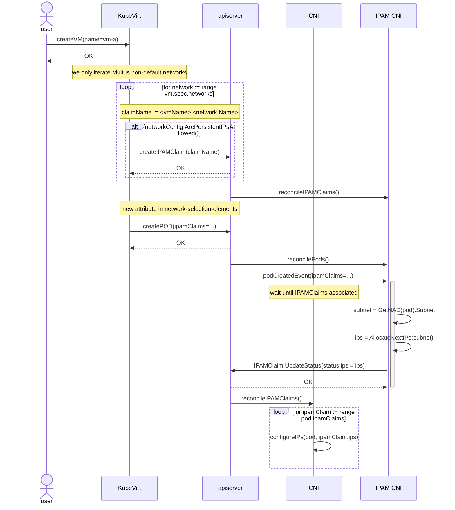
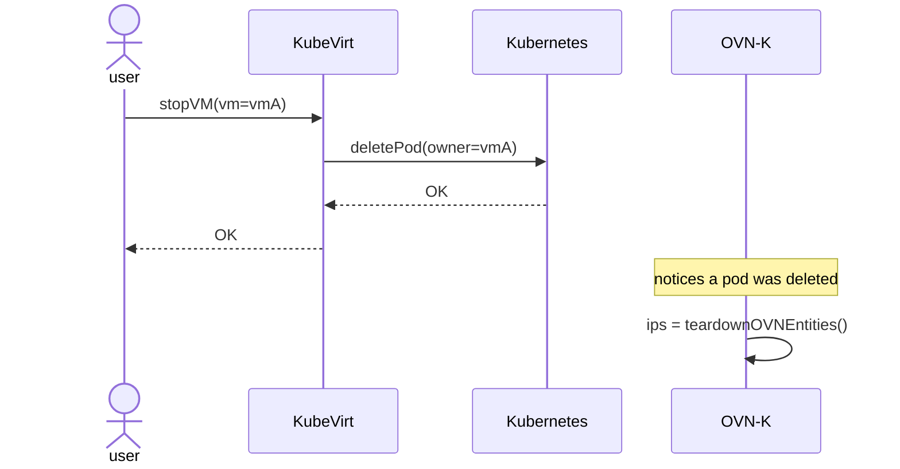
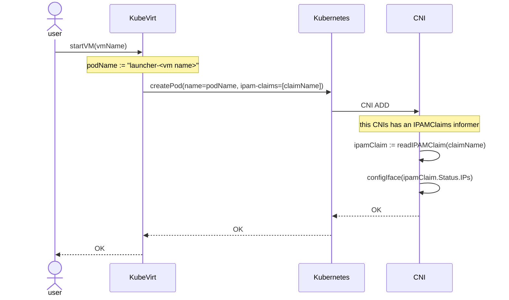
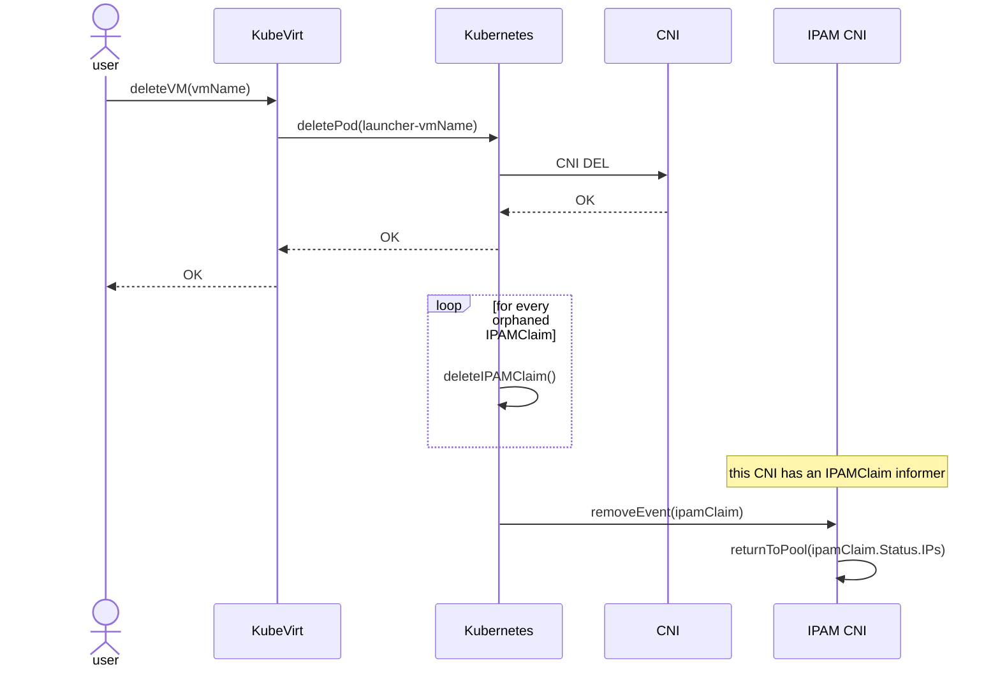

# Overview

## Motivation
Virtual Machine owners want to offload IPAM from their custom solutions (e.g.
custom DHCP server running on their cluster network) to SDN.

The other alternative - static IP address allocation - is also not ideal for
virtualization users, given how cumbersome it is - i.e. specifying the IP for
each VM's interface.

This motivation only applies to secondary networks, since the cluster default
network already has IPAM in it, as per the Kubernetes networking model.

## Definition of users
There are two types of users regarding this feature, the network admin, and the
VM user. They are described below:
- net admin: this user can configure the network interconnecting the Kubernetes
nodes. They can create / update / delete network attachment definitions.
- VM user: this user can create / delete virtual machines.

## User Stories
- As a VM user, I want my VMs to automatically get IP addresses from a
configured range, so I don't need to manage my own IP pools, DHCP server, or
static IP configuration.
- As a VM user, I want to migrate (one of) my VMs to another node, preserving
the networking configuration, so the IP-aware applications running in the VM are
not impacted.
- As a VM user, I want to start Virtual Machines (currently stopped) with the
original VM network configuration, so the IP-aware applications running in the
VM are not impacted.
- As a network admin, I want to decide which networks can be subject to having
persistent IP allocations surviving VM migration, and VM stop.

## Goals
- Manage KubeVirt Virtual Machines IP addresses from within the SDN solution
provided by OVN-Kubernetes.
- IPv4 range can be defined on OVN Kubernetes secondary network
- VMs are able to get a IP from this subnet
- The IP sticks to a VM during live-migration
- The IP sticks to a VM even if it is temporarily shut down

## Non-goals
- this design proposal's scope is limited to secondary networks - i.e. the
default cluster network's IP allocation should still follow the pod lifecycle.
- seamless live migration. Some packets will be dropped during live migration;
this feature is tracked in a follow up epic.
- configure the default-route or DNS on secondary attachments.

## Repos
- [CRD](https://github.com/k8snetworkplumbingwg/ipamclaims)
- [CNI plugin](https://github.com/ovn-org/ovn-kubernetes)
- [KubeVirt](https://github.com/kubevirt/kubevirt)

## Design
This feature is essentially about tying the IPAM allocation to a VM custom
resource, instead of a pod.

This means we want the IP allocations to remain when the VM is stopped (thus the
corresponding VMI and pod are deleted), but for them to be released to the IP
pools when the VM CR is deleted.

Given OVN-Kubernetes (the CNI plugin where this feature will be implemented)
operates at pod level (i.e. it does **not** know what a KubeVirt VM is), and its
source of truth is in essence the live pods on the cluster, we need to have
something in the data model representing this existing allocation when the pod
is deleted (the stopped VM scenario). If we don't, those IP addresses would be
allocatable for other workloads while the VM is stopped.

Thus, we propose to introduce a new CRD to the k8snetworkplumbingwg, and make it
part of the Kubernetes multi-network defacto standard in this update proposal.
The `IPAMClaim` CRD was added to the Kubernetes multi-networking de-facto
[standard](https://github.com/k8snetworkplumbingwg/multi-net-spec/blob/master/v1.3/%5Bv1.3%5D%20Kubernetes%20Network%20Custom%20Resource%20Definition%20De-facto%20Standard.pdf)
version 1.3. The sections describing the CRD and how to use them are in sections
4.1.2.1.11 (network selection element update) and 8 (IPAMClaim CRD).

The IPAMClaim CRD is available in
[this repo](https://github.com/k8snetworkplumbingwg/ipamclaims).

The CNI plugin must be adapted to compute its IP pool not only from the live
pods in the cluster, but also from these CRs.

### Configuring the feature
We envision this feature to be configurable per network, meaning the network
admin should enable the feature by enabling the `allowPersistentIPs` flag in the
CNI configuration for the secondary network (i.e. in the
`NetworkAttachmentDefinition` spec.config attribute).

A feature gate may (or may not) be required in the KubeVirt.

### Requesting the feature from the CNI plugin
There are essentially four ways this feature can be developed:
1. VM user creates the persistent IPs allocation
2. KubeVirt creates the persistent IPs allocation
3. the CNI plugin creates the persistent IPs allocation
4. an external controller creates the persistent IPs allocation

The first two options require KubeVirt to indicate via the network selection
element the name of the `IPAMClaim` when creating the pod encapsulating the VM
workload; the third option, requires KubeVirt to send all the required
information for OVN-Kubernetes to create the persistent allocation - including
the owner reference - and manage its lifecycle.

In the last option, KubeVirt must also indicate via the network selection
element the name of the IPAMClaim to use. If we use a webhook, we could take
this a step further, and mutate the templated pod to feature the required
IPAMClaim reference in the network selection element. Without looking into the
OVN-K configuration (i.e. the NAD.spec.config) we would have to have all
virtualization workloads subject to the webhook, which would impact the VM
creation times, and possibly risk the VM failing to be created because the
webhook failed on something unrelated. Our recommendation is to avoid the
webhook design.

Take into account the CNI plugin operates exclusively at pod level, it cannot
fulfill the VM lifecycle entirely - it relies on Kubernetes garbage collection
to delete these allocations, and cannot safely perform VM foreground deletion
while guaranteeing the allocated IP addresses would be returned too early to the
pool, and thus be available for other workloads - which would cause the same IP
to be available in a shutting down VM, and a booting up workload at the same
time. This is explained more thoroughly in
[this-section](#premature-ip-release-considerations).

Thus, having the CNI plugin create the IPAMClaim CR was discarded.

### Workflow Description

#### Creating a Virtual Machine
The user initially requests a virtual machine (VM) to be created. If they
desire their VM to have "sticky IPs" - i.e. the IP allocations to outlive the
pod the VM runs on - the following requirements must be met:

- the KubeVirt CR must have the required feature gate enabled: e.g.
  `VMPersistentIPs`
- the NAD holding the configuration for the secondary network must allow for
persistent IPs - `{..., "allowPersistentIPs": true, ...}`

If the KubeVirt feature gate is enabled, KubeVirt will create the `IPAMClaims`
for each multus non-default network, thus declaring intent of having persistent
IP allocations for those interfaces.
This could be further improved by having KubeVirt only create those for multus
non-default network having the `allowPersistentIPs` knob enabled - KubeVirt
already reads `NetworkAttachmentDefinition`s. Refactoring it to read those via
informers would be good, to alleviate the API load.

Having a cluster-wide configuration knob to enable/disable the persistent IPs
feature is not recommended - we consider the appropriate configuration place
to be the network-attachment-definition configuration.

The IPAM CNI plugin will then react accordingly and if the NAD configuration
allows it, allocate IPs from its pool - which will be persisted in the
`IPAMClaim` status. Finally, the CNI will configure the interface with these
IP addresses.

Please refer to the diagram below to better understand the proposed workflow
for VM creation:
1. the user provisions a VM object
2. the KubeVirt controller creates an IPAMClaim (in the same namespace of the
  VM) for each multus non-default network in the corresponding VMI spec
3. KubeVirt templates the KubeVirt launcher pod, featuring in each network
  selection element the name of the claim where the CNI will find the IP address
4. OVN-K allocates an IP address for pod requests featuring an
  `ip-claim-reference` pointing to an `IPAMClaim` for one of the networks it
  currently manages. **Only afterwards** will it update the corresponding
  `IPAMClaim` with the generated IPs. Users can only rely / use the `IPAMClaim`
  status for informational purposes.
5. the CNI plugin will see this network has persistent IPs enabled; it will
  then look in the pod's network selection elements for the claim name where
  the persistent IP address will be located. If it doesn't find it there, the
  plugin will retry later, using exponential backoff. Once the `IPAMClaim`
  features the IPs in the status, the OVN-Kubernetes CNI will configure the
  pod's OVN annotations with this IP, which will in turn trickle down to the
  pod interface.

On step 5, if an IPAMClaim already exists (belonging to a previous VM with the
same name), the controller throws an error, and will reconcile later. Eventually
the controller will delete the previous IPAMClaim, and the flow will manage to
create a new one. We are able to identify this by comparing the VM's UID in the
IPAMClaim owner references with the UID of the VM being reconciled.



**NOTES**:
- When the feature gate is not enabled, KubeVirt will **not** request
  persistent IP allocations from the CNI.
- OVN-Kubernetes will **not** check for consistency errors related to the
  `IPAMClaim`s used in two different pods simultaneously.

#### Stopping a Virtual Machine


OVN-Kubernetes will **not** delete the `IPAMClaim` CRs for the deleted VM pod.
The IP addresses allocated to the VM will **not** be released to the IP pool
when there's a corresponding `IPAMClaim` for the attachment being deleted.

#### Starting a (previously stopped) Virtual Machine
This flow is - from a CNI perspective - quite similar to the
[Creating a VM flow](#creating-a-virtual-machine):
1. the workload controller (KubeVirt) templates the pod, featuring the required
   `IPAMClaim` references in each network selection element.
2. OVN-Kubernetes will read the network selection element; if it sees an
   `IPAMClaim` reference, it will attempt to read it from the datastore.
3. if the read `IPAMClaim` features IP addresses in its status, OVN-Kubernetes
   will configure the interface with those IPs. If the status doesn't feature
   IP addresses, the CNI plugin will retry later, with exponential backoff.

As when creating a new VM, an error is thrown when the IPAMClaim belonged to an
old VM with the same name. Eventually the garbage collector will remove this old
IPAMClaim, and in the next reconcile loop the controller will create a new
IPAMClaim.



When creating the pod, the OVN-Kubernetes IPAM module finds existing
`IPAMClaim`s for the workload. It will thus use those already reserved
allocations, instead of generating brand new allocations for the pod where the
encapsulating object will run. The migration scenario is similar.

#### Removing a Virtual Machine
This flow is - from a CNI perspective - quite similar to the
[Stopping a VM flow](#stopping-a-virtual-machine). The main difference is after
the VM is deleted, Kubernetes Garbage Collection will kick in, and remove the
orphaned `IPAMClaim`s. OVN-Kubernetes will need to react to the `IPAMClaim`
delete event, to return those IP addresses to the respective IP pools.



#### Hot-plug a VM interface
Hot-plugging an interface from a KubeVirt VM is a two step process, requiring
a migration:
1. the user mutates the VM.Spec.Template of the running VM, adding the new
   interface(s)
2. the user migrates the VM
3. all interfaces in the template definition (including the new ones) will be
   templated in the pod where the VM will run after the migration.
4. The new interfaces be attached into the live VM.

#### Hot-unplug a VM interface
Hot-unplugging an interface from a KubeVirt VM is a two step process, requiring
a migration:
1. the user mutates the VM.Spec.Template of the running VMI setting the
   interface(s) as absent
2. KubeVirt dettaches the interface from the live VM
3. the user migrates the VM
4. the interfaces marked as absent will not be templated on the destination pod
   (i.e. the migration destination pod will not have those interfaces)

To ensure the IPs allocated to hot-unplugged interfaces are returned to the
pool, KubeVirt needs to delete the `IPAMClaim`, otherwise, they will only be
garbage collected when the VM is deleted.

Finally, OVN-Kubernetes must react to the deletion of the IPAMClaim, and return
this IP address to its in-memory pool.

### Migration considerations
When migrating VMs to a new node there will be a few moments (seconds even)
where both source and destination pods will be ready at the same time, having
the same IP address configured. This will surely lead to some dropped packets.

Providing seamless live-migration is not one of the goals of this feature - a
follow up epic will focus on that, by binding the logical switch port for the
pod to the node where the VM is available in "real time" - i.e. initially the
port is bound to the src node, then it becomes bound on both nodes, then
finally it is bound exclusively to the dst node (when the destination pod takes
over). This feature is called OVN multi-chassis binding; Openstack uses it
successfully, as indicated in
[this talk](https://www.youtube.com/watch?v=ijZTMXAg-eI).

### Premature IP release considerations
When VM [foreground deletes](https://kubernetes.io/docs/concepts/architecture/garbage-collection/#foreground-deletion)
are used, the VM object is first marked for deletion, and then all dependants (
in our case, the IPAMClaims) are deleted.

This would cause the IP addresses to be released to the pool while VM is still
being torn down. If a new workload comes up, it might be allocated with this
address, and the traffic will not work properly.

To prevent this, we plan on setting a finalizer on the IPAMClaim upon its
creation, and to remove it when the VM is actually deleted.

This essentially makes it not possible for the IPAMClaim to be created by the
CNI plugin, since it cannot track / understand the VM lifecycle.

With VM
[background deletion](https://kubernetes.io/docs/concepts/architecture/garbage-collection/#background-deletion)
scheme is used, the owner object is always deleted before the dependents. Plus,
we are sure the `IPAMClaim` is removed **after** the VMI and launcher pod
because the VMI has a finalizer that is only cleared (by virt-controller) once
the launcher pod is deleted. And the IPAMClaim finzalizer is removed only when
the VMI is gone.

#### Guest considerations
The guest requires a DHCP client on all interfaces where IPAM is enabled.

### KubeVirt related changes

#### Pod templating

KubeVirt would need to template the pod accordingly - i.e. the
`NetworkSelectionElements` must feature the `ipam-claim-reference` attribute to
indicate to the IPAM CNI / CNI which `IPAMClaim` they should use to persist the
IP allocation across reboots / migrations.

Check the following network selection elements annotation from a KubeVirt
launcher pod to see an example:

```bash
kubectl get pods <launcher pod name> -ojsonpath="{ @.metadata.annotations.k8s\.v1\.cni\.cncf\.io\/networks }" | jq
[
  {
    "name": "tenantred",
    "namespace": "default",
    "interface": "pod16367aacb67",
    "ipam-claim-reference": "vm-a.tenantred"
  }
]
```

#### Creating the IPAMClaim
KubeVirt must create the IPAMClaims (and set finalizers / owner references) to
properly ensure the VM's lifecycle is reflected in the allocation.

There are two important sections to fill when creating the IPAMClaim reference:
- the IPAMClaim name
- the spec.network attribute

The `IPAMClaim` name will be created using the following pattern:
`<vm name>.<logical network name>`. The logical network name is the [name of the
network](https://kubevirt.io/api-reference/main/definitions.html#_v1_network)
in the KubeVirt API.

The `IPAMClaim.spec.network` must be the name of network as per the
[CNI spec](https://github.com/containernetworking/cni/blob/main/SPEC.md#configuration-format).
This attribute is mandatory as per the CNI specification, and the CNI requires
it to understand how to map IPAMClaims to the networks (and thus, IP pool) when
de-allocating the IP address as a result of the `IPAMClaim` deletion.

Below you can find an example of a network attachment definition, and a VM
snippet, specifying the behavior of attachments to the `tenantblue` network,
along with an `IPAMCLaim` for that network.
```yaml
---
apiVersion: k8s.cni.cncf.io/v1
kind: NetworkAttachmentDefinition
metadata:
  name: tenantblue-netconfig
spec:
  config: |2
    {
            "cniVersion": "0.4.0",
            "name": "tenantblue-network",
            "type": "ovn-k8s-cni-overlay",
            "topology":"localnet",
            "subnets": "192.168.10.0/24",
            "excludeSubnets": "192.168.10.1/32",
            "allowPersistentIPs": true,
            "netAttachDefName": "default/tenantblue-netconfig"
    }
---
apiVersion: k8s.cni.cncf.io/v1alpha1
kind: IPAMClaim
metadata:
  name: vm1.tenantblue
spec:
  network: tenantblue-network
  interface: net1
---
apiVersion: kubevirt.io/v1
kind: VirtualMachine
metadata:
  name: vm-workload
spec:
  running: true
  template:
    spec:
      domain:
        devices:
...          
          interfaces:
          - name: tenantblue
            bridge: {}
...
      networks:
      - name: tenantblue
        multus:
          networkName: default/tenantblue-netconfig
...
```

**NOTE:** the mandatory `name` attribute in the CNI configuration
(NAD.spec.config) **must** match the `IPAMClaim.spec.network` attribute of the
IPAMClaim so the CNI plugin can map the IPAMClaim to the network.

#### KubeVirt feature gate
The feature is opt-in via the network-attachment-definition, (thus disabled by
default). When the feature gate is disabled, the NAD configuration will not be
read, and the feature won't be used. adding a feature gate is good practice,
especially since we're using an alpha API.

#### KubeVirt API changes
No API changes are required on KubeVirt.

## Alternatives

### Separate IPAMClaim lifecycle manager
Creating the IPAMClaims could be implemented in a separate controller that also
knew how to manage the VM's lifecycle.

Doing so is re-implementing the wheel, since we would have to pretty much
re-implement the virt-controller reconcile loop, including hotplug/unplug. This
means any changes to features might span across different repos, with different
maintainers, and collaborators.

That plus release yet another component, which would need to be integrated into
the [cluster-network-addons-operator](https://github.com/kubevirt/cluster-network-addons-operator),
and also maintained and cared for - i.e. yet another repo to keep CVEs away
from, refresh dependencies, update kubevirtci (I'm assuming it'll be used for
e2e tests), and so forth.

Finally, having a separate controller manage the IPAMClaim lifecycle would also
open the door for scenarios where the pod is templated (and requested) before
the IPAM is created. This can bloat the VM creation time, since the SDN response
to the CNI ADD command to create / configure the pod's networking infrastructure
cannot proceed without the IPAMClaim when persistent IPs are requested on that
network. This means the CNI flow would not be able to proceed, and would have to
be retried, until the IPAMClaim is found. Despite being listed as a drawback,
using eventual consistency is a common kubernetes pattern.

As advantages, this would enable us to integrate the CRD into the product as a
side effect (in CNAO), instead of expecting the user to do so manually.

From the KubeVirt perspective, this route would enable less code changes:
KubeVirt would not need to create the `IPAMClaim`s nor have to check the
NAD configuration - all it would have to do is to template the launcher pod with
the proper `ipam-claim-reference` in the network-selection-element. To ensure
some CNIs are not broken by this (which as per the CNI spec can happen),
KubeVirt could only template the pods based on the feature gate, plus on some
well known label set on the VM (i.e. `allow-persistent-ips.k8s.cni.cncf.io`).

### The VM user creates IPAMClaims manually
Another option (cumbersome to the user) would be to leave the management of the
lifecycle of the IPAMClaims directly to the user - i.e. they would be
responsible for creating the IPAMClaims, and deleting those once they are no
longer required.

The user would need to create the IPAMClaims with a specific name, since
KubeVirt would still need to template the pod with a reference of an IPAMClaim.

To prevent scenarios where a user mistakenly deletes an IPAMClaim for a VM in
use - which would cause the IP address to be returned to the pool - when
KubeVirt requests the IP address, it would also set a finalizer in the IPAMClaim
to signal it has a "stake" in the IPAMClaim. Once the VM is deleted, KubeVirt
would also remove the aforementioned finalizer. Using unstructured would allow
writting / deleting the finalizer on the CR without having to consume the CRD.

