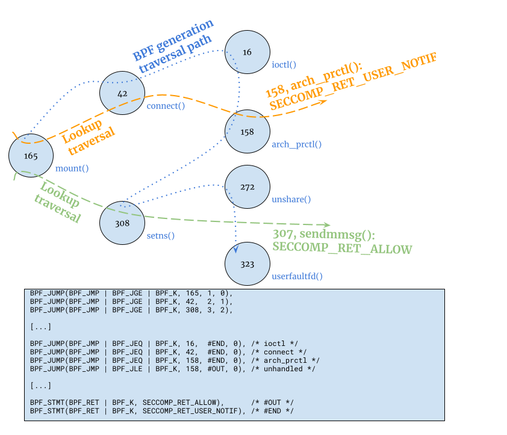

# seitan: Implementation Details

- [seitan: Implementation Details](#seitan--implementation-details)
  * [Overview](#overview)
  * [Input](#input)
  * [Output: BPF program](#output--bpf-program)
  * [Output: Matches and actions bytecode
    (_gluten_)](#output--matches-and-actions-bytecode---gluten--)

## Overview

_Seitan-cooker_ **builds**:

* the BPF program corresponding to **the seccomp** filter that provides
  userspace notifications for selected system calls. This process could be
triggered either at the time of the configuration of a given virtual machine
instance, or at the time of the build of KubeVirt components for a specific
distribution or deployment, depending on the desired degree of configuration
flexibility.  The **BPF program is** **handled as an opaque object** by
`virt-launcher`, which installs it in its own context, using the `prctl()`
system call, and lets child processes inherit it. This **avoids** the need for
any security-relevant **parsing** at run-time in privileged and unprivileged
components

* A **bytecode** (_gluten_) implementing system call **matches**, intended here
  as an expressive representation of call arguments (as opposed to the simple
logic offered by BPF programs), with optional cross-references and counting
operations, **and corresponding actions** to be performed.

Further details are illustrated in the following sections.

## Input

The input to the BPF program builder consists of a **JSON configuration model**
representing:

* system call **matches**, described as a set of architecture-specific system
  call numbers, syscall-specific expressions matching on arguments, possibly
with captured values, and optional specifications of process identifiers,
executable paths, stateful counters
* resulting **actions**, following one of these three possibilities:
    * **transform and replay** in a different security context, with a
      specification of the following action to be performed on the target
process, including return code adjustments and possible atomic re-injection of
file descriptors
    * **block**, and optionally abort the calling process
    * permit **regular continuation**, based on observed arguments. In order to
      address the inherent _time-of-check, time-of-use_ concern given by the
fact that a separate thread of the calling process can affect process memory
after the moment of the call, if the system call involves user-supplied
references, the seccomp monitor can, optionally, be configured to copy
sufficient context (defined by system call specific notions), replace the
pointers to user-supplied data in the architecture registers used for the call,
and operate on this copy

For convenience of implementation and improved usability, a **portion** of the
JSON configuration can be **automatically derived by the** description of the
**resources** needed by the Virtual Machine Instance.

## Output: BPF program

The aforementioned matches are used to derive the required BPF program, which
operates on **system call numbers** as well as **arguments** for selected calls,
in case they are specified by matches and they don't refer to user-supplied data
(i.e. flags, numbers).

In order to impose a constraint on the computational complexity and latency
resulting from examination of system calls in the seccomp kernel machine, the
BPF program is structured as a modified binary search tree (cf. Figure 3.), with
additional jumps to the end of the program between equally sized groups of
leaves (representing system call numbers). This provides a  **upper bound** on
the complexity of the matching operation.

A notable difference compared to the approach used by some existing generators
(_libseccomp_, _passt_) of BPF programs used exclusively for filtering purposes
arises from the need to let unhandled system calls follow their natural
completion path, as well. That is, **syscalls** that are **not blocked,** but
**not handled** either, **deserve equal attention** as unfiltered syscalls.

*Figure 3. BPF program generation and lookup paths allowing for low latency on
unhandled calls*

When BPF programs are used to simply block a selected group of system calls, the
blocked system calls can safely have unbounded latency, as they will typically
lead to process termination.

Given that the seccomp monitor runs as a privileged component, it is desirable
to allow this monitor itself to perform only a minimal set of system calls. This
is implemented as a **further** **classic** **filtering BPF program**, that
applies to the seccomp monitor itself and depends on the configured actions
instead.

This proposal is limited to a minimal set of syscalls and to situations
requiring the coordination between _virt-launcher_ and _virt-handler_. In these
cases, the performance penalty is compensated by the simplification of the
synchronization between the privileged and unprivileged components. For example,
in the case of the SCSI persistent reservation, the proxy isn’t necessary as
QEMU can be directly connected to the _pr-helepr_ daemon. In the case of the tap
device creation, it could reduce the start-up creation.

## Output: Matches and actions bytecode (_gluten_)

In parallel to the BPF program generation, _seitan-cooker_ compiles a separate
output consisting of a compact, fixed-layout **binary representation of** the
configured **matches** and **actions**, also called _gluten_.

This **representation** (as opposed to the BPF program, consumed by
_seitan-eater_) is **directly loaded in memory by the seccomp monitor
(_seitan_)**, which then uses bytecode directives to match on system call
signatures and arguments, and to react accordingly, implementing the matches and
actions declared in the model.
