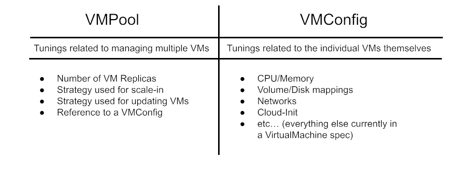

# Overview

This design provides an approach for creating a VM grouping and replication abstraction for KubeVirt called a VirtualMachinePool.

## Motivation

The ability to manage groups (or fleets) of similar VMs using a higher level abstraction is a staple among commonly utilized Iaas operational patterns. By bringing stateful VM group management to KubeVirt, we open the door for operation teams to utilize their existing patterns for managing KubeVirt VMs. This feature further aligns KubeVirt as an Iaas offering comparable to the public clouds which makes KubeVirt a more attractive option for Iaas management on baremetal hardware.

## Goals

* VM pool abstraction capable of managing replication of stateful VMs at scale
* Automated rollout of spec changes across and other updates across a pool of stateful VMs
* Automated and manual scale-out and scale-in VMs associated with a pool
* Autohealing (delete and replace) of VMs in a pool not passing health checks
* Ability to specify unique secrets and configMap data per VM within a VMPool
* Ability to detach VMs from VMPool for debug and analysis

## Non-Goals

* Not designing a VM fleet abstraction capable of managing multiple VM groupings containing VMs which are dissimilar to one another. A VMPool consists only of VMs which are similar in shape to one another that are derived from a single config.

## Terms

* **VirtualMachine [VM]** - Refers specifically to the KubeVirt VirtualMachine API object.
* **VirtualMachinePool [VMPool]** - KubeVirt API for scaling out/in replicas of KubeVirt VirtualMachines.
* **VirtualMachineConfig [VMConfig]** - KubeVirt API representing a VirtualMachine spec which is referenced by a VirtualMachinePool.
* **Scale-out and Scale-in** - Terms to describe the action of modifying the replica count of VMs within a VMPool.
* **Detach VM** - The process of manually separating a VirtualMachine from a VirtualMachinePool.
* **UpdateIn Strategy** - The policy used to define how a VMPool handles rolling out VMConfig updates to VMs within the pool.
* **ScaleIn Strategy** - The policy used to define how a VMPool handles removing VMs from a pool during scale-in.

## User Stories

* As a cluster user, I want to automate batch rollout of changes (CPU/Memory/Disk/PubSSHKeys/etc…) across a fleet of VMs.
* As a cluster user managing fleets of VMs I want to automate scale out of VM instances based on utilization
* As a cluster user managing fleets of VMs I want to automate scale-in of identical VM instances to optimize cluster resource consumption
* As a user transitioning workloads to KubeVirt I want to use similar management patterns provided by existing Iaas platforms (AWS, Azure, GCP)
* As a cluster admin managing nested Kubernetes clusters on top of KubeVirt VMs, I want the ability to elastically scale the underlying KubeVirt VM infrastructure.
* As a SRE managing the availability of VM fleets I want to automate VM recovery by auto detecting and deleting misbehaving VMs and having the platform spin up fresh new instances as a replacement.
* As a pool user/manager I want to remove a VM from the pool without modifying it for debugging. The missing VM can be replaced by the pool.

# Design

The VMPool design introduces two new APIs represented as CRDs, the VirtualMachinePool (VMPool) object and the VirtualMachineConfig (VMConfig) object. For the most part, a VMConfig object is simply a VM object without a status section that is used by a VMPool to stamp out multiple replicas.

The figure below illustrates the relationship between a VMPool, VMConfig, and VM. The VMPool stamps out new VM replicas using the contents as in the VMConfig.


In order to make this even more tangible, below is a figure that outlines the types of tunings present in each of these APIs.



## VirtualMachineConfig (VMConfig) API

The VMConfig API contains a VirtualMachineSpec structure that is identical to a VM object, which makes it similar to a VM object itself. However there are some key differences here between the two objects.

**VMConfig vs VM**

**Differences**
* A VMConfig object can never be started. Instead the VMConfig object is referenced by higher level controllers (like a VMPool) which can start many instances of VMs using the VMConfig.
* The VMConfig has a different status section from VM
* A VMConfig’s name does not correlate in any way to a VM generated from the VMConfig
* In a VMConfig, all naming resulting in newly created objects are treated as generated names in practice. For example, the name of a DataVolumeTemplate in a VMConfig.Spec.DataVolumeTemplates list will be treated as a generated name when VMs are spawned using the config. This ensures all VMs derived from a VMConfig are unique.

**Similarities**
* VMConfig and VM object’s spec structure are identical

## VirtualMachinePool (VMPool) API

The VMPool API represents all the tunings necessary for managing a pool of stateful VMs. This API is very simple and leverages the VMConfig object for most of the heavy lifting pertaining to what the VM instances within the pool actually look like.

The VMPools spec contains the following tunings and values

* **VirtualMachineConfigRef** - (Required) A structure that points to a VMConfig object
	* **Name** - (Required) The name of the VMConfig to assign to this VMPool. Assumes the object type is VirtualMachineConfig and that the object exists in the same namespace as the pool.
* **Replicas** - (Required) An integer representing the desired number of VM replicas
* **MaxUnavailable**  - (Optional) (Defaults to 25%) Integer or string pointer, that when set represents either a percentage or number of VMs in a pool that can be unavailable (ready condition false) at a time during automated update.
* **NameGeneration** - (Optional) Specifies how objects within a pool have their names generated
	* **VMPrefix** - (Defaults to VMPool.Name) - String representing the prefix to use for when naming VMs.
	* **AppendPostfixToSecretReferences** - (default false) Boolean that indicates if VM’s unique postfix should be appended to references to Secrets in the VMI’s Volumes list. This is useful when needing to pre-generate unique secrets for VMs within a pool.
	* **AppendPostfixToConfigMapReferences** - (default false) Boolean that indicates if VM’s unique postfix should be appended to ConfigMap references in the VMI’s Volumes list. This is useful when needing to pre-generate unique secrets for VMs within a pool.

* **UpdateStrategy** - (Optional) Specifies how the VMPool controller manages updating VMs within a VMPool
	* **Unmanaged** - No automation during updates. The VM is never touched after creation. Users manually update individual VMs in a pool.
	* **Opportunistic** - Opportunistic update of VMs which are in a halted state.
	* **Proactive** - (Default) Proactive update by forcing VMs to restart during update.
		* **SelectionPolicy** - (Optional) (Defaults to "random" base policy when no SelectionPolicy is configured) The priority in which VM instances are selected for proactive scale-in
			* **OrderedPolicies** - (Optional) Ordered list of selection policies. Policies include [LabelSelector|NodeSelector]
			* **BasePolicy** - (Optional) Catch all polices [Oldest|Newest|Random]
* **ScaleInStrategy** - (Optional) Specifies how the VMPool controller manages scaling in VMs within a VMPool
	* **Unmanaged** - No automation during scale-in. The VM is never touched after creation. Users manually delete individual VMs in a pool. Persistent state preservation is up to the user removing the VMs
	* **Opportunistic** - Opportunistic scale-in of VMs which are in a halted state.
		* **StatePreservation** - (Optional) specifies if and how to preserve state of VMs selected for scale-in.
			* **Disabled** - (Default) all state for VMs selected for scale-in will be deleted
			* **Offline** - PVCs for VMs selected for scale-in will be preserved and reused on scale-out (decreases provisioning time during scale out)
			* **Online** - [NOTE we can't implement this until we have the ability to suspend VM memory state to a PVC] PVCs and memory for VMs selected for scale-in will be preserved and reused on scale-out (decreases provisioning and boot time during scale out)
Each VM’s PVCs are preserved for future scale out
	* **Proactive** - (Default) Proactive scale-in by forcing VMs to shutdown during scale-in.
		* **SelectionPolicy** - (Optional) (Defaults to "random" base policy when no SelectionPolicy is configured) The priority in which VM instances are selected for proactive scale-in
			* **OrderedPolicies** - (Optional) Ordered list of selection policies. Policies include [LabelSelector|NodeSelector]
			* **BasePolicy** - (Optional) Catch all polices [Oldest|Newest|Random]
		* **StatePreservation** - (Optional) specifies if and how to preserve state of VMs selected for scale-in.
			* **Disabled** - (Default) all state for VMs selected for scale-in will be deleted
			* **Offline** - PVCs for VMs selected for scale-in will be preserved and reused on scale-out (decreases provisioning time during scale out)
			* **Online** - [NOTE we can't implement this until we have the ability to suspend VM memory state to a PVC] PVCs and memory for VMs selected for scale-in will be preserved and reused on scale-out (decreases provisioning and boot time during scale out)
Each VM’s PVCs are preserved for future scale out
* **AutohealingStrategy** - (Optional)
	* **None** - (Default) VM state is preserved, even during crashloop. No action is taken to auto recover the VM.
	* **ReprovisionOnFailure** - VM is completely reprovisioned with persistent state refresh if the VM’s VMI terminates unexpectedly with VMI.Status.Phase=failed. This is useful in instances where a VM has data corruption and continues to fail liveness checks.


## VMPool API Examples

**Automatic rolling updates and scale-in strategy with state preservation to optimization of boot times during scale-out**

```yaml
apiVersion: kubevirt.io/v1
kind: VirtualMachinePool
metadata:
  name: my-vm-pool
spec:
  VirtualMachineConfigRef:
    name: my-template
  replicas: 100
  maxUnavailable: 10
  scaleInStrategy:
    proactive:
      statePreservation: Offline
      selectionPolicy:
        basePolicy: "Oldest"
  updateStrategy:
    proactive:
      selectionPolicy:
        basePolicy: "Oldest"
```

**Manual rolling updates and Manual scale-in strategy**

```yaml
apiVersion: kubevirt.io/v1
kind: VirtualMachinePool
metadata:
  name: my-vm-pool
spec:
  VirtualMachineConfigRef:
    name: my-template
  replica: 100
  scaleInStrategy:
    unmanaged: {}
  updateStrategy:
    unmanaged: {}
```

**Automatic rolling updates and scale-in strategy with VM ordered selection policy on scale-in**

```yaml
apiVersion: kubevirt.io/v1
kind: VirtualMachinePool
metadata:
  name: my-vm-pool
spec:
  VirtualMachineConfigRef:
    name: my-template
  replicas: 100
  maxUnavailable: 10
  scaleInStrategy:
    proactive:
      selectionPolicy:
        orderedPolicies:
          - labelSelector
            - non-important-vms
          - nodeSelector
            - node2
            - node3
        basePolicy: "Oldest"
      statePreservation: Offline
  updateStrategy:
    proactive:
      selectionPolicy:
        basePolicy: "Oldest"
```

# Special Topics

The topics in this section tackles in detail how specific use cases and functionality are handled with the VMPool abstraction.

## Manually Detaching VM from VMPool

A VM in a VMPool can be detached from a VMPool by removing the owner reference. This removes that VM from being actively managed by the VMPool.

Since VMs within a VMPool each have a unique sequential postfix applied to each VM name, a detached VM’s sequence number will be skipped during scale-in and scale-out operations until the detached VM is either returned to the Pool (by manualing adding the VMPool owner reference back) or the VM is deleted which frees the resource name.

## VM Naming

By default, VM names are generated from the VMPool’s name by appending the VMPool’s name with a sequential unique postfix. This is similar to how pods are generated from a StatefulSet’s name.

## State Preservation during Scale-in

During scale-in when the scaleInStrategy is set to `Proactive` with `StatePreservation=Offline`, the VM’s being removed from the pool will have their PVC state preserved. In order to ensure on the next scale-out event that VMs using the exact same state are started again, the previous VM names will be reused during scale-out. This is similar in concept to how a StatefulSet uses predictable sequential names.

When scaleInStrategy is set to `Proactive` with `Preservation=Disabled`, all PVC state will be completely removed from VMs during scale-in and reprovisioned during scale-out.

## Handling of Annotations and Labels

VMs will inherit the Labels/Annotations from the VMPool.

VMIs will inherit the Labels/Annotations from the VMITemplate section of a VMConfig in the same fashion that VMIs inherit Labels/Annotations from the VMITemplate of a VM.

## Handling Persistent Storage

Usage of a DataVolumeTemplate within a VMConfig will result in unique persistent storage getting created for each VM within a VMPool. The DataVolumeTemplate name will have the VM’s sequential postfix appended to when the VM is created from the VMConfig which makes each VM a completely unique stateful workload.

## Handling Unique VM CloudInit and ConfigMap Volumes at Scale

By default, any secrets or configMaps references in a VMConfig’s Volume section will be used directly as is, without any modification to the naming. This means if you specify a secret in a CloudInitNoCloud volume within a VMConfig, that every VM instance spawned from that VMConfig will get the exact same secret used for their cloud-init user data.

This default behavior can be modified by setting the **AppendPostfixToSecretReferences** and **AppendPostfixToConfigMapReferences** booleans to true on the VMPool spec. When these booleans are enabled, references to secret and configMap names will have the VM’s sequential postfix appended to the secret and configmap name. This allows someone to pre-generate unique per VM secret and configMap data for a VMPool ahead of time in a way that will be predictably assigned to VMs within the VMPool.

## Autohealing

When managing VMs at large scale, it is useful to automate the recovery of VMs which continually fail to reach a ready state. This automatically fixes scenarios where a VM’s state has somehow been corrupted and needs to be completely refreshed.

By setting `AutohealingStrategy=ReprovisionOnFailure` on the VMPool’s spec, VMs which reach an unexpected failure state will automatically be completely deleted (including persistent storage) and re-provisioned. This allows for auto recovery in application scenarios that can withstand such an action.

Autohealing must have an CrashLoopBackoff mechanism to prevent it from causing unnecessary strain on the cluster.

## Throttling Parallel VM Creation/Update

The VMPool controller should establish some default upper limits when it comes to how many VMs can be batch created and updated at a time. This is similar to the VMIReplicaSet controller's internal `BurstReplicas` global variable. By default VMIReplicaSets will only create at most 250 VMIs at a time, but this is configurable as a global setting. The VMPool controller should adopt the same pattern of a max upper limit of 250 VMs per a VMPool with a global configurable setting.

This setting is primarily meant as a way of preventing the VMPool controller from creating an unintentionally cluster DoS.

## VirtualMachinePool vs VirtualMachineInstanceReplicaSet

VMPools are designed to manage stateful VM workloads while VMIReplicaSets are designed to manage stateless VMI workloads.

A VMIReplicaSet makes sense for a user who wants to manage stateless VMI objects using similar patterns to how Kubernetes ReplicaSets manage pods.

A VMPool makes sense for a user who wants to manage stateful VM objects using similar patterns found in Iaas public clouds, like AWS, GCP, Azure. In this way, a VMPool is more similar to an AWS AutoscalingGroup or a GCP ManagedInstanceGroup than it is to any core Kubernetes API.

