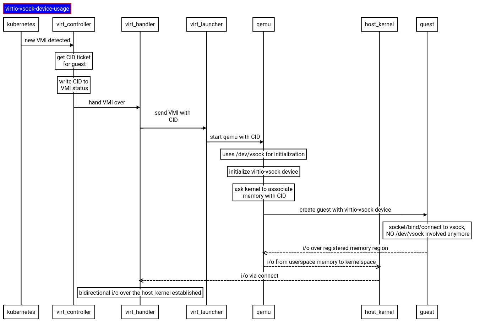

## RFE: VSOCK Support for KubeVirt

**Authors:** Zhuchen Wang, Roman Mohr 

## Context

### Objective

Extend KubeVirt with `vsock` support to allow more flexible guest-host communication patterns. This proposal aims to enable use-cases for vendors which want to bring in their own agents which communicate with the node and exchange information between guests and the host in a reliable way without additional network-layer security like TLS.

#### Goals

*   Allow **node-local** **privileged** services via vsock to `connect` to services `bound` in guest VMs to a vsock port.
*   Allow guests to `connect` to **privileged node-local** services via vsock to node-local privileged services `bound` on the node to a vsock port.
*   Allow **unprivileged control-plane or nodel-local** services to connect over a REST API via websockets to a guest VM (similar to console/vnc), to give vendors flexibility:
    *   Scaling: Let the control-plane monitor CRs in an efficient way and proactively reach out to the guest VM, without having to change virt-handler for each vendor.
    *   Security: Bring access control to RBAC level for clear auditing, and allow running node-local services without privileges by granting RBAC/gatekeeper access.

#### Non-Goals

*   Let the `qemu-guest-agent` make use of `vsock`, but it should be extensible to be used for it in a later stage.
*   Adding application level-security which requires certificate rotation (like TLS).
*   It should under the right constraints be usable without additional security layers outside of node-local-security measures like selinux, seccomp, …
*   We are not interested in keeping the CID stable over the lifetime of a VMI
*   We are not interested in keeping connections during migrations alive.

#### Use-cases

*   As a vendor I want to plugin my own guest-agent(s) or services in addition to `qemu-guest-agent`. Even a single vendor may have more than one guest-agent, due to legal or team responsibilities. There are services which can for various reasons not be incorporated into `qemu-guest-agent`, for reasons like legal constraints, vendor-specific features, team responsibilities, ….
*   As a vendor I want to have an easy-to-use extension mechanism based on normal socket communication to easily develop reliable communication patterns with e.g. gRPC to maximize development speed while at the same time avoid vulnerabilities, bugs, …
*   As a vendor, I want the ability to have intercommunication between a guest and a pod on the same host without having to use a network interface.

### Background

KubeVirt uses for local guest-host communication right now `virtio-serial`. This is currently used in KubeVirt by `libvirt` and `qemu` to communicate with the `qemu-guest-agent`. `virtio-serial` can also be used by other agents, but it is a little bit cumbersome due to:

*   A small set of ports on the `virtio-serial` device
*   Low bandwidth
*   No socket based communication possible, which requires every agent to establish their own protocols, or work with translation layers like SLIP to be able to use protocols like gRPC for reliable communication.
*   No easy and supportable way to get a `virtio-serial` socket assigned and being able to access it without entering the virt-launcher pod.
*   Due to the point above, privileges are required for services.

With `virtio-vsock` (https://man7.org/linux/man-pages/man7/vsock.7.html) we get support for easy guest-host communication which solves the above issues from a user/admin perspective.

### Design

The feature can be added to KubeVirt in two phases.

*   Phase 1: node-local bits to wire in vsock, only allowing privileged node-local services to communicate with the Guest VMs.
*   Phase 2: Add websocket proxying to virt-handler, to allow accessing VSOCK ports via REST calls and  protecting it via k8s RBAC.

### Phase 1: node-local wiring of vsock

*   The `/dev/vhost-vsock` device will be exposed via virt-handler under the `vsock` feature gate
*   Each virt-launcher with `vsock` enabled will request the device
*   Virt-controller will hand out a CID to virt-launcher and add it to the VMI status. 
*   virt-launcher/libvirt/qemu take the CID and configure the vsock device via `/dev/vhost-vsock`
*   From this point on `/dev/vhost-vsock` does not have any function anymore
*   To simplify the migration story, the CID will be unique cluster wide. Therefore the CID will be retained after migration. (With 100 000 k8s nodes we would still have enough CIDs to run more than 20 000 VMs per node). The CID has a type of `uint32`, which is large enough to satisfy a cluster-wide unique allocation)

#### API changes

A `autoattachVsock` flag will be added to the VMI spec at `spec.domain.devices` which defaults to `false` to stay backward compatible. Also a `VsockCID` field will be added to the VMI status as `status.vsockCID` for CID allocation and lookup.

### Phase 2: websocket access via the apiserver

This follows exactly the same architecture as vnc/console. `GET /virtualmachineinstances/&lt;name>/vsock?port=123` will be added to the REST-API and it will return a websocket connection to the guest, if something is listening on the guest. Then, for example, node-local or control-plane services can establish a gRPC connection on top of the websocket connection to the guest service and invoke RPC calls.

By default none of our aggregated cluster-roles will get RBAC access to this endpoint.

Creating a websocket connection via this REST-API means that all traffic goes
through the kubernetes apiserver. Therefore the same scale considerations apply
like for `exec`, `port-forward`, `vnc` and so forth.

### Security

Note: The `dev/vhost-vsock` device is **NOT NEEDED** to connect or bind to a `vsock` port. This means that it is slightly more challenging to secure it.

The following measure will therefore be put in place:

*   The whole `vsock` features will live behind a feature gate
*   By default the first 1024 ports of a vsock device are privileged. Services trying  to connect to those require `CAP_NET_BIND_SERVICE`.
*   The proposal writers ensured that the `AF_VSOCK` `socket` syscall gets blocked in containerd 1.7+ (https://github.com/containerd/containerd/issues/7442). A similar change can be done on other popular CRI implementations. It is right now the responsibility of the vendor to ensure that the used CRI selects a default seccomp policy which blocks `socket` calls in a similar way like it was done for containerd.
*   RBAC access to vsock devices will not be added to any of the default roles.
*   virt-launcher will not auto-assign CIDs to ensure that virt-handler has an easy way of tracking the identity without races. While this still allows virt-launcher to fake-use an assigned CID, it eliminates possible assignment races which attackers could make use-of to redirect vsock calls.

### Possible next steps

*   Allow running `qemu-guest-agent` over virtio-vsock too. This proposal is preparing the ground for such a possible switch but is not making the actual changes for the `qemu-guest-agent`.
*   Introduce a general purpose mechanism via gRPC in virt-handler which allows efficient and scalable collection of version and readiness of registered third-party agents and `qemu-guest-agent` without having to alter virt-handler, or having to run additional node-local services.
